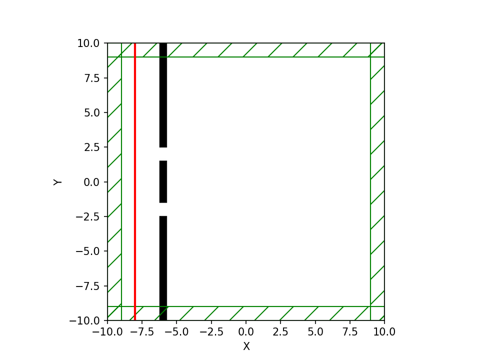
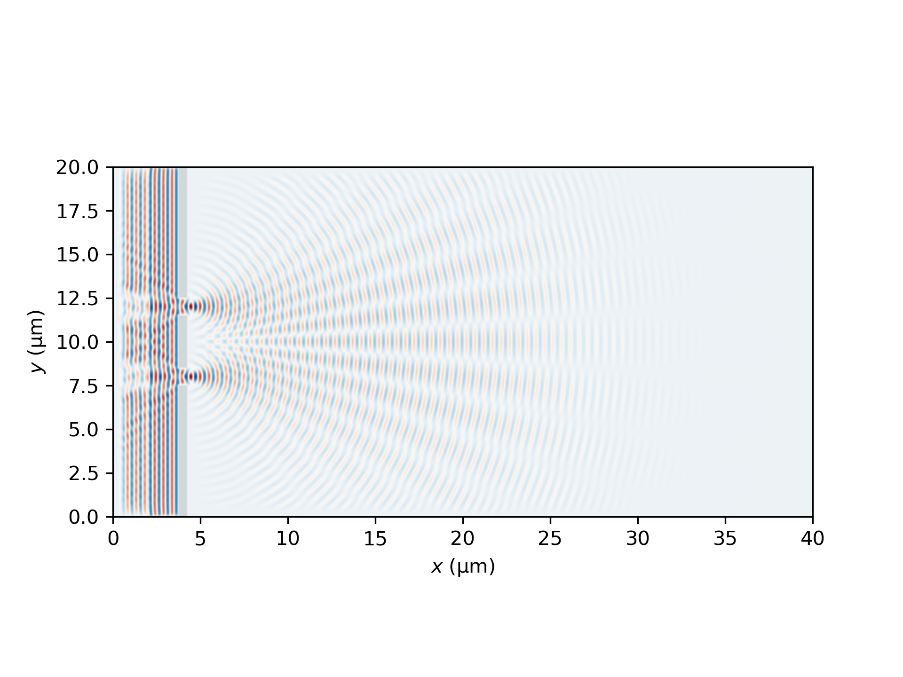
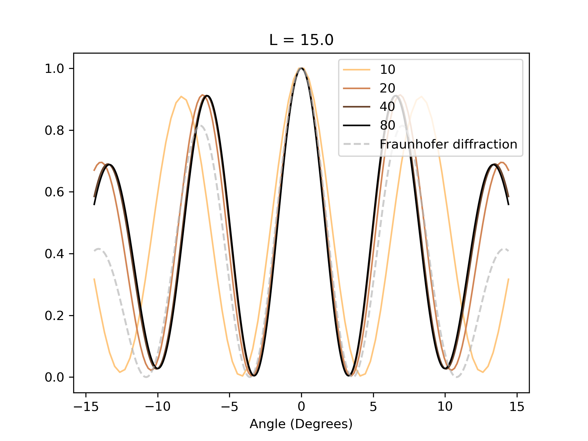
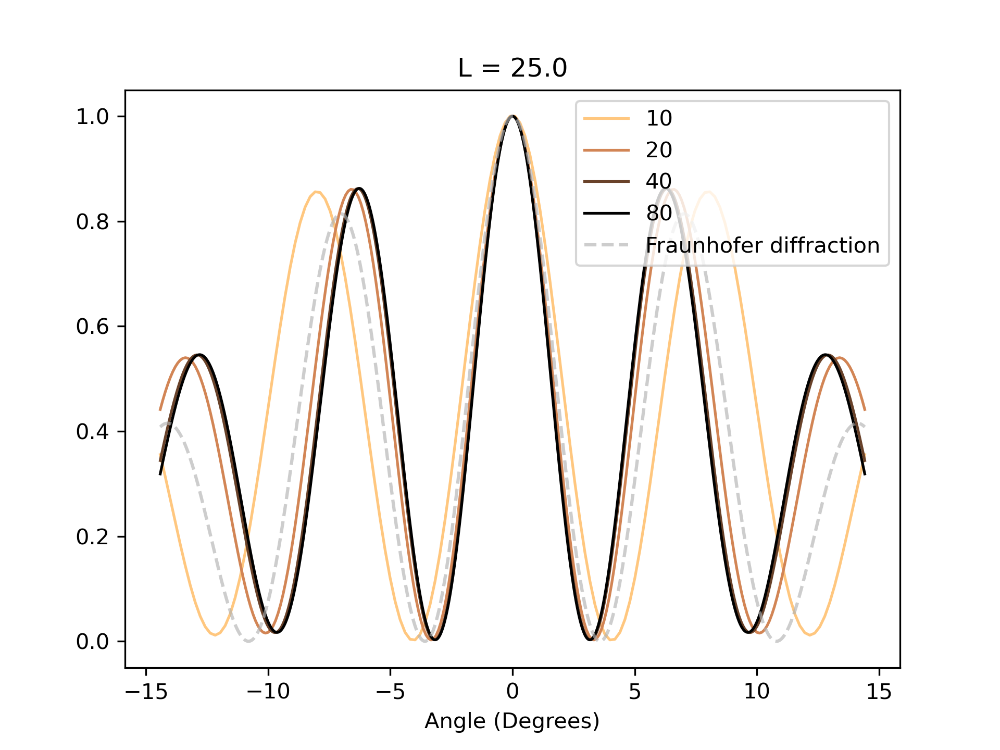
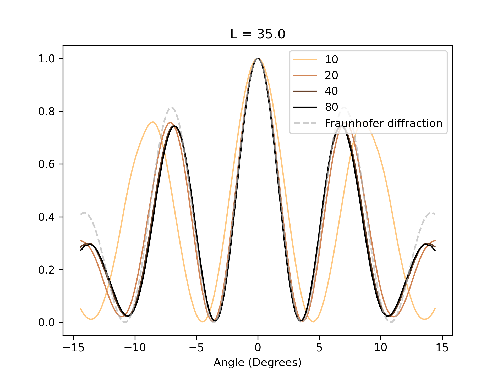

=======================
Double-slit diffraction
=======================
.. _double_slit:

Introduction
============

In this example demo we will simulate the diffraction and interference pattern produced by a plane wave passing through a double slit.
We will also use this demo to introduce the basic building blocks of a Meep simulation.

This will cover:

* Choosing the basic parameters of the simulation, such as dimensions and resolution

* Creating the objects present in the simulation

* Creating a current source for our electromagnetic waves

* Extracting field data

* Basic plotting and animation based on field data

Basics and plotting
===================

As we are making a Python script the first thing we should do is load the libraries necessary for our simulation,
which in this case are the Meep library, NumPy for math functions and Matplotlib for plotting data.

.. code-block:: python

    import meep as mp
    import numpy as np
    import matplotlib.pyplot as plt

For the first step in making a simulation is choosing the dimensions of our simulation and the size of the simulation cell.
This simulation will be two dimensional and the simulation cell as such will be 40 µm x 20 µm x 0. In Meep all sizes and times are defined numerically
and scale units can be assigned to them freely. For example the this 40 x 20 2D cell could be defined to in microns or millimeters and the
wavelength and frequency of light sources and the timesteps of the simulation would have to be scaled accordingly.

.. code-block:: python

    width = 40
    height = 20
    cell = mp.Vector3(width, height, 0) # Defining the cell vector

Note that we define our cell in three dimensions and simply choose the z-axis of the cell to be 0 to define it as two dimensional.
Also note that the coordinate system of the cell defines the center as (0,0,0), in this case the horizontal sides are at -15 and 15.
Next we will define the thickness of the PML layer surrounding the perimeter of our simulation cell. Without going into detail, the PML
layer is a boundary condition that absorbs electromagnetic waves, with the purpose of avoiding waves reflecting off the sides
of the simulation cell. A rule of thumb for minimum PML thickness is half of the wavelength of our current source.
For this demo the PML thickness will be 1 µm for the sake of having it be an integer.

.. code-block:: python

    dpml = 1
    pml_layers = [mp.PML(dpml)]

Now we will define the geometry of the simulation, which in this case consists of a wall with a double-slit.
Geometry is set by defining the objects it consists of which in this case are three Block objects that make up the wall.
The electromagnetic properties of the objects must also be defined. In this simple case they will be a dielectric material with a high permittivity.

.. code-block:: python

    # Defining lengths and positions
    aperture = 1 # Size of slits
    gap = 4 # Gap between centers of slits  
    center_length = gap - aperture # Length of center segment of wall
    side_length = (height - center_length - 2*aperture)/2 # Length of side wall segments
    material = mp.Medium(epsilon=1e7)
    thickness = 0.5
    wall_xpos = -width/2 + dpml + 3 # Position of wall on x-axis

    # Defining the geometry of the cell
    geometry = [
        mp.Block(
            mp.Vector3(thickness, side_length, mp.inf),
            center=mp.Vector3(wall_xpos, height/2-side_length/2, 0),
            material=material,
        ),
        mp.Block(
            mp.Vector3(thickness, side_length, mp.inf),
            center=mp.Vector3(wall_xpos, -height/2+side_length/2, 0),
            material=material,
        ),
        mp.Block(
            mp.Vector3(thickness, center_length, mp.inf),
            center=mp.Vector3(wall_xpos, 0, 0),
            material=material,
        )
    ]

Meep offers multiple different object types as functions, in this case a simple ``Block`` object is enough
to define the three wall segments. Note that the z-axis dimension of the blocks is must be set to infinite
in this two-dimensional case. Next we must define the plane wave current source. This can be done in multiple
ways but in this case we will use a continous eigenmode source function.

.. code-block:: python

    # Defining plane wave current source
    frequency = 2.0
    wavelength = 1/frequency
    sources = [
        mp.EigenModeSource(
            src=mp.ContinuousSource(frequency,
            is_integrated=True,
            width=5),
            center=mp.Vector3(-width/2+dpml+1,0,0),
            size=mp.Vector3(y=height),
            eig_band=1,
            eig_match_freq=True,
        )
    ]

Note that this current source is the same height as the simulation cell, meaning it extends into the PML
layer. To account for this we must include ``is_integrated=True`` in the continuous source definition to prevent unwanted
behaviour. Often when using an EigenMode current source a direction must be defined. In this case the size of the source causes it to default to emitting horizontally as we want it to.
Next we can define the resolution of the simulation and finally define the simulation object. The resolution value corresponds to pixels/µm and also controls the size of the timesteps that the simulation works in,
improving temporal resolution. In this first run we only want to simulate the visuals of the wave propagating, so a resolution of 20 is enough. There are multiple rules of thumb for resolution in different situations
and it is also recommended to choose the resolution of your simulation by doubling it until your simulation has converged on a result.

.. code-block:: python

    # Resolution of the simulation
    resolution = 20 

    # Defining the simulation object
    sim = mp.Simulation(
        cell_size=cell,
        boundary_layers=pml_layers,
        geometry=geometry,
        sources=sources,
        resolution=resolution,
    )

Now that we have defined the simulation object, we can visualize the simulation cell.

.. code-block:: python
    
    plt.figure(dpi=300)
    sim.plot2D()
    plt.show()

This figure shows the PLM layer along the edge of the cell, current source in red and the walls for the double slit. 

Now we can run the simulation. Meep units are defined so the wave will take 40 timesteps to travel 40 µm.
To account for distance and the source wait time. Lets set the simulation runtime to 45 timesteps, to ensure
that the wave has traveled through the whole cell.

.. code-block:: python

    sim.run(until=45)

Now we can extract the electric field data at the end of the simulation and plot it. Extracting field data directly can usually be done
with the ``get_array`` command, which returns an array of field values, with a defined center, size and field component within the
simulation cell. 

.. code-block:: python

    # Data of dielectric values of the cell
    eps_data = sim.get_array(center=mp.Vector3(), size=cell, component=mp.Dielectric)

    # Data of the electric field
    ez_data = sim.get_array(center=mp.Vector3(), size=cell, component=mp.Ez)

    # Plotting the electric field after it has propagated through the cell. Includes wall as dielectric data
    plt.figure(dpi = 300)
    plt.imshow(eps_data.transpose(), extent = [0, width, 0, height], interpolation="spline36", cmap="binary")
    plt.imshow(ez_data.transpose(), extent = [0, width, 0, height], interpolation="spline36", cmap="RdBu", alpha=0.9)
    plt.xlabel(r"$x$ (µm)")
    plt.ylabel(r"$y$ (µm)")
    plt.savefig('field_info.png')
    plt.show()

Intensity distribution
=======================

Let us next observe how the simulated intensity distribution converges on a result when resolution of the simulation is doubled. Let us also use this demo to compare the simulated intensity distribution to a theoretical approximation.
The theoretical equation we will be using is based on the Fraunhofer diffraction equation, which is used to model plane waves diffracting off incident objects.
Fraunhofer diffraction also requires the diffraction pattern to be viewed at a sufficiently long distance away from the object. This is
described by the Fraunhofer condition, which can be written as

.. math::

   \frac{W^2}{L\lambda}\ll1,

where :math:`W` is the largest size of a diffracting aperture or slit, :math:`L` is the smaller of the distance between a point source and the aperture
or the distance between the aperture and the observation plane and :math:`\lambda` is the wavelength of the light. In the case of our simulation
:math:`W` is 1 µm, :math:`L` will be 35 µm and the wavelength is 0.5 µm. As such the we get a condition value of :math:`\approx 0.06`, which is not low enough to count as a far-field scenario. As such we should not expect the Fraunhofer diffraction based intensity distribution to match ver closely with the simulated intensity distribution.
The equation for the theoretical intensity distribution is 

.. math::

    \frac{I}{I_0}=\left(\frac{\sin\beta}{\beta}\right)^2\cos^2\alpha,
    \alpha =\frac{\pi g\sin \theta }{\lambda },
    \beta =\frac{\pi a\sin \theta }{\lambda }.

where :math:`g` is the distance between the centers of the slits, :math:`a` is the size of the slit and :math:`\theta` is the
angle of direction away from the double slit.

Let us now move to simulating the intensity distribution. The cell size, simulation geometry and current source will remain the same, but the simulation will be ran multiple times at different resolutions. We will also be enabling the calculation of complex field components in the simulation definition to let us extract intensity directly from the field data. We will be extracting arrays of field data at multiple distances away from the double-slit to see how the simulated intensity distribution developes as it propagates. Adding complex components will approximately double the simulation time. We will also be running the simulation at doubling resolutions from 10 to 80. At a resolution as high as 80, running the simulation will take approximately an hour, depending heavily on the specs of you computer. 

Now let us begin showing the changes to the code. Let us add the Matplotlib library as is for plot colormaps.

.. code-block:: python

    import meep as mp
    import numpy as np
    import matplotlib.pyplot as plt

Now we can define cell dimensions, PML-layers, geometry and the current source exactly like we did in the first demo.

.. code-block:: python

    width = 40
    height = 20
    cell = mp.Vector3(width, height, 0)

    dpml = 1
    pml_layers = [mp.PML(dpml)]

    # Defining lengths and positions
    aperture = 1 # Size of slits
    gap = 4 # Gap between centers of slits  
    center_length = gap - aperture # Length of center segment of wall
    side_length = (height - center_length - 2*aperture)/2 # Length of side wall segments
    material = mp.Medium(epsilon=1e7)
    thickness = 0.5
    wall_xpos = -width/2 + dpml + 3 # Position of wall on x-axis

    # Defining the geometry of the cell
    geometry = [
        mp.Block(
            mp.Vector3(thickness, side_length, mp.inf),
            center=mp.Vector3(wall_xpos, height/2-side_length/2, 0),
            material=material,
        ),
        mp.Block(
            mp.Vector3(thickness, side_length, mp.inf),
            center=mp.Vector3(wall_xpos, -height/2+side_length/2, 0),
            material=material,
        ),
        mp.Block(
            mp.Vector3(thickness, center_length, mp.inf),
            center=mp.Vector3(wall_xpos, 0, 0),
            material=material,
        )
    ]

    # Defining plane wave current source
    frequency = 2.0
    wavelength = 1/frequency
    sources = [
        mp.EigenModeSource(
            src=mp.ContinuousSource(frequency,
            is_integrated=True,
            width=5),
            center=mp.Vector3(-width/2+dpml+1,0,0),
            size=mp.Vector3(y=height),
            eig_band=1,
            eig_match_freq=True,
        )
    ]

We will want to make a new plot for each distance L away from the double-slit that we want to observe. Let us choose three distances at 15, 25 and 35 µm away. Let us define the figures and axis for the three plots. Let us also add in the colormap to be used later.

.. code-block:: python

    # Figure and axis containers
    figs = []
    axs = []

    # Defining three separate figures and their axis
    for p in range(0,3):
        figs.append(plt.figure(dpi=300))
        axs.append(figs[p].add_subplot(1, 1, 1))

    cmap = mpl.colormaps['copper']

Now let us define the maximum distance from double-slit to observation plane, which will be 35 µm and the maximum angle away from the direction of the plane wave that we will observe at every distance.

.. code-block:: python

    slits_to_dpml = (width/2 - dpml) - wall_xpos
    theta_max = np.arctan((height/2 - dpml)/slits_to_dpml)

Now we will start the for-loop for running the simulation at different resolutions. All comments will be in the code since we want to include the whole for-loop structure in one code block.

.. code-block:: python

    for k in range(0,4):

        # Resolution of the simulation doubles each loop
        resolution = 10*(2**k)

        # Plot color for current resolution off colormap
        plt_color = cmap((3-k)/3)

        # Define simulation
        sim = mp.Simulation(
            cell_size=cell,
            boundary_layers=pml_layers,
            geometry=geometry,
            sources=sources,
            resolution=resolution,
            force_complex_fields=True, # Turn on calculation of complex fields
        )

        # Running the simulation for enough time for field to propagate to end
        sim.run(until=width+5)

        # Extracting field data and calculating intensity data from it
        ez_data = sim.get_array(center=mp.Vector3(), size=cell, component=mp.Ez)
        intensity_field = np.abs(ez_data)**2
        
        # For-loop to extract and calculate intensity distributions at different distances for current resolution
        Ls = []
        for i in range(0,3):
            L = slits_to_dpml - i*10
            Ls.append(L)

            # Taking 1D array of intensity values at some distance from double-slit
            intensity_slice = intensity_field[(width - dpml - i*10) * resolution]

            # Extracting the correct cell data points from the array for the angle area we want to observe
            if i == 0:
                intensity_slice_no_dpml = intensity_slice[dpml*resolution-1:-dpml*resolution+1]
            else:
                y_max = np.tan(theta_max)*L
                y_dif = int(height/2 - y_max)
                intensity_slice_no_dpml = intensity_slice[y_dif*resolution-1:-y_dif*resolution+1]

            # Normalizing the intensity values
            i_max = max(intensity_slice_no_dpml)
            intensity_norm = [x/i_max for x in intensity_slice_no_dpml]

            # Calculating theta values for intensity values and plotting to correct figure
            theta = np.linspace(-theta_max,theta_max,len(intensity_norm))
            axs[i].plot([x / np.pi * 180 for x in theta], intensity_norm, color = plt_color, linewidth = 1.25, label=f"{resolution}")
            if k == 0:
                axs[i].set_title(f'L = {Ls[i]}')

Next we will calculate the Fraunhofer diffraction based intensity distribution and add them to each distanced plot.

.. code-block:: python

    # Calculating Fraunhofer diffraction intensity distribution
    theta2 = np.linspace(-theta_max,theta_max,1000)
    alpha = np.pi * gap * np.sin(theta2) / wavelength
    beta = np.pi * aperture * np.sin(theta2) / wavelength
    i_theory = ((np.sin(beta)/beta) ** 2) * (np.cos(alpha) ** 2)

    # Adding Fraunhofer values to each distance figure and saving the figures
    for i in range(0,3):
        axs[i].plot(theta2 / np.pi * 180, i_theory, color=(0.7,0.7,0.7,0.65), linewidth = 1.5, ls = '--', label="Fraunhofer diffraction")
        axs[i].set_xlabel("Angle (Degrees)")
        axs[i].legend(loc="upper right")
        figs[i].savefig(f'dist{Ls[i]}.png')

This results in the following three figures

The intensity distribution at L = 15.0 µm

The intensity distribution at L = 25.0 µm

The intensity distribution at L = 35.0 µm

From these figures we can observe that the simulated distribution converges well with resolution doubling, with resolutions 40 and 80 being almost perfectly identical. We can also observe that the intensity distribution over angles is more dispersed at lower resolutions.
For the different distances we can observe the secondary and tertiary intensity peaks dropping as we move away from the double-slit. Dropping even lower than the Fraunhofer diffraction based distribution, which is meant to give best results at much larger distance. We are currently unsure of the cause for this but it may have something to do with a point source intensity being correlated to travel distance by :math:`\frac{1}{r^2}` while we are taking measurements at a flat plane, where distance to the measurement plane is higher at higher angles. 

 

