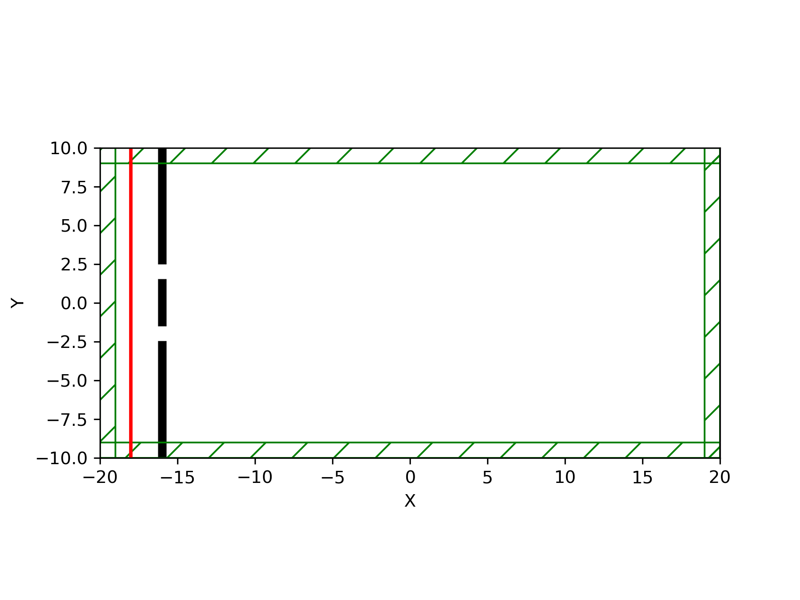

=======================
Double-slit diffraction
=======================
.. _double_slit:

Introduction
============

In this example demo we will simulate the diffraction and interference pattern produced by a plane wave passing through a double slit.
We will use use this demo to intruduce the basic building blocks of a MEEP simulation.

This will cover 

* Choosing the basic parameters of the simulation, such as dimensions and resolution

* Creating the objects present in the simulation

* Creating a current source for our electromagnetic waves

* Extracting field data

* Basic plotting and animation based on field data

Basics and plotting
===================

As we are making a Python script the first thing we should do is load the libraries necessary for our simulation,
which in this case are the MEEP library, NumPy for math functions and Matplotlib for plotting data.

.. code-block:: python

    import meep as mp
    import numpy as np
    import matplotlib.pyplot as plt

For the first step in making a simulation is choosing the dimensions of our simulation and the size of the simulation cell.
This simulation will be two dimensional and the simulation cell will be 20 µm x 20 µm. Please note the
unitless nature of MEEP, allowing us to simply assume the base unit for all distance values to be 1 µm.

.. code-block:: python

    width = 20
    height = 20
    cell = mp.Vector3(width, height, 0)

Note that we define our cell in three dimensions and simply choose the z-axis of the cell to be 0 to define it as two dimensional.
Also note that the coordinate system of the cell defines the center as (0,0,0), in this case the sides are at -10 and 10.
Next we will define the thickness of the PML layer surrounding the perimeter of our simulation cell. Without going into detail, the PML
layer is a boundary condition that absorbs electromagnetic waves, with the purpose of avoiding waves reflecting off the sides
of the simulation cell. A rule of thumb for minimum PML thickness is half of the wavelength of our current source.
For this demo the PML thickness will be 1 µm for the sake of having it be an integer.

.. code-block:: python

    dpml = 1
    pml_layers = [mp.PML(dpml)]

Now we will define the geometry of the simulation, which in this case consists of a wall with a double-slit.
Geometry is set by defining the objects it consists of which in this case are three objects of dielectric material
which make up the wall. The electromagnetic properties of the objects must also be defined. In this simple case
they will be a dielectric material with a high permittivity.

.. code-block:: python

    # Defining lengths and positions
    aperture = 1 # Size of slits
    gap = 4 # Gap between centers of slits  
    center_length = gap - aperture # Length of center segment of wall
    side_length = (height - center_length - 2*aperture)/2 # Length of side wall segments
    material = mp.Medium(epsilon=1e7)
    thickness = 0.5
    wall_xpos = -width/2 + dpml + 3 # Position of wall on x-axis

    # Defining the geometry of the cell
    geometry = [
        mp.Block(
            mp.Vector3(thickness, side_length, mp.inf),
            center=mp.Vector3(wall_xpos, height/2-side_length/2, 0),
            material=material,
        ),
        mp.Block(
            mp.Vector3(thickness, side_length, mp.inf),
            center=mp.Vector3(wall_xpos, -height/2+side_length/2, 0),
            material=material,
        ),
        mp.Block(
            mp.Vector3(thickness, center_length, mp.inf),
            center=mp.Vector3(wall_xpos, 0, 0),
            material=material,
        )
    ]

MEEP offers multiple different object types as functions, in this case a simple block object is enough
to define the three wall segments. Note that the z-axis dimension of the blocks is set to infinite
in this two-dimensional case. Next we must define the plane wave current source. This can be done in multiple
ways but in this case we will use a continous eigenmode source function.

.. code-block:: python

    # Defining plane wave current source
    frequency = 2.0
    wavelength = 1/frequency
    sources = [
        mp.EigenModeSource(
            src=mp.ContinuousSource(frequency,
            is_integrated=True,
            width=5),
            center=mp.Vector3(-width/2+dpml+1,0,0),
            size=mp.Vector3(y=height),
            eig_band=1,
            eig_match_freq=True,
        )
    ]

Note that this current source is the same height as the simulation cell, meaning it extends into the PML
layer. To account for this we must include ``is_integrated=True`` in the continuous source definition to prevent unwanted
behaviour. Next we can define the resolution of the simulation and finally define the simulation object. The resolution value corresponds to pixels/µm
in this simulation. We also included the ``width`` command, which causes the current source to wait 5 timesteps before activating.

.. code-block:: python

    # Resolution of the simulation
    resolution = 20 

    # Defining the simulation object
    sim = mp.Simulation(
        cell_size=cell,
        boundary_layers=pml_layers,
        geometry=geometry,
        sources=sources,
        resolution=resolution,
    )

Now we can run the simulation. MEEP units are defined so the wave will take 20 timesteps to travel 20 µm.
To account for distance and the source wait time. Lets set the simulation runtime to 30 timesteps, to ensure
that the wave has traveled through the whole cell.

.. code-block:: python

    sim.run(until=30)

Now we can extract the electric field data at the end of the simulation and plot it.
We will also plot the simulation cell information.

.. code-block:: python

    # Data of for walls of simulation
    eps_data = sim.get_array(center=mp.Vector3(), size=cell, component=mp.Dielectric)

    # Data of the electric field
    ez_data = sim.get_array(center=mp.Vector3(), size=cell, component=mp.Ez)

    # Plotting the simulation cell, includes PLM borders, current source and objects
    plt.figure(dpi=150)
    sim.plot2D()
    plt.show()

    # Plotting the electric field after 30 timesteps of simulation, includes wall as dielectric data
    plt.figure()
    plt.imshow(eps_data.transpose(), interpolation="spline36", cmap="binary")
    plt.imshow(ez_data.transpose(), interpolation="spline36", cmap="RdBu", alpha=0.9)
    plt.axis("off")
    plt.show()

.. figure:: double_slit_figures/field_plot.png
   :alt: test text
   :width: 90%
   :align: center   

Intensity and comparing with theory
===================================