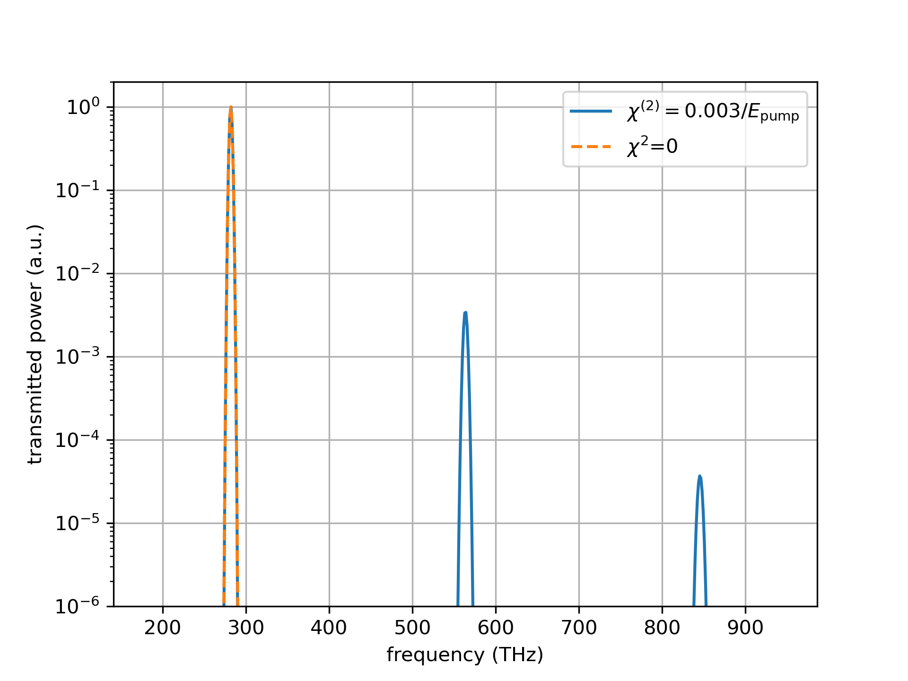
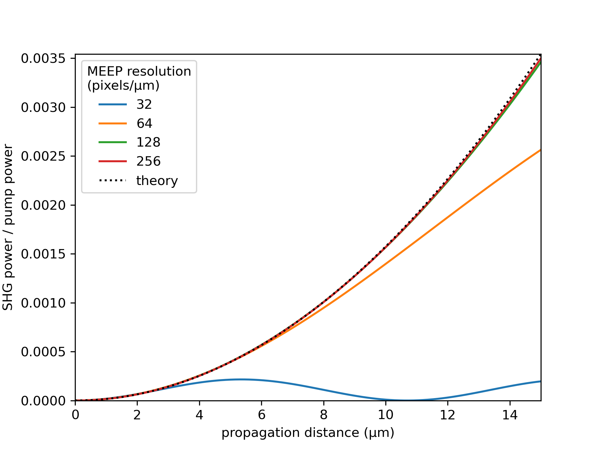
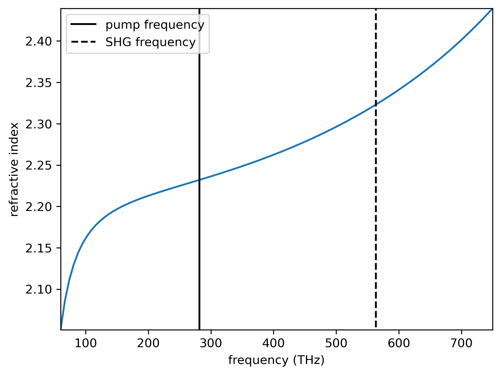
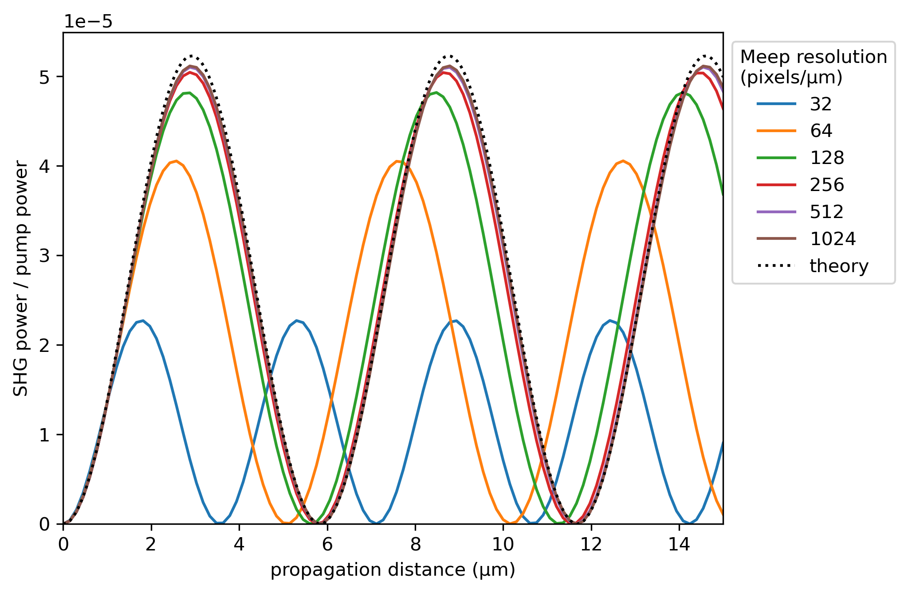
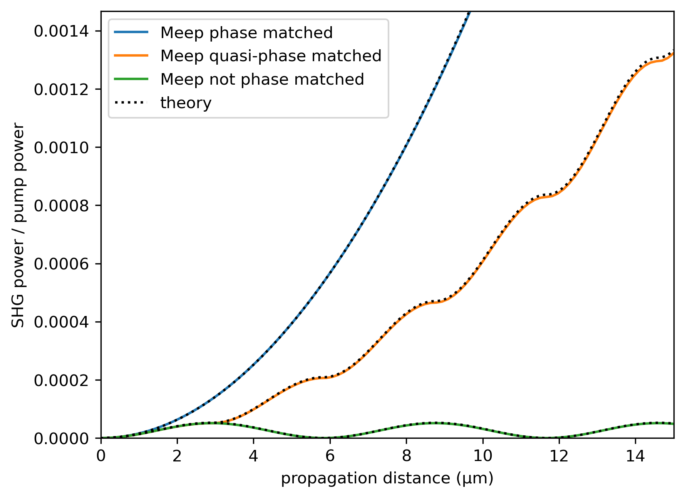
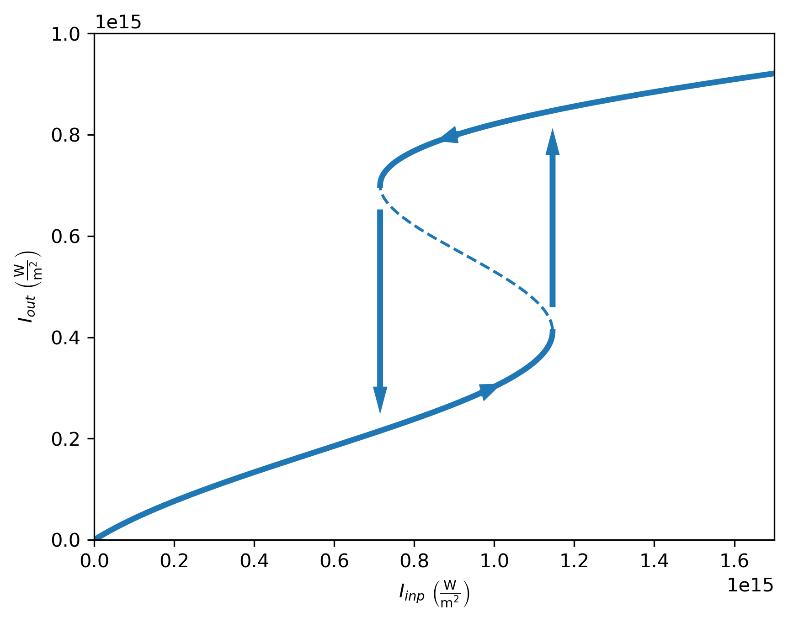
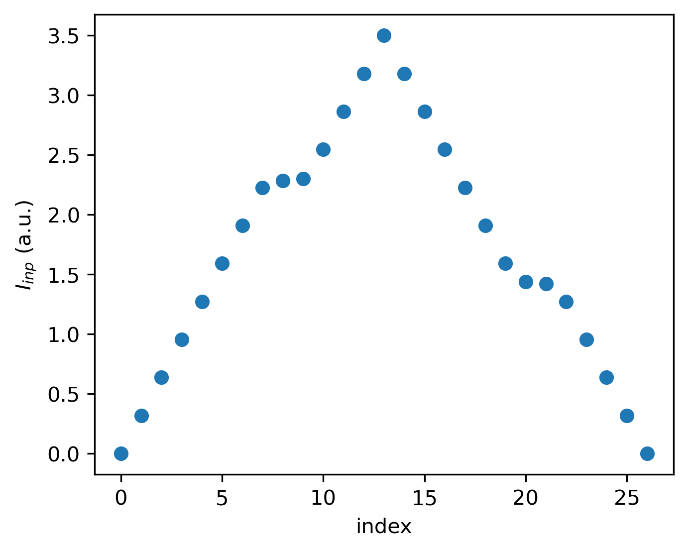
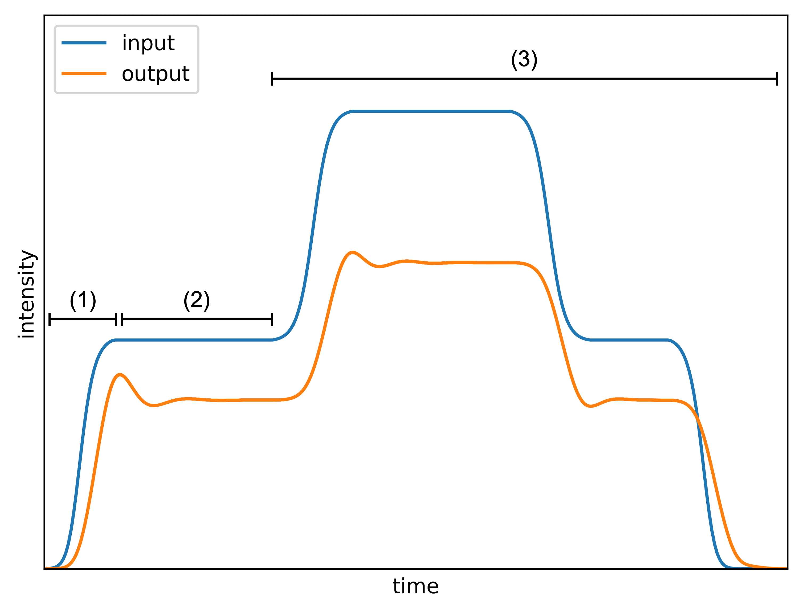

===================
Nonlinear Effects
===================

.. _nonlinear_phenomena:

Introduction
============

MEEP supports nonlinear optical simulations via materials with user defined :math:`\chi^{(2)}` or :math:`\chi^{(3)}` nonlinear susceptibilities. In this section, we will provide example simulations of both second and third order nonlinear effects: second harmonic generation under different phase matching conditions and optical bistability. We hope these examples will be useful for new MEEP users looking to simulate nonlinear effects, as the official MEEP documentation provides only a single `example simulation on nonlinearities <https://meep.readthedocs.io/en/latest/Python_Tutorials/Third_Harmonic_Generation/>`_.

First, we will give a very brief introduction on nonlinear optics. Within the linear regime where the optical electric field :math:`\tilde{E}` is not very large, the material polarization :math:`\tilde{P}` is given by

.. math::

   \tilde{P} = \varepsilon_0 \chi^{(1)} \tilde{E},

where :math:`\varepsilon_0` is the vacuum permittivity and :math:`\chi^{(1)}` is the linear susceptibility. However, if the electric field is sufficiently large (i.e. intensity is high), the linear relationship no longer holds and nonlinear correction terms are required. In this case, the material polarization can be written as 

.. math::

   \tilde{P} = \varepsilon_0 \left[ \chi^{(1)} \tilde{E} + \chi^{(2)} \tilde{E}^2 + \chi^{(3)} \tilde{E}^3 + \ldots \right],

where :math:`\chi^{(2)}` and :math:`\chi^{(3)}` are second and third order nonlinear susceptibilities, respectively. The powers of the electric field have severe consequences, some of which can be deduced with a simple treatment.

If we write the optical electric field as the sum of a complex field and it's complex conjugate :math:`\tilde{E} = E e^{-\mathrm{i} \omega t} + E^* e^{\mathrm{i} \omega t}`, the second order nonlinear polarization becomes

.. math::

   \tilde{P}^{(2)} = \varepsilon_0  \chi^{(2)} \tilde{E}^2 = \varepsilon_0  \chi^{(2)} \left(E^2 e^{-\mathrm{i} 2\omega t} + (E^*)^2 e^{\mathrm{i} 2\omega t} + \lvert E \rvert ^2 \right).

We notice that the first and second term inside the brackets are complex conjugates of each other, so the imaginary part cancles out and we are left with a term that is oscillating at twice the initial frequency. The oscillating polarization acts as a new source of light, and therefore frequency doubled light is generated! This phenomenon is known as second harmonic generation, and we will study it closer in demo 1.

We can expand the third order nonlinear polarization in a similar way. If we do this and examine only the term that is oscillating at the incident frequency :math:`\omega`, we obtain

.. math::

   \tilde{P}^{(3)}(\omega) = 3\varepsilon_0  \chi^{(3)}  \lvert E \rvert ^2 E e^{-\mathrm{i} \omega t}.

Now the total polarization oscillating at :math:`\omega` consists of the regular linear contribution, as well as a nonlinear contribution. We can write the total polarization at frequency :math:`\omega` as 

.. math::

   \tilde{P}^{\mathrm{tot}}(\omega) = \varepsilon_0 \chi^{(1)} E e^{-\mathrm{i} \omega t} + 3\varepsilon_0  \chi^{(3)}  \lvert E \rvert ^2 E e^{-\mathrm{i} \omega t} = \varepsilon_0 \left(  \chi^{(1)}  + 3 \chi^{(3)}  \lvert E \rvert ^2 \right) E e^{-\mathrm{i} \omega t} = \varepsilon_0 \chi_{\mathrm{eff}} E e^{-\mathrm{i} \omega t},

where we have defined an effective susceptibility :math:`\chi_{\mathrm{eff}}=\chi^{(1)}  + 3 \chi^{(3)}  \lvert E \rvert ^2` as the sum of linear and nonlinear contributions. If we recall that in general, the refractive index is given by :math:`n=\sqrt{1+\chi}` and that the intensity of the light is proportional to :math:`\lvert E \rvert ^2`, we can observe that intensity of the light affects the effective refractive index experienced by the light! This effect is known as an intensity-dependent refractive index or self-phase modulation, and we will examine one concequence of it, optical bistability, in demo 2.

.. note::

   The above reasoning is sufficient for getting a sense of the nonlinear effects, but a more rigorous treatment would be required for making actual calculations.

Demo 1: Second Harmonic Generation
==================================

This demo provides an example a simulation of nonlinear processes in MEEP with second harmonic generation (SHG). It is a second order nonlinear process, where light with frequency :math:`\omega` is injected to a material with a second order nonlinear susceptibility :math:`\chi^{(2)}`, and new light with frequency :math:`2 \omega` is generated. We have used the `example simulation on third harmonic generation <https://meep.readthedocs.io/en/latest/Python_Tutorials/Third_Harmonic_Generation/>`_ from the official documentation as a starting point for this demo, but we will expand on it significantly by studying the evolution of the second harmonic field during propagation under different phase matching conditions.

This demo will discuss the following practical matters of simulation:

- Simulations with :math:`\chi^{(2)}` nonlinearity
- Units with second order nonlinearities
- Resolution convergence analysis
- Materials with predefined dispersion using `meep.materials library <https://meep.readthedocs.io/en/latest/Materials/>`_

The code used to produce this demo is available at TODO.

SHG without Dispersion: Perfect Phase Matching
----------------------------------------------

First, we will simulate SHG without the presence of dispersion (same refractive index for all frequencies). The desired simulation behaviour is presented schematically below TODO. We want to place a pump source with wavelength 1064 nm in a :math:`\chi^{(2)}` material, and then measure the output spectrum after propagtion in a 1D simulation. We will use lithium niobate (LiNbO\ :sub:`3`\ ) as the nonlinear material, which is a common material in second order nonlinear optics applications.

First, we import the required libraries and define parameters:

.. code-block:: python

   import numpy as np
   from matplotlib import pyplot as plt
   import meep as mp
   from meep.materials import LiNbO3

   c = 2.998e8  # speed of light
   a = 1e-6  # charasteristic length scale (m)

   # Nd:YAG laser wavelength 1064 nm converted to MEEP frequency units
   f_pump = a/1064e-9

   # permittivity at source frequency. The .epsilon() returns the
   # permittivity tensor, so we index an element that is on the diagonal
   eps = LiNbO3.epsilon(f_pump)[0,0]
   n0 = np.sqrt(eps)  # refractive index

Next, we define a simulation function that propagates the input pulse in a :math:`\chi^{(2)}` medium and measures the output spectrum, as described in the above figure. A nonlinear optical simulation can be implemented simply by using a material with nonzero nonlinear susceptibility. We are simulating the case without dispersion, so we are using a constant refractive index that corresponds to the refractive index of LiNbO\ :sub:`3`\  at the pump frequency.

.. code-block:: python

   def chi2_propagation(chi2, f_pump, amplitude, resolution):
      """Propagate pulse in a second order nonlinear material and measure
      output spectrum.

      :param chi2: float, second order nonlinear susceptibility
      :param f_pump: float, pump frequency
      :param amplitude: float, pump current amplitude J
      :param resolution: int, resolution of simulation

      :return: (np.ndarray, np.ndarray), output spectral powers and
      corresponding frequencies
      """

      # perfectly matched layers
      pml_size = 2.0
      pml_layers = [mp.PML(pml_size)]

      # define simulation cell (15 µm propagation distance)
      cell_len = 15 + 2*pml_size
      cell = mp.Vector3(0, 0, cell_len)

      # define pump source
      source_loc = mp.Vector3(0, 0, -0.5*cell_len + pml_size)
      f_width = f_pump/20.0
      sources = [
         mp.Source(
               mp.GaussianSource(f_pump, fwidth=f_width),
               component=mp.Ex,
               center=source_loc,
               amplitude=amplitude,
         )
      ]

      # material of the simulation. Note the constant epsilon and hence
      # constant refractive index (no dispersion) and second order nonlinear
      # susceptibility chi2
      default_material = mp.Medium(epsilon=LiNbO3.epsilon(f_pump)[0,0], chi2=chi2)

      # define simulation object
      sim = mp.Simulation(
         cell_size=cell,
         sources=sources,
         boundary_layers=pml_layers,
         default_material=default_material,
         resolution=resolution,
         dimensions=1,
      )

      # define flux object for measuring the spectrum after propagation
      f_min = f_pump/2
      f_max = f_pump*3.5
      n_freq = 600
      end_loc = mp.Vector3(0, 0, 0.5*cell_len - pml_size)
      trans = sim.add_flux(
         0.5*(f_min + f_max),
         f_max-f_min,
         n_freq,
         mp.FluxRegion(end_loc),
      )
      
      # run for sufficiently long such that the pulse has fully passed
      # through the end of the material
      sim.run(until=250)

      # retrieve spectral powers and corresponding frequencies
      trans_flux = mp.get_fluxes(trans)
      freqs = mp.get_flux_freqs(trans)

      return np.array(trans_flux), np.array(freqs)

Next, we determine the value of :math:`\chi^{(2)}` we will use for our material. It turns out that if we define :math:`\chi^{(2)}` in terms of the dimensionless product :math:`\chi^{(2)}E_\text{pump}`, where :math:`E_\text{pump}` is the pump amplitude, we will spare ourselves the effort of converting the value of :math:`\chi^{(2)}` from MEEP natural units to SI units when comparing simulation results to theoretical predictions later, since the value of the dimensionless product is the same regardless unit system. We choose :math:`\chi^{(2)}E_\text{pump}=0.003`, and then we have to find the value of :math:`E_\text{pump}` in MEEP units and set :math:`\chi^{(2)}=\frac{0.003}{E_\text{pump}}`.

Note that we are using this procedure to deal with the units, not (only) because we are too lazy to convert from MEEP units to SI units, but mainly because it follows the spirit of the official recommended way of dealing with units in nonlinearities. Units of second order nonlinearities are not explicitly discussed in the official documentation, but our approach aligns closely with the `official recommended procedure for Kerr nonlinearities <https://meep.readthedocs.io/en/latest/Units_and_Nonlinearity/#kerr-nonlinearities>`_. If you ever find yourself in an situation where you need to convert units of electric fields or nonlinear susceptibilities from MEEP units to SI units, it is highly likely that you don't actually need to do so and you should instead look for a way of expressing the quantity as a dimensionless ratio or product.

We will use a Gaussian source with current amplitude :math:`J=1`. Because sources in MEEP are current sources, we have to calculate the resulting electric field amplitude when the current is oscillating at the chosen amplitude. In our 1D simulation, the electric amplitude field is given by :math:`E_\text{pump}=\frac{1}{2}ZJ`, where :math:`Z=\sqrt{\frac{\mu}{\varepsilon}}` is the impedance of the medium (note that :math:`\mu=1` in MEEP units) and the factor :math:`\frac{1}{2}` appears because the electric field is split equally between left and and right propagating parts. Note that `there is no general formula for relating current amplitude and electric field amplitude <https://meep.readthedocs.io/en/latest/FAQ/#how-does-the-current-amplitude-relate-to-the-resulting-field-amplitude>`_ in higher dimension, and we can relate them with the above formula only because we are working with a 1D simulation.

Finally, we are using a Gaussian source, but the theory on SHG we will soon encounter assumes a plane wave source. It turns out the Gaussian peak amplitude can be converted to an effective plane wave amplitude by dividing by :math:`\sqrt{2}`. Using all this information, are now ready to determine the value of :math:`\chi^{(2)}` as follows:

.. code-block:: python

   source_amplitude = 1  # source current amplitude J
   Z = np.sqrt(1/eps)  # impedance of medium
   E = Z*source_amplitude/2  # electric field amplitude
   E /= np.sqrt(2)  # Gaussian source

   chi2_E_prod = 0.003  # dimensionless product
   chi2 = chi2_E_prod / E  # in MEEP units

We can now run the simulation. We will first obtain a reference power spectrum without nonlinearities by setting :math:`\chi^{(2)}=0`, after which the simulation is repeated with the desired :math:`\chi^{(2)}` value. We will use a resolution 256 for now, but we will examine the effect of resolution more closely later.

.. code-block:: python

   res = 256
   reference_trans_flux, freqs = chi2_propagation(chi2=0, f_pump=f_pump,
                                     amplitude=source_amplitude, resolution=res)
   trans_flux, freqs = chi2_propagation(chi2=chi2, f_pump=f_pump,
                                        amplitude=source_amplitude, resolution=res)

The results of the simulation are then plotted as follows:

.. code-block:: python

   fig, ax = plt.subplots()

   # convert frequencies from MEEP units to SI units
   freqs_SI = freqs * c/a

   norm = np.max(reference_trans_flux)
   ax.semilogy(freqs_SI*1e-12, trans_flux/norm,
               label=fr"$\chi^{{(2)}}={chi2_E_prod}/E_{{\text{{pump}}}}$")
   ax.semilogy(freqs_SI*1e-12, reference_trans_flux/norm, linestyle="--",
               label=rf"$\chi^{{(2)}}$={0}")
   ax.set_xlabel("frequency (THz)")
   ax.set_ylabel("transmitted power (a.u.)")
   ax.set_xlim([freqs_SI[0]*1e-12, freqs_SI[-1]*1e-12])
   ax.set_ylim([1e-6, 2])
   ax.legend()
   ax.grid(True)

We can observe that without nonlinearities, there is only a single peak corresponding to the pump source, which is the expected result. However, when the simulation is performed in a medium with a nonzero :math:`\chi^{(2)}`, new frequencies are created at twice and three times the initial frequency! The peak at twice the initial frequency is caused by SHG, and the peak at three times the initial frequency is a result from a sum frequency generation process between the pump and SHG fields. In fact, if we extended the measured frequency range, we would see peaks of decreasing power at every integer multiple of the initial frequency resulting from frequency mixing processes of the newly generated fields.

We have chosen the parameters such that the SHG field has more than two orders of magnitude less power than the pump field. This means that we can safely use the undepleted pump assumption, which makes our treatment slightly simpler.

So far, everything we have done follows closely the `example simulation on third harmonic generation <https://meep.readthedocs.io/en/latest/Python_Tutorials/Third_Harmonic_Generation/>`_ from the official documentation. Next, we will expand on the official example and study the evolution of the SHG field during propagation. We will place multiple monitors along the propagation length that measure the power at twice the initial frequency. Also, we will measure the initial pump power for reference. This is achieved by modifying the simulation function as follows. The new parameter :code:`flux_spectrum` determines whether the output spectrum or evolution of SHG field is measured and returned. We have written explicitly only those parts of the function that are modified. The full simulation script is available on GitHub TODO.

.. code-block:: python

   def chi2_propagation(chi2, f_pump, amplitude, resolution,
                        flux_spectrum=True):

      # ... beginning of function is identical as before

      end_loc = mp.Vector3(0, 0, 0.5*cell_len - pml_size)
      if flux_spectrum:
         # define flux object for measuring the spectrum after propagation.
         f_min = f_pump/2
         f_max = f_pump*3.5
         n_freq = 600
         trans = sim.add_flux(0.5*(f_min + f_max), f_max-f_min, n_freq, mp.FluxRegion(end_loc))
      else:
         # monitor power at SHG frequency in different locations along
         # propagation length
         n_monitors = 100
         monitor_locs_z = np.linspace(source_loc[2], end_loc[2], n_monitors)
         propagation_shg_fluxes = []
         for z in monitor_locs_z:
               # measure flux at twice the pump frequency             
               shg_flux = sim.add_flux(2*f_pump, 0, 1, mp.FluxRegion(mp.Vector3(0, 0, z)))
               propagation_shg_fluxes.append(shg_flux)
         
         # measure initial pump power for reference. Note that flux object
         # cannot be exactly on top of source because equal power is emitted
         # to the left and right of the source.
         pump_flux = sim.add_flux(f_pump, 0, 1, mp.FluxRegion(source_loc+mp.Vector3(0, 0, 0.1)))
      
      # run for sufficiently long such that the pulse has fully passed
      # through the end of the material
      sim.run(until=250)

      if flux_spectrum:
         # retrieve spectral powers and corresponding frequencies.
         trans_flux = mp.get_fluxes(trans)
         freqs = mp.get_flux_freqs(trans)

         return np.array(trans_flux), np.array(freqs)

      else:
         # retrieve SHG power along propagation
         propagation_shg_powers = []
         for flux in propagation_shg_fluxes:
               propagation_shg_powers.append(mp.get_fluxes(flux))
         
         # retrieve pump power
         pump_power = mp.get_fluxes(pump_flux)
         
         return ( np.array(propagation_shg_powers).flatten(),
                  # change coordinates such that source is at z=0
                  monitor_locs_z-source_loc[2],
                  pump_power )

Next, we will run the new simulation function and obtain the SHG power at multiple different propagation distances. We perform a resolution convergence analysis by running the simulation at multiple different resolutions. The chosen resolutions are powers 2 in the range [32, 256].

.. code-block:: python

   # perform convergence analysis by doubling resolution repeatedly
   resolutions = 32 * 2**np.arange(4)
   shg_powers = []

   for res in resolutions:
      # measure SHG power during propagation and initial pump power
      shg_power, z, pump_power = chi2_propagation(chi2=chi2, f_pump=f_pump,
                                     amplitude=source_amplitude, resolution=int(res),
                                     flux_spectrum=False)
      shg_powers.append(shg_power)

   shg_powers = np.array(shg_powers)

We will compare the MEEP simulation to the analytical expression predicted by the theory. Starting from Maxwell's equations, it can be shown that the propagation evolution of the SHG intensity :math:`I_2` is given by

.. math::

   I_2(z)= \frac{\omega_1^2 ( \chi^{(2)} )^2}{2 \varepsilon_0 n_0^3 c^3} I_1^2 z^2,

where :math:`\omega_1` and :math:`I_1` are the pump frequency and intensity, :math:`n_0` is the refractive index, and :math:`z` is the propagation distance. The SHG intensity is expected to grow quadratically as a function propagation distance when no dispersion is present. `It is recommended to use real E-fields in MEEP simulations involving nonlinearities <https://meep.readthedocs.io/en/latest/Materials/#nonlinearity>`_, for which the relation :math:`I=\frac{1}{2} \varepsilon_0 n_0 c E^2` holds. Using this relation, the above equation can be written as

.. math::

   \frac{I_2}{I_1} = \frac{P_2}{P_1} = \frac{\omega_1^2}{4 n_0^2 c^2} \left(\chi^{(2)}E_\text{pump}\right)^2 z^2,

where P is the optical power. The equation is now in a form where it is convenient to convert between MEEP units and SI units; the ratio on the left side is dimensionless so it's value is independent of units, and the right side features the dimensionless product :math:`\chi^{(2)}E_\text{pump}` whose value is also the same in MEEP units and SI units.

We can now plot a comparison of the MEEP simulation results and theory prediction:

.. code-block:: python

   fig, ax = plt.subplots()

   # plot the power ratio simulated in MEEP
   ax.plot(z, shg_powers.T/pump_power, label=resolutions)

   # calculate power ratio predictedy by theory
   z_theory = np.linspace(0, z[-1]*a, 200)
   f_pump_SI = f_pump * c/a  # convert f from MEEP units to SI units
   omega_pump_SI = 2*np.pi*f_pump_SI
   power_ratio_theory = omega_pump_SI**2 / (4*n0**2*c**2) * (chi2_E_prod)**2 * z_theory**2

   # plot power ratio predicted by theory
   ax.plot(z_theory/a, power_ratio_theory, "k:", label="theory")

   ax.set_xlabel("propagation distance (µm)")
   ax.set_ylabel("SHG power / pump power")
   ax.set_xlim([0, z[-1]])
   ax.set_ylim([0, power_ratio_theory[-1]])
   leg = ax.legend()
   leg.set_title("MEEP resolution\n(pixels/µm)")

We can see that at a resolution of 256, the MEEP simulation result has converged to a nice agreement between the theoretical curve. The SHG power is increasing quadratically as a function of propagation distance. Still, the agreement between MEEP and theory is not perfect, which could be caused by the fact we are assuming in the theory that the pump is not losing any energy to the SHG field. While this assumption quite accurate with our chosen parameters, as seen from figure of the spectral powers, the assumption is not completely accurate.

Interestingly, when the resolution is too low, we get completely incorrect behaviour. The curve corresponding to a resolution of 32 looks like a there is a phase matching problem, even though there is actually perfect phase matching when dispersion is not used in the simulation. For reference, the official documentation recommends to use a resolution corresponding to at least 8 pixels per shortest wavelength, which for our parameters is equivalent to :math:`8/\lambda_\text{min}=8/(1/(2 n_0 f_\text{pump}))\approx 33.6`, where everything is in MEEP units and :math:`\lambda_\text{min}` is the wavelength of the SHG field inside the medium. We can see that we need a significantly higher resolution to get a good agreement with theory. It could be that nonlinear simulations require much higher resolutions than the recommended 8 pixels per shortest wavelength.

SHG with Dispersion: Phase Matching Problem
-------------------------------------------

Having successfully conquered SHG without the presence of dispersion, we will move on to simulate SHG in a dispersive material, giving rise to the phase matching problem. Dispersion can be easily included in MEEP by importing materials with predefined dispersion from the `meep.materials library <https://meep.readthedocs.io/en/latest/Materials/>`_. It is also possible to use `user defined dispersion <https://meep.readthedocs.io/en/master/Materials/#material-dispersion>`_, but we will restrain ourselves to using only predefined dispersion in this demo.

The predefined dispersion relation of LiNbO\ :sub:`3`\ can be plotted as follows:

.. code-block:: python

   freqs = np.linspace(0.2, 2.5, 100)  # in MEEP units
   freqs_SI = freqs * c/a  # convert to SI units

   # .epsilon() returns the permittivity tensor at given frequency,
   # so we index an element that is on the diagonal
   epsilon = np.array([LiNbO3.epsilon(f)[0][0] for f in freqs])
   n = np.sqrt(epsilon)

   # plot dispersion relation
   fig, ax = plt.subplots()
   ax.plot(freqs_SI*1e-12, n)

   # draw vertical lines at pump and SHG frequencies
   ax.plot([f_pump_SI*1e-12, f_pump_SI*1e-12], [0, 10], 'k-', label='pump frequency')
   ax.plot([2*f_pump_SI*1e-12, 2*f_pump_SI*1e-12], [0, 10], 'k--', label='SHG frequency')

   ax.set_xlabel('frequency (THz)')
   ax.set_ylabel('refractive index')
   ax.set_xlim([freqs_SI[0]*1e-12, freqs_SI[-1]*1e-12])
   ax.set_ylim([n.min(), n.max()])
   ax.legend(loc='upper left')

We can observe that the pump field and SHG field experiences different refractive indices. This leads to the phase matching problem which inhibits the growth of the SHG intensity during propagation. The physical mechanism behind the phase matching problem can described in many different ways, one of which states that the nonlinear polarization response oscillating at the SHG frequency effectively experiences the same refractive index as the pump field. However, the SHG field experiences a different refractive index than the polarization response generating the field, which means that periodically the polarization response is generating a SHG field that cancels out the existing SHG field. This prevents the quadratic growth of SHG intensity during propagation, and leads to a weak sinusoidal SHG intensity as a function of propagation distance.

We update our simulation function as follows to include dispersion. The new :code:`dispersion` parameter determines whether dispersion is used.

.. code-block:: python

   def chi2_propagation(chi2, f_pump, amplitude, resolution,
                        flux_spectrum=True, dispersion=False):

   # ... beginning of function is identical as before

   if dispersion:
      # dispersion is automatically included with the imported material
      default_material = LiNbO3
      # add nonlinearity
      default_material.E_chi2_diag = mp.Vector3(chi2, chi2, chi2)

   else:
      # note the constant epsilon (no dispersion) and
      # second order nonlinear susceptibility chi2
      default_material = mp.Medium(epsilon=LiNbO3.epsilon(f_pump)[0,0], chi2=chi2)

   # end of function is identical as before ...

We can now run the simulation with dispersion. We will again perform a resolution convergence analysis.

.. code-block:: python

   # perform convergence analysis by doubling resolution repeatedly
   resolutions_disp = 32 * 2**np.arange(6)
   shg_powers_disp = []

   for res in resolutions_disp:
      # measure SHG power during propagation and initial pump power
      shg_power_disp, z, pump_power_disp = chi2_propagation(chi2=chi2, f_pump=f_pump,
                                               amplitude=source_amplitude,
                                               resolution=int(res), flux_spectrum=False,
                                               dispersion=True)
      shg_powers_disp.append(shg_power_disp)

   shg_powers_disp = np.array(shg_powers_disp)

We will again compare the simulation to the theoretical analytical expression. In the precence of dispersion, the power ratio between the SHG field and pump field is given by

.. math::

   \frac{P_2}{P_1} = \frac{\omega_1^2}{n_1 n_2 c^2 \Delta k^2} \left(\chi^{(2)}E_\text{pump}\right)^2 \sin ^2 \frac{z\Delta k}{2},

where :math:`n_1` and :math:`n_2` are the refractive indices experienced by the pump field and SHG field, respectively, and :math:`\Delta k=2\frac{\omega_1}{c} \left(n_1 -n_2 \right)` is the wave vector miss match between between the pump and SHG waves. We have again written the equation in a form where unit conversion between MEEP units and SI units is almost automatically taken care of, as the left side is a dimensionless ratio and the right side contains the dimensionless product :math:`\chi^{(2)}E_\text{pump}`.

Next, we plot a comparison of MEEP results and theory:

.. code-block:: python

   fig, ax = plt.subplots()

   # plot the power ratio simulated in MEEP
   ax.plot(z, shg_powers_disp.T/pump_power_disp, label=resolutions_disp)

   n1 = n0
   n2 = np.sqrt(LiNbO3.epsilon(2*f_pump)[0,0])
   delta_k_SI = 2*omega_pump_SI/c * (n1 - n2)
   power_ratio_theory_disp = (omega_pump_SI**2 / (n1*n2 * c**2 * delta_k_SI**2)
                              * (chi2_E_prod)**2 * np.sin(delta_k_SI*z_theory/2)**2)

   # plot power ratio predicted by theory
   ax.plot(z_theory/a, power_ratio_theory_disp, "k:", label="theory")

   ax.set_xlabel("propagation distance (µm)")
   ax.set_ylabel("SHG power / pump power")
   ax.set_xlim([0, z[-1]])
   ax.set_ylim([0, 1.05*power_ratio_theory_disp.max()])
   leg = ax.legend(loc='upper left', bbox_to_anchor=(1, 1))
   leg.set_title("MEEP resolution\n(pixels/µm)")

The MEEP simulation has converged to a good agreement with the theory at a resolution of 512. The power of the SHG field is not increasing quadratically as with perfect phase matching, but insead oscillating as a weak sinusoidal, as predicted by the theory. The agreement with is not perfect as seen from the peaks, which could be caused by the inaccuracy of the undepleted pump assumption and the fact the refractive index varies slightly within the pulse bandwidths, which is not taken into account in the theory.

We can see that we perhaps need a higher resolution to reach convergence with dispersion than in the earlier figure without dispersion. This is reasonable, since the SHG field experiences a higher refractive index with dispersion, resulting in a smaller wavelength. Although it is not easy to make comparisons between the figures since the y-axes have differenct scales. 

Quasi-Phase Matching
--------------------

We have now seen that without dispersion, the SHG power grows quadratically with propagation distance, and with dispersion, it ocillates weakly as a sinusoidal due to the phase matching problem. In experiments and applications, it usually desired to achieve the quadratic growth of the SHG power. Even though real materials are always dispersive, the quadratic growth can be achieved by utilizing special techniques.

The most common way to achieve phase matching in the presence of dispersion is birefringent phase matching. It relies on birefrince (polarization dependence of the refractive index) and the fact that some SHG light is generated with orthogonal polarization with respect to the pump field, resulting from the off-diagonal elements of the :math:`\chi^{(2)}` susceptibility tensor. However, MEEP doesn't support off-diagonal elements of nonlinear susceptibility tensors, and hence it is not possible to simulate birefringent phase matching directly in MEEP.

The second most common phase matching method, quasi-phase matching, can be simulated in MEEP. The idea of quasi-phase matching is to switch the sign of :math:`\chi^{(2)}` after the SHG power has reached the first local maximum of the sinusoidal, leading to continued growth of the SHG power. After that, the sign of :math:`\chi^{(2)}` is switched repeatedly with the same period. The distance from :math:`z=0` to the first local maximum of the sinusoidal is known as the coherence length, and it is given by :math:`L_c=\frac{\pi}{\Delta k}`.

Next, we modify our simulation function to implement quasi-phase matching. We have made quite a few updates to the function since we first introduced it, so we will show the whole function explicitly this time.

.. code-block:: python

   from copy import copy

   def chi2_propagation(chi2, f_pump, amplitude, resolution, flux_spectrum=True, 
                        dispersion=False, quasi_phase_matching=False,
                        coherence_length=0):

      """Propagate pulse in a second order nonlinear material and measure
      output spectrum or SHG power at different propagation distances.

      :param chi2: float, second order nonlinear susceptibility
      :param f_pump: float, pump frequency
      :param amplitude: float, pump current amplitude J
      :param resolution: int, resolution of simulation
      :param flux_spectrum: bool, determines whether output spectrum (True) or
      SHG power at different propagation distances (False) is returned
      :param dispersion: bool, determines whether dispersion is used
      :param quasi_phase_matching: bool, determines whether quasi-phase matching
      is used
      :param coherence_length: float, if quasi-phase matching is used, determines
      the length after which sign of chi2 is switched

      :return: if flux_spectrum==True, returns tuple the (spectral powers,
      corresponding frequencies), otherwise returns the tuple (SHG powers,
      corresponding propagation distances, initial pump power)
      """

      # perfectly matched layers
      pml_size = 2.0
      pml_layers = [mp.PML(pml_size)]

      # define simulation cell (15 µm propagation distance)
      cell_len = 15 + 2*pml_size
      cell = mp.Vector3(0, 0, cell_len)

      # define pump source
      source_loc = mp.Vector3(0, 0, -0.5*cell_len + pml_size)
      f_width = f_pump/20.0
      sources = [
         mp.Source(
               mp.GaussianSource(f_pump, fwidth=f_width),
               component=mp.Ex,
               center=source_loc,
               amplitude=amplitude,
         )
      ]

      geometry = []
      if quasi_phase_matching and dispersion:
         default_material = LiNbO3

         # create geometry where sign of chi2 is switched every
         # coherence length

         z = source_loc[2]
         sign = 1
         while True:
               if z >= cell_len/2:
                  break

               z_start = z
               z_end = np.min([z+coherence_length, cell_len/2])
               # previously defined geometry is affected without copy
               material = copy(LiNbO3)
               # add nonlinearity with switched sign
               material.E_chi2_diag = mp.Vector3(sign*chi2, sign*chi2, sign*chi2)
               block = mp.Block(size=mp.Vector3(0, 0, z_end-z_start),
                              center=mp.Vector3(0, 0, (z_start+z_end)/2),
                              material=material)
               geometry.append(block)

               z += coherence_length
               sign *= -1
               
      elif dispersion:
         # dispersion is automatically included with the imported material
         default_material = LiNbO3
         # add nonlinearity
         default_material.E_chi2_diag = mp.Vector3(chi2, chi2, chi2)

      elif not dispersion:
         # note the constant epsilon (no dispersion) and
         # second order nonlinear susceptibility chi2
         default_material = mp.Medium(epsilon=LiNbO3.epsilon(f_pump)[0,0], chi2=chi2)
      
      else:
         print('bad input')
         return

      # define simulation object
      sim = mp.Simulation(
         cell_size=cell,
         sources=sources,
         boundary_layers=pml_layers,
         default_material=default_material,
         geometry=geometry,
         resolution=resolution,
         dimensions=1,
      )

      end_loc = mp.Vector3(0, 0, 0.5*cell_len - pml_size)
      if flux_spectrum:
         # define flux object for measuring the spectrum after propagation
         f_min = f_pump/2
         f_max = f_pump*3.5
         n_freq = 600
         trans = sim.add_flux(0.5*(f_min + f_max), f_max-f_min, n_freq, mp.FluxRegion(end_loc))
      else:
         # monitor power at SHG frequency in different locations along
         # propagation length
         n_monitors = 100
         monitor_locs_z = np.linspace(source_loc[2], end_loc[2], n_monitors)
         propagation_shg_fluxes = []
         for z in monitor_locs_z:
               # measure flux at twice the pump frequency             
               shg_flux = sim.add_flux(2*f_pump, 0, 1, mp.FluxRegion(mp.Vector3(0, 0, z)))
               propagation_shg_fluxes.append(shg_flux)
         
         # measure initial pump power for reference. Note that flux object
         # cannot be exactly on top of source because equal power is emitted
         # to the left and right of the source.
         pump_flux = sim.add_flux(f_pump, 0, 1, mp.FluxRegion(source_loc+mp.Vector3(0, 0, 0.1)))
      
      # run for sufficiently long such that the pulse has fully passed
      #  through the end of the material
      sim.run(until=250)

      if flux_spectrum:
         # retrieve spectral powers and corresponding frequencies
         trans_flux = mp.get_fluxes(trans)
         freqs = mp.get_flux_freqs(trans)

         return np.array(trans_flux), np.array(freqs)

      else:
         # retrieve SHG power along propagation
         propagation_shg_powers = []
         for flux in propagation_shg_fluxes:
               propagation_shg_powers.append(mp.get_fluxes(flux))
         
         # retrieve pump power
         pump_power = mp.get_fluxes(pump_flux)
         
         return ( np.array(propagation_shg_powers).flatten(),
                  # change coordinates such that source is at z=0
                  monitor_locs_z-source_loc[2],
                  pump_power )

We can now calculate the coherence length and simulate the evolution of the SHG field with quasi-phase matching. We will use the resolution of 512 which was found to be sufficient for the case with dispersion.

.. code-block:: python

   delta_k = delta_k_SI*a
   coherence_length = np.abs(np.pi/delta_k)
   shg_power_quasi, z, pump_power_quasi = chi2_propagation(chi2=chi2, f_pump=f_pump,
                                             amplitude=source_amplitude, resolution=512,
                                             flux_spectrum=False, dispersion=True,
                                             quasi_phase_matching=True,
                                             coherence_length=coherence_length)

Again, we compare the simulation result to the analytical expression predicted by the theory. Under quasi-phase matching, the SHG power is expected to grow as TODO. It was found when making this demo that the description of quasi-phase matching given in the Boyd book is slightly inaccurate, as every other "step" of the "staircase" is missing.

We can now calculate the theoretical curve and plot it with the MEEP simulation result. We will also plot the earlier curves with perfect phase matching (no dispersion) and with phase miss match (with dispersion) for reference.

.. code-block:: python

   fig, ax = plt.subplots()

   ax.plot(z, shg_powers[-1,:]/pump_power, label="MEEP phase matched")
   ax.plot(z, shg_power_quasi/pump_power_quasi, label="MEEP quasi-phase matched")
   ax.plot(z, shg_powers_disp[-1,:]/pump_power_disp, label="MEEP not phase matched")

   def quasi_staircase(z, delta_k):
      coherence_length = np.pi/delta_k

      if z <= coherence_length:
         y=2*np.sin(delta_k * z / 2)**2
      else:
         n = z//coherence_length
         z_current = z%coherence_length
         y = 2*n**2+2*n+1 - (1+2*n)*np.cos(delta_k*z_current)

      return y

   stairs = np.array([quasi_staircase(z_i, delta_k_SI) for z_i in z_theory])
   power_ratio_theory_quasi = (1/2 *  omega_pump_SI**2 / (n1*n2 * c**2 * delta_k_SI**2)
                               * (chi2_E_prod)**2 * stairs)                            
   ax.plot(z_theory/a, power_ratio_theory_quasi, "k:", label="theory")

   ax.plot(z_theory/a, power_ratio_theory_disp, "k:")
   ax.plot(z_theory/a, power_ratio_theory, "k:")

   ax.set_xlabel("propagation distance (µm)")
   ax.set_ylabel("SHG power / pump power")
   ax.set_xlim([0, z[-1]])
   ax.set_ylim([0, power_ratio_theory_quasi[-1]*1.1])
   ax.legend()

The simulation agrees quite well with the theory again. As with the case with dispersion, the slight discrepancy with the theory is likely caused by the inaccuracy of the undepleted pump assumption and the slight variation of refractive index within the pulse bandwidths. With quasi-phase matching, the SHG power is growing approximately quadratically, but not as steeply as with perfect phase matching. Compared to the case without phase matching, the benefit of quasi-phase matching is evident.

Demo 2: Optical Bistability
===========================

This demo provides an example simulation of a third order nonlinear effect. We will simulate optical bistability, which is a nonlinear effect arising from the intensity-dependent refractive index in a :math:`\chi^{(3)}` material. In an optically bistable system, the same optical input can lead to two different stable optical outputs, and the output realized is determined by the history of the system. Optical bistability has applications in optical communication and computing, where it can be used as an optical digital memory element.

This demo will discuss the following practical matters of simulation:

- Simulations with :math:`\chi^{(3)}` nonlinearity
- Making a simulation with highly customized dynamics: we use a source whose behaviour is automatically determined by the output intensity

The code used to produce this demo is available at TODO.

Theory of Optical Bistability
-----------------------------

We begin by introducing the theory of optical bistability. An optically bistable system can be realized with a setup described by the figure below. An input beam with intensity :math:`I_\text{inp}` is injected to a cavity consisting of a :math:`\chi^{(3)}` material, and an output beam with intensity :math:`I_\text{out}` comes out. It is possible to write :math:`I_\text{inp}` as a function of :math:`I_\text{out}` as TODO cite

.. math::

   I_\text{inp}=\left( 1+4 \frac{R}{T^2} \sin^2 \left[ \frac{\omega L}{c} \left( n_0 + n_2 \frac{\alpha I_\text{out}}{T} \right) \right] \right) I_\text{out},

where :math:`R` and :math:`T` are the reflectance and transmittance of the mirrors, respectively, :math:`L` is the cavity length, and :math:`n_0` and :math:`n_2` are the linear and nonlinear refractive indices of the cavity, respectively. The parameter :math:`\alpha` reflects the fact that the total intensity inside the cavity consists of intensities of right and left propagating waves, and an approximation :math:`\alpha \approx 2` can be made TODO cite. For more accurate results, one would have to take standing wave effects into account TODO cite. However, this beyond the scope of our documentation, and we will instead take the practical and slightly unrigorous approach of finding the value of :math:`\alpha` by fitting it to our simulation data.

TODO figure

The above formula is :math:`I_\text{inp}` as a function of :math:`I_\text{out}`, but we are actually interested in finding :math:`I_\text{out}` as a function of :math:`I_\text{inp}`. This is not possible to do analytically, but we can plot :math:`I_\text{inp}` as a function of :math:`I_\text{out}` and then swap the x and y axes to visualize :math:`I_\text{out}` as a function of :math:`I_\text{inp}`. We make this plot after defining our simulation parameters in the code below. We are using a 15 µm block of gallium arsenide (GaAS) as the nonlinear cavity and a laser wavelength of 1550 nm. We don't need to use external mirrors, as the refractive index contrast of GaAs and air provides sufficient reflectance.

.. code-block:: python

   import meep as mp
   from meep.materials import GaAs
   import numpy as np
   import matplotlib.pyplot as plt
   from scipy.signal import argrelextrema

   c = 2.998e8  # speed of light
   a = 1e-6  # charasteristic length scale (m)

   L_SI = 15e-6  # length of chi3 cavity (m)
   lambda_SI = 1550e-9  # laser wavelength (m)
   omega_SI = 2*np.pi*c/lambda_SI
   lambda_ = lambda_SI/a  # wavelength in MEEP units

   # linear refractive index at laser frequency
   n0 = np.sqrt(GaAs.epsilon(1/lambda_)[0,0])
   # nonlinear refractive index of GaAs in m^2/W. Hales et.al [2]
   n2_SI = 2e-17

   # reflectivity and transimittivity of GaAs-air interface from Fresnel equation
   R = ((1-n0)/(1+n0))**2
   T = 1-R

   # we have found alpha by fitting it to our simulation results (see below)
   alpha = 1.93

   # calculate input intensity as a function of output intensity
   I_out_SI = np.linspace(0, 1e15, 1000)
   phi = omega_SI/c * (n0 + alpha*n2_SI*I_out_SI/T)*L_SI
   I_inp_SI = (1 + 4*R/T**2*np.sin(phi)**2)*I_out_SI   

   # plot output intensity as a function of input intensity
   fig, ax = plt.subplots()
   color = 'tab:blue'
   ax.plot(I_inp_SI, I_out_SI, '--', color=color)

   # find the discontinuous jumps of output intensity (which correspond
   # to local maxima and minima of input intensity) and plot lower and
   # upper arms of the curve with a thicker line
   discon_idx_incr = argrelextrema(I_inp_SI, np.greater)[0][0]
   discon_idx_decr = argrelextrema(I_inp_SI, np.less)[0][0]
   ax.plot(I_inp_SI[:discon_idx_incr], I_out_SI[:discon_idx_incr], linewidth=3, color=color)
   ax.plot(I_inp_SI[discon_idx_decr:], I_out_SI[discon_idx_decr:], linewidth=3, color=color)

   # add arrows to help visualize the intensity path
   arrow_width = 1e13
   ax.arrow(I_inp_SI[discon_idx_incr], I_out_SI[discon_idx_incr]+5e13,0, 3e14,
            width = arrow_width, color=color)
   ax.arrow(I_inp_SI[discon_idx_decr], I_out_SI[discon_idx_decr]-5e13,0, -3.5e14,
            width = arrow_width, color=color)
   idx1 = 290
   ax.arrow(I_inp_SI[idx1], I_out_SI[idx1],
            I_inp_SI[idx1+1]-I_inp_SI[idx1], I_out_SI[idx1+1]-I_out_SI[idx1],
            width=arrow_width, color=color)
   idx2 = 800
   ax.arrow(I_inp_SI[idx2], I_out_SI[idx2],
            I_inp_SI[idx2]-I_inp_SI[idx2+1], I_out_SI[idx2]-I_out_SI[idx2+1],
            width=arrow_width, color=color)

   ax.set_xlim([0, 1.7e15])
   ax.set_ylim([0, 1e15])
   ax.set_xlabel(r"$I_{inp} \ \left( \frac{\text{W}}{\text{m}^2} \right)$")
   ax.set_ylabel(r"$I_{out} \ \left( \frac{\text{W}}{\text{m}^2} \right)$")

We can observe that for a certain range of input intensities, the output intensity can have two different stable values, corresponding to the lower and upper arms of the curve. This is the defining behaviour of an optically bistable system.

Setting Up Simulation
---------------------

Next, we will simulate the system described by the first figure in order to achieve optical bistability in MEEP. We use GaAs with predefined dispersion as the nonlinear cavity to ensure that there are no phase-matched frequency conversion processes causing unwanted side-effects. The simulation cell and cavity are constructed as follows:

.. code-block:: python

   # define cell
   pml_size = 1
   pml_layers = [mp.PML(pml_size)]
   L = L_SI/a  # length of chi3 cavity in MEEP units
   cavity_gap = 2  # source-cavity and cavity-ouput monitor gap
   cell_len = L + 2*pml_size + 2*cavity_gap
   cell = mp.Vector3(0, 0, cell_len)

   # define cavity with third order nonlinearity
   cavity_material = GaAs
   n2 = 0.01  # nonlinear refractive index in MEEP units
   chi3 = 4/3 * n2*n0**2  # notice lack of epsilon_0 and c due to MEEP units
   cavity_material.E_chi3_diag = mp.Vector3(chi3, chi3, chi3)  # add third order nonlinearity
   geometry = [mp.Block(size=mp.Vector3(0,0,L),
                        center=mp.Vector3(0,0,0),
                        material=cavity_material)]

Next, we determine the set of input intensities we will use for our source. In order to reconstruct the theoretical hysteresis loop of the above figure, we will first increase the input intensity monotonically in discrete steps, and then lower it back to zero after reaching the maximum. We will also place points just before and after the discontinuous jumps predicted by the theory, in order to localize the discontiniuties as accurately as possible.

.. code-block:: python

   I_inp_increasing = np.linspace(0, 3.5, 12)

   # find the discontinuous jumps of output intensity predicted
   # by the theory. Discontinuities correspond to local maxima
   # and minima of input intensity.
   discon_idx_incr = argrelextrema(I_inp_SI, np.greater)[0][0]
   discon_idx_decr = argrelextrema(I_inp_SI, np.less)[0][0]

   # convert input intensities at discontinuities from SI units
   # to MEEP units. The conversion is based onthe fact that n_2*I
   # is dimensionless, so it's value is same in MEEP and SI units.
   I_inp_discon_incr = I_inp_SI[discon_idx_incr]*n2_SI/n2
   I_inp_discon_decr = I_inp_SI[discon_idx_decr]*n2_SI/n2

   # determine input intensities just before and after the discontinuity
   discon_gap = I_inp_increasing.max()/200
   points_incr = [I_inp_discon_incr - discon_gap/2, I_inp_discon_incr + discon_gap/2]
   points_decr = [I_inp_discon_decr + discon_gap/2, I_inp_discon_decr - discon_gap/2]

   # put increasing and decreasing intensities to a single vector
   I_inp_incr = np.sort(np.hstack((I_inp_increasing, points_incr)))
   I_inp_decr = np.sort(np.hstack((I_inp_increasing, points_decr)))[::-1]
   I_inp = np.hstack((I_inp_incr, I_inp_decr[1:]))

   # plot the input intensities
   fig, ax = plt.subplots()
   ax.plot(I_inp, "o")
   ax.set_xlabel('index')
   ax.set_ylabel(r"$I_{inp} \ \left( \text{a.u.} \right)$")
   fig.set_size_inches(5,4)

The set of input intensities are plotted above. Based on the theory, we expect to find the discontinuous jumps in output intensity between the adjacent points with almost the same intensity.

Adaptive Simulation
-------------------

We have to measure the output intensity corresponding to each input intensity defined above. Perhaps the main challenge of this demo is to set up a simulation where we set the input intensity to the desired value, and then wait for the output intensity to stabilize before measuring it, for each input intensity. It can take some time for the output intensity to stabilize, as we have to wait for the light to bounce around in the cavity many times before stability is reached. The desired simulation behaviour is desrcibed schematically below.

1. Gradually ramp up input intensity to desired value
2. Wait for output intensity to stabilize and then measure it
3. Repeat for each input intensity

The easiest solution would be to wait for a fixed time duration after setting the input intensity. However, we found that it takes significantly longer for the output intensity to stabilize after the two discontinuous jumps than for the rest of the transitions. If we used a fixed duration, we would have to use the duration required for the discontinuous jumps every time, which would be excessively long for most transitions. Hence the best solution is to make an adaptive simulation that automatically detects when the output intensity has stabilized, after which the output intensity is measured and next input intensity transition is started.

We can make an adaptive simulation by making a class whose functions we pass to MEEP. The class is initialized as:

.. code-block:: python

   class simControl:
      """Class for creating an adaptive simulation, where it is automatically
      detected when output intensity has stabilized, after which output
      intensity is measured and next input intensity transition is started.
      """

      def __init__(self, I_inp, source_freq):
         """Initialize object.
         
         :param I_inp: np.ndarray, vector of input intensities in MEEP units
         :param source_freq: float, source frequency in MEEP units
         """
         
         # convert intensity to electric field
         E_inp = np.sqrt(2*I_inp)
         # convert electric field to source current amplitude
         # E = Z*current_amplitude/2, where Z = np.sqrt(1/eps) = 1
         self.input_amps = 2*E_inp

         # current current source amplitude index
         self.amp_idx = 0

         # initialize output intensities
         self.I_out = np.zeros(self.input_amps.shape)

         # current time and time index
         self.t = 0
         self.ti = 0

         # time duration for gradual input intensity transition
         self.transition_duration = 500
         # start time of latest transition
         self.transition_start_t = 0
         self.in_transition = False
         # determines the range of x values of the hyperbolic tangent
         # shaped transition
         self.k = 2.5

         self.freq = source_freq

         # initialize list for storing source amplitude envelope
         self.source_envelope_all = []
         # initialize list for storing output Poynting vector values
         self.S_all = []
         # determines how frequenntly output Poynting vector is measured
         self.S_measurement_dt = 0.03/self.freq
         # averaging window length for obtaining output intensity by time
         # averaging Poynting vector
         self.S_averaging_window_len = 80/self.freq

         # determines how frequently output intensity stability is measured
         self.stability_measurement_period = 100
         # time window length within which the stability is measured
         self.stability_measurement_window = 500
         # tolerance for output intensity stability
         self.stability_tol = 1e-3*I_inp.max()
         # maximum time to wait before next transition if output intensity
         # doesn't stabilize naturally
         self.max_stabilization_t = 10000

The input source of the simulation is controlled by the class. We define the source function in the code below. We are using a hyperbolic tangent function to achieve a smooth transition between two input intensities. The resulting transition can be seen in the above figure. 

.. code-block:: python

      def source_envelope(self, t):
         """Envelope function of current source. Uses hyperbolic tangent function
         for creating a smooth transition between two input intensities.
         
         :param t: float, time in MEEP units
         :return: float, envelope value"""

         if self.amp_idx >= self.input_amps.size-1:
            return 0
         
         y = self.input_amps[self.amp_idx]

         if self.in_transition:
            t_trans = t - self.transition_start_t

            if t_trans >= self.transition_duration:
                  # if transition is complete, update object internal state
                  print("transition complete")
                  self.in_transition = False
                  y += self.input_amps[self.amp_idx+1] - self.input_amps[self.amp_idx]
                  self.amp_idx += 1

            else:
                  # implement hyperbolic tangent transition function
                  amp_step = self.input_amps[self.amp_idx+1] - self.input_amps[self.amp_idx]
                  y_step = (amp_step*(np.tanh(2*self.k/self.transition_duration*t_trans - self.k)
                                    / np.tanh(self.k)+1)/2)
                  y += y_step
         
         return y

      def source_func(self, t):
         """Current source function.
         
         :param t: float, time in MEEP units
         :return: complex, source value
         """
         
         # update time and time index
         self.t = t
         self.ti += 1

         # calculate and store envelope value
         y = self.source_envelope(t)
         if self.ti%10000 == 0:
            self.source_envelope_all.append(y)

         # add phase
         return y*np.exp(1j*2*np.pi*self.freq*t)

Next, we define a function that measures and stores the output Poyting vector z-component. The Poynting vector is given by 

.. math::

   \mathbf{S} = \mathbf{E} \times \mathbf{H},

where :math:`\mathbf{E}` is the electric field vector and :math:`\mathbf{H}` is the magnetic field's auxiliary field vector. 

.. code-block:: python

      def measure_S_out(self, sim):
         """Measures output Poynting vector z component
         
         :param sim: mp.simulation.Simulation, simulation object
         """

         # obtain Ex and Hy after the nonlinear cavity
         Ex = sim.get_field_point(c=mp.Ex, pt=mp.Vector3(0,0,cell_len/2-pml_size)).real
         Hy = sim.get_field_point(c=mp.Hy, pt=mp.Vector3(0,0,cell_len/2-pml_size)).real

         # calculate and store Sz
         Sz = Ex*Hy
         self.S_all.append(Sz)

         # Contrary to the information in the official documentation, it appears that
         # c=mp.Sz (derived component) isn't supported for get_field_point. We had to
         # calculate S manually.

Next, we define a function a function that tests if the output intensity has stabilized. The latest output intensities are obtained by time averaging Poyting vector values, since :math:`I = \left< S \right>_t`. Output intensity stability is checked by testing if the maximum variation in the latest output intensities is smaller than the tolerance.

.. code-block:: python

      def output_stability_check(self, sim):
         """Tests if output intensity has stabilized. First obtains output intensity by
         time averaging Poynting vector values, and then tests if maximum variation of
         output intensity is smaller than tolerance.
         
         :param sim: mp.simulation.Simulation, simulation object
         """

         if self.t == 0 or self.in_transition:
            return

         # obtain latest output intensities by time averaging Poynting vector values
         dt = self.t / len(self.S_all)
         N = int(self.stability_measurement_window / dt)
         S = np.array(self.S_all[-N:])
         N_window = int(self.S_averaging_window_len/dt)
         averaging_window = np.ones(N_window)/N_window
         I = np.convolve(S, averaging_window, mode='valid')

         # output intensity range
         range_ = I.max()-I.min()

         print(f"progress: {self.amp_idx}/{self.input_amps.size-1}")
         print("testing stability")

         # test if output intensity has stabilized
         if (range_ < self.stability_tol or
            self.t-(self.transition_start_t+self.transition_duration)>self.max_stabilization_t):

            if range_ < self.stability_tol:
                  print("  stability reached, starting transition")
            else:
                  print("  max stabilization time passed, starting transition despite no stabilization")
            
            # if output intensity is stabilized, update internal state of object and store
            # output intensity
            self.in_transition = True
            self.transition_start_t = self.t
            self.I_out[self.amp_idx] = I.mean()

         else:
            print(f"  not stabilized, range={range_:.5f} > tol={self.stability_tol:.5f}")

Finally, we define a function that tests if all the input intensities have been used, meaning that the simulation is done.

.. code-block:: python

      def simulation_stop_check(self, sim):
         """Tests if simulation is done, i.e. all input intensities have been
         used.
         
         :param sim: mp.simulation.Simulation, simulation object
         """

         return self.amp_idx >= self.input_amps.size-1

Now we are ready to use our shiny new class to make a simulation with the desired dynamics. We define the source, controlled by the class, and the simulation object in the code below. We cannot pass functions of the class directly to MEEP, but an easy workaround to use a lambda function that executes the class function.

.. code-block:: python

   # define object for controlling simulation
   sim_control = simControl(I_inp=I_inp, source_freq=1/lambda_)

   # define source
   source_func = lambda sim: sim_control.source_func(sim)
   sources = [mp.Source(mp.CustomSource(source_func, end_time=mp.inf),
                        component=mp.Ex,
                        center=mp.Vector3(0,0, -cell_len/2+pml_size))]

   # define simulation object
   resolution = 512
   sim = mp.Simulation(
      cell_size=cell,
      sources=sources,
      boundary_layers=pml_layers,
      geometry=geometry,
      resolution=resolution,
      dimensions=1,
   )

We are using a resolution 512, for which the simulation takes around half an hour to run. We do not perform a resolution convergence analysis explicitly here, but we have verified that the simulation has pretty much converged at the resolution of 512. Even higher resolutions could be used for slightly better convergence, but that would take longer to run.

Finally, we can run the simulation. We pass out custom functions for measuring the Poynting vector, testing output intensity stability, and testing if the simulation is done to the simulation as follows:

.. code-block:: python

   measure_func = lambda sim: sim_control.measure_S_out(sim)
   stability_func = lambda sim: sim_control.output_stability_check(sim)
   stop_func = lambda sim: sim_control.simulation_stop_check(sim)

   # custom functions can be used during the simulation with at_every function
   sim.run(mp.at_every(sim_control.S_measurement_dt, measure_func),
         mp.at_every(sim_control.stability_measurement_period, stability_func),
         until=stop_func)

Results
-------

Conclusions
===========
