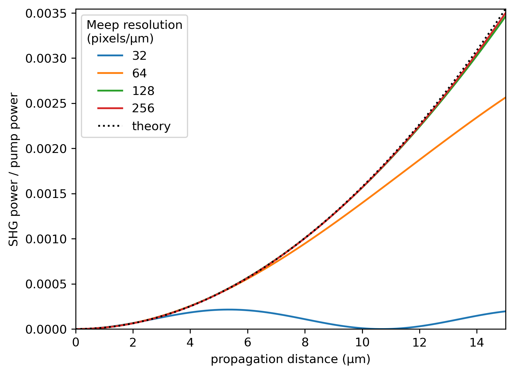

===================
Nonlinear Effects
===================

.. _nonlinear_phenomena:

Introduction
============

MEEP supports nonlinear optical simulations via materials with user defined :math:`\chi^{(2)}` or :math:`\chi^{(3)}` nonlinear susceptibilities. In this section, we will provide example simulations of both second and third order nonlinear effects: second harmonic generation under different phase matching conditions and optical bistability. We hope these examples will be useful for new MEEP users looking to simulate nonlinear effects, as the official MEEP documentation provides only a single `example simulation on nonlinearities <https://meep.readthedocs.io/en/latest/Python_Tutorials/Third_Harmonic_Generation/>`_.

First, we will give a very brief introduction on nonlinear optics. Within the linear regime where the optical electric field :math:`\tilde{E}` is not very large, the material polarization :math:`\tilde{P}` is given by

.. math::

   \tilde{P} = \varepsilon_0 \chi^{(1)} \tilde{E},

where :math:`\varepsilon_0` is the vacuum permittivity and :math:`\chi^{(1)}` is the linear susceptibility. However, if the electric field is sufficiently large (i.e. intensity is high), the linear relationship no longer holds and nonlinear correction terms are required. In this case, the material polarization can be written as 

.. math::

   \tilde{P} = \varepsilon_0 \left[ \chi^{(1)} \tilde{E} + \chi^{(2)} \tilde{E}^2 + \chi^{(3)} \tilde{E}^3 + \ldots \right],

where :math:`\chi^{(2)}` and :math:`\chi^{(3)}` are second and third order nonlinear susceptibilities, respectively. The powers of the electric field have severe consequences, some of which can be deduced with a simple treatment.

If we write the optical electric field as the sum of a complex field and it's complex conjugate :math:`\tilde{E} = E e^{-\mathrm{i} \omega t} + E^* e^{\mathrm{i} \omega t}`, the second order nonlinear polarization becomes

.. math::

   \tilde{P}^{(2)} = \varepsilon_0  \chi^{(2)} \tilde{E}^2 = \varepsilon_0  \chi^{(2)} \left(E^2 e^{-\mathrm{i} 2\omega t} + (E^*)^2 e^{\mathrm{i} 2\omega t} + \lvert E \rvert ^2 \right).

We notice that the first and second term inside the brackets are complex conjugates of each other, so the imaginary part cancles out and we are left with a term that is oscillating at twice the initial frequency. The oscillating polarization acts as a new source of light, and therefore frequency doubled light is generated! This phenomenon is known as second harmonic generation, and we will study it closer in demo 1.

We can expand the third order nonlinear polarization in a similar way. If we do this and examine only the term that is oscillating at the incident frequency :math:`\omega`, we obtain

.. math::

   \tilde{P}^{(3)}(\omega) = 3\varepsilon_0  \chi^{(3)}  \lvert E \rvert ^2 E e^{-\mathrm{i} \omega t}.

Now the total polarization oscillating at :math:`\omega` consists of the regular linear contribution, as well as a nonlinear contribution. We can write the total polarization at frequency :math:`\omega` as 

.. math::

   \tilde{P}^{\mathrm{tot}}(\omega) = \varepsilon_0 \chi^{(1)} E e^{-\mathrm{i} \omega t} + 3\varepsilon_0  \chi^{(3)}  \lvert E \rvert ^2 E e^{-\mathrm{i} \omega t} = \varepsilon_0 \left(  \chi^{(1)}  + 3 \chi^{(3)}  \lvert E \rvert ^2 \right) E e^{-\mathrm{i} \omega t} = \varepsilon_0 \chi_{\mathrm{eff}} E e^{-\mathrm{i} \omega t},

where we have defined an effective susceptibility :math:`\chi_{\mathrm{eff}}=\chi^{(1)}  + 3 \chi^{(3)}  \lvert E \rvert ^2` as the sum of linear and nonlinear contributions. If we recall that in general, the refractive index is given by :math:`n=\sqrt{1+\chi}` and that the intensity of the light is proportional to :math:`\lvert E \rvert ^2`, we can observe that intensity of the light affects the effective refractive index experienced by the light! This effect is known as an intensity-dependent refractive index or self-phase modulation, and we will examine one concequence of it, optical bistability, in demo 2.

.. note::

   The above reasoning is sufficient for getting a sense of the nonlinear effects, but a more rigorous treatment would be required for making actual calculations.

Demo 1: Second Harmonic Generation
==================================

This demo provides an example a simulation of nonlinear processes in MEEP with second harmonic generation (SHG). It is a second order nonlinear process, where light with frequency :math:`\omega` is injected to a material with a second order nonlinear susceptibility :math:`\chi^{(2)}`, and new light with frequency :math:`2 \omega` is generated. We have used the `example simulation on third harmonic generation <https://meep.readthedocs.io/en/latest/Python_Tutorials/Third_Harmonic_Generation/>`_ from the official documentation as a starting point for this demo, but we will expand on it significantly by studying the evolution of the second harmonic field during propagation under different phase matching conditions.

This demo will discuss the following practical matters of simulation:

- Materials with :math:`\chi^{(2)}` nonlinearity
- Units with second order nonlinearities
- Resolution convergence analysis
- Materials with predefined dispersion using `meep.materials library <https://meep.readthedocs.io/en/latest/Materials/>`_

The code used to produce this demo is available at TODO.

SHG without Dispersion: Perfect Phase Matching
----------------------------------------------

First, we will simulate SHG without the presence of dispersion (same refractrive index for all frequencies). The desired simulation behaviour is presented schematically below TODO. We want to place a pump source with wavelength 1064 nm in a :math:`\chi^{(2)}` material, and then measure the output spectrum after propagtion in a 1D simulation. We will use lithium niobate (LiNbO\ :sub:`3`\ ) as the nonlinear material, which is a common material in second order nonlinear optics applications.

First, we import the required libraries and define parameters:

.. code-block:: python

   import numpy as np
   from matplotlib import pyplot as plt
   import meep as mp
   from meep.materials import LiNbO3

   c = 2.998e8  # speed of light
   a = 1e-6  # charasteristic length scale

   # Nd:YAG laser wavelength 1064 nm converted to MEEP frequency units
   f_pump = a/1064e-9

   # permittivity at source frequency. The .epsilon() returns the
   # permittivity tensor, so we index an element that is on the diagonal
   eps = LiNbO3.epsilon(f_pump)[0,0]
   n0 = np.sqrt(eps)  # refractive index

Next, we define a simulation function that propagates the input pulse in a :math:`\chi^{(2)}` medium and measures the output spectrum, as described in the above figure. A nonlinear optical simulation can be implemented simply by using a material with nonzero nonlinear susceptibility. We are simulating the case without dispersion, so we are using a constant refractive index that corresponds to the refractive index of LiNbO\ :sub:`3`\  at the pump frequency.

.. code-block:: python

   def chi2_propagation(chi2, f_pump, amplitude, resolution):
      """Propagate pulse in a second order nonlinear material and measure
      output spectrum.

      :param chi2: float, second order nonlinear susceptibility
      :param f_pump: float, pump frequency
      :param amplitude: float, pump current amplitude J
      :param resolution: int, resolution of simulation
      :return: (np.ndarray, np.ndarray), output spectral powers and
      corresponding frequencies
      """

      # perfectly matched layers
      pml_size = 2.0
      pml_layers = [mp.PML(pml_size)]

      # define simulation cell (15 µm propagation distance)
      cell_len = 15 + 2*pml_size
      cell = mp.Vector3(0, 0, cell_len)

      # define pump source
      source_loc = mp.Vector3(0, 0, -0.5*cell_len + pml_size)
      f_width = f_pump/20.0
      sources = [
         mp.Source(
               mp.GaussianSource(f_pump, fwidth=f_width),
               component=mp.Ex,
               center=source_loc,
               amplitude=amplitude,
         )
      ]

      # material of the simulation. Note the constant epsilon and hence
      # constant refractive index (no dispersion) and second order nonlinear
      # susceptibility chi2
      default_material = mp.Medium(epsilon=LiNbO3.epsilon(f_pump)[0,0], chi2=chi2)

      # define simulation object
      sim = mp.Simulation(
         cell_size=cell,
         sources=sources,
         boundary_layers=pml_layers,
         default_material=default_material,
         resolution=resolution,
         dimensions=1,
      )

      # define flux object for measuring the spectrum after propagation
      f_min = f_pump/2
      f_max = f_pump*3.5
      n_freq = 600
      end_loc = mp.Vector3(0, 0, 0.5*cell_len - pml_size)
      trans = sim.add_flux(
         0.5*(f_min + f_max),
         f_max-f_min,
         n_freq,
         mp.FluxRegion(end_loc),
      )
      
      # run for sufficiently long such that the pulse has fully passed
      # through the end of the material
      sim.run(until=250)

      # retrieve spectral powers and corresponding frequencies
      trans_flux = mp.get_fluxes(trans)
      freqs = mp.get_flux_freqs(trans)

      return np.array(trans_flux), np.array(freqs)

Next, we determine the value of :math:`\chi^{(2)}` we will use for our material. It turns out that if we define :math:`\chi^{(2)}` in terms of the dimensionless product :math:`\chi^{(2)}E_\text{pump}`, where :math:`E_\text{pump}` is the pump amplitude, we will spare ourselves the effort of converting the value of :math:`\chi^{(2)}` from MEEP natural units to SI units when comparing simulation results to theoretical predictions later, since the value of the dimensionless product is the same regardless unit system. We choose :math:`\chi^{(2)}E_\text{pump}=0.003`, and then we have to find the value of :math:`E_\text{pump}` in MEEP units and set :math:`\chi^{(2)}=\frac{0.003}{E_\text{pump}}`.

Note that we are using this procedure to deal with the units, not (only) because we are too lazy to convert from MEEP units to SI units, but mainly because it follows the spirit of the official recommended way of dealing with units in nonlinearities. Units of second order nonlinearities are not explicitly discussed in the official documentation, but our approach aligns closely with the `official recommended procedure for Kerr nonlinearities <https://meep.readthedocs.io/en/latest/Units_and_Nonlinearity/#kerr-nonlinearities>`_. If you ever find yourself in an situation where you need to convert units of electric fields or nonlinear susceptibilities from MEEP units to SI units, it is highly likely that you don't actually need to do so and you should instead look for a way of expressing the quantity as a dimensionless ratio or product.

We will use a Gaussian source with current amplitude :math:`J=1`. Because sources in MEEP are current sources, we have to calculate the resulting electric field amplitude when the current is oscillating at the chosen amplitude. In our 1D simulation, the electric amplitude field is given by :math:`E_\text{pump}=\frac{1}{2}ZJ`, where :math:`Z=\sqrt{\frac{\mu}{\varepsilon}}` is the impedance of the medium (note that :math:`\mu=1` in MEEP units) and the factor :math:`\frac{1}{2}` appears because the electric field is split equally between left and and right propagating parts. Note that `there is no general formula for relating current amplitude and electric field amplitude <https://meep.readthedocs.io/en/latest/FAQ/#how-does-the-current-amplitude-relate-to-the-resulting-field-amplitude>`_ in higher dimension, and we can relate them with the above formula only because we are working with a 1D simulation.

Finally, we are using a Gaussian source, but the theory on SHG we will soon encounter assumes a plane wave source. It turns out the Gaussian peak amplitude can be converted to an effective plane wave amplitude by dividing by :math:`\sqrt{2}`. Using all this information, are now ready to determine the value of :math:`\chi^{(2)}` as follows:

.. code-block:: python

   source_amplitude = 1  # source current amplitude J
   Z = np.sqrt(1/eps)  # impedance of medium
   E = Z*source_amplitude/2  # electric field amplitude
   E /= np.sqrt(2)  # Gaussian source

   chi2_E_prod = 0.003  # dimensionless product
   chi2 = chi2_E_prod / E  # in MEEP units

We can now run the simulation. We will first obtain a reference power spectrum without nonlinearities by setting :math:`\chi^{(2)}=0`, after which the simulation is repeated with the desired :math:`\chi^{(2)}` value. We will use a resolution 256 for now, but we will examine the effect of resolution more closely later.

.. code-block:: python

   res = 256
   reference_trans_flux, freqs = chi2_propagation(chi2=0, f_pump=f_pump,
                                     amplitude=source_amplitude, resolution=res)
   trans_flux, freqs = chi2_propagation(chi2=chi2, f_pump=f_pump,
                                        amplitude=source_amplitude, resolution=res)

The results of the simulation are then plotted as follows:

.. code-block:: python

   fig, ax = plt.subplots()

   # convert frequencies from MEEP units to SI units
   freqs_SI = freqs * c/a

   norm = np.max(reference_trans_flux)
   ax.semilogy(freqs_SI*1e-12, trans_flux/norm,
               label=fr"$\chi^{{(2)}}={chi2_E_prod}/E_{{\text{{pump}}}}$")
   ax.semilogy(freqs_SI*1e-12, reference_trans_flux/norm, linestyle="--",
               label=rf"$\chi^{{(2)}}$={0}")
   ax.set_xlabel("frequency (THz)")
   ax.set_ylabel("transmitted power (a.u.)")
   ax.set_xlim([freqs_SI[0]*1e-12, freqs_SI[-1]*1e-12])
   ax.set_ylim([1e-6, 2])
   ax.legend()
   ax.grid(True)

.. figure:: nonlinear_phenomena_figures/shg_spectrum.png
   :alt: test text
   :width: 90%
   :align: center

We can observe that without nonlinearities, there is only a single peak corresponding to the pump source, which is the expected result. However, when the simulation is performed in a medium with a nonzero :math:`\chi^{(2)}`, new frequencies are created at twice and three times the initial frequency! The peak at twice the initial frequency is caused by SHG, and the peak at three times the initial frequency is a result from a sum frequency generation process between the pump and SHG fields. In fact, if we extended the measured frequency range, we would see peaks of decreasing power at every integer multiple of the initial frequency resulting from frequency mixing processes of the newly generated fields.

We have chosen the parameters such that the SHG field has more than two orders of magnitude less power than the pump field. This means that we can safely use the undepleted pump assumption, which makes our treatment slightly simpler.

So far, everything we have done follows closely the `example simulation on third harmonic generation <https://meep.readthedocs.io/en/latest/Python_Tutorials/Third_Harmonic_Generation/>`_ from the official documentation. Next, we will expand on the official example and study the evolution of the SHG field during propagation. We will place multiple monitors along the propagation length that measure the power at twice the initial frequency. Also, we will measure the initial pump power for reference. This is achieved by modifying the simulation function as follows. The new parameter :code:`flux_spectrum` determines whether the output spectrum or evolution of SHG field is measured and returned. We have written explicitly only those parts of the function that are modified. The full simulation script is available on GitHub TODO.

.. code-block:: python

   def chi2_propagation(chi2, f_pump, amplitude, resolution,
                        flux_spectrum=True):

      # ... beginning of function is identical as before

      end_loc = mp.Vector3(0, 0, 0.5*cell_len - pml_size)
      if flux_spectrum:
         # define flux object for measuring the spectrum after propagation.
         f_min = f_pump/2
         f_max = f_pump*3.5
         n_freq = 600
         trans = sim.add_flux(0.5*(f_min + f_max), f_max-f_min, n_freq, mp.FluxRegion(end_loc))
      else:
         # monitor power at SHG frequency in different locations along
         # propagation length
         n_monitors = 100
         monitor_locs_z = np.linspace(source_loc[2], end_loc[2], n_monitors)
         propagation_shg_fluxes = []
         for z in monitor_locs_z:
               # measure flux at twice the pump frequency             
               shg_flux = sim.add_flux(2*f_pump, 0, 1, mp.FluxRegion(mp.Vector3(0, 0, z)))
               propagation_shg_fluxes.append(shg_flux)
         
         # measure initial pump power for reference. Note that flux object
         # cannot be exactly on top of source because equal power is emitted
         # to the left and right of the source.
         pump_flux = sim.add_flux(f_pump, 0, 1, mp.FluxRegion(source_loc+mp.Vector3(0, 0, 0.1)))
      
      # run for sufficiently long such that the pulse has fully passed
      # through the end of the material
      sim.run(until=250)

      if flux_spectrum:
         # retrieve spectral powers and corresponding frequencies.
         trans_flux = mp.get_fluxes(trans)
         freqs = mp.get_flux_freqs(trans)

         return np.array(trans_flux), np.array(freqs)

      else:
         # retrieve SHG power along propagation
         propagation_shg_powers = []
         for flux in propagation_shg_fluxes:
               propagation_shg_powers.append(mp.get_fluxes(flux))
         
         # retrieve pump power
         pump_power = mp.get_fluxes(pump_flux)
         
         return ( np.array(propagation_shg_powers).flatten(),
                  # change coordinates such that source is at z=0
                  monitor_locs_z-source_loc[2],
                  pump_power )

Next, we will run the new simulation function and obtain the SHG power at multiple different propagation distances. We perform a resolution convergence analysis by running the simulation at multiple different resolutions. The chosen resolutions are powers 2 in the range [32, 256].

.. code-block:: python

   # perform convergence analysis by doubling resolution repeatedly
   resolutions = 32 * 2**np.arange(4)
   shg_powers = []

   for res in resolutions:
      # measure SHG power during propagation and initial pump power
      shg_power, z, pump_power = chi2_propagation(chi2=chi2, f_pump=f_pump,
                                     amplitude=source_amplitude, resolution=int(res),
                                     flux_spectrum=False)
      shg_powers.append(shg_power)

   shg_powers = np.array(shg_powers)

We will compare the MEEP simulation to the analytical expression predicted by the theory. Starting from Maxwell's equations, it can be shown that the propagation evolution of the SHG intensity :math:`I_2` is given by

.. math::

   I_2(z)= \frac{\omega_1^2 ( \chi^{(2)} )^2}{2 \varepsilon_0 n_0^3 c^3} I_1^2 z^2,

where :math:`\omega_1` and :math:`I_1` are the pump frequency and intensity, :math:`n_0` is the refractive index, and :math:`z` is the propagation distance. The SHG intensity is expected to grow quadratically as a function propagation distance when no dispersion is present. `It is recommended to use real E-fields in MEEP simulations involving nonlinearities <https://meep.readthedocs.io/en/latest/Materials/#nonlinearity>`_, for which the relation :math:`I=\frac{1}{2} \varepsilon_0 n_0 c E^2` holds. Using this relation, the above equation can be written as

.. math::

   \frac{I_2}{I_1} = \frac{P_2}{P_1} = \frac{\omega_1^2}{4 n_0^2 c^2} \left(\chi^{(2)}E_\text{pump}\right)^2 z^2,

where P is the optical power. The equation is now in a form where it is convenient to convert between MEEP units and SI units; the ratio on the left side is dimensionless so it's value is independent of units, and the right side features the dimensionless product :math:`\chi^{(2)}E_\text{pump}` whose value is also the same in MEEP units and SI units.

We can now plot a comparison of the MEEP simulation results and theory prediction:

.. code-block:: python

   fig, ax = plt.subplots()

   # plot the power ratio simulated in MEEP
   ax.plot(z, shg_powers.T/pump_power, label=resolutions)

   # calculate power ratio predictedy by theory
   z_theory = np.linspace(0, z[-1]*a, 200)
   f_pump_SI = f_pump * c/a  # convert f from MEEP units to SI units
   omega_pump_SI = 2*np.pi*f_pump_SI
   power_ratio_theory = omega_pump_SI**2 / (4*n0**2*c**2) * (chi2_E_prod)**2 * z_theory**2

   # plot power ratio predicted by theory
   ax.plot(z_theory/a, power_ratio_theory, "k:", label="theory")

   ax.set_xlabel("propagation distance (µm)")
   ax.set_ylabel("SHG power / pump power")
   ax.set_xlim([0, z[-1]])
   ax.set_ylim([0, power_ratio_theory[-1]])
   leg = ax.legend()
   leg.set_title("MEEP resolution\n(pixels/µm)")

We can see that at a resolution of 256, the MEEP simulation result has converged to a nice agreement between the theoretical curve. The SHG power is increasing quadratically as a function of propagation distance. Still, the agreement between MEEP and theory is not perfect, which could be caused by the fact we are assuming in the theory that the pump is not losing any energy to the SHG field. While this assumption quite accurate with our chosen parameters, as seen from figure of the spectral powers, the assumption is not completely accurate.

Interestingly, when the resolution is too low, we get completely incorrect behaviour. The curve corresponding to a resolution of 32 looks like a there is a phase matching problem, even though there is actually perfect phase matching when dispersion is not used in the simulation. For reference, the official documentation recommends to use a resolution corresponding to at least 8 pixels per shortest wavelength, which for our parameters is equivalent to :math:`8/\lambda_\text{min}=8/(1/(2 n_0 f_\text{pump}))\approx 33.6`, where everything is in MEEP units and :math:`\lambda_\text{min}` is the wavelength of the SHG field inside the medium. We can see that we need a significantly higher resolution to get a good agreement with theory. It could be that nonlinear simulations require much higher resolutions than the recommended 8 pixels per shortest wavelength.

SHG with Dispersion: Phase Matching Problem
-------------------------------------------

Having successfully conquered SHG without the presence of disersion, we will move on to simulate SHG in a material with dispersion, giving rise to the phase matching problem. Dispersion can be simulated easily in MEEP by importing materials with predefined dispersion from the `meep.materials library <https://meep.readthedocs.io/en/latest/Materials/>`_. It is also possible to use `user defined dispersion <>https://meep.readthedocs.io/en/master/Materials/#material-dispersion`_, but we will restrain ourselves to using only predefined dispersion in this demo.

The predefined dispersion relation of LiNbO\ :sub:`3`\ can be plotted as follows:

.. code-block:: python

   freqs = np.linspace(0.2, 2.5, 100)  # in MEEP units
   freqs_SI = freqs * c/a  # convert to SI units

   # .epsilon() returns the permittivity tensor at given frequency,
   # so we index an element that is on the diagonal
   epsilon = np.array([LiNbO3.epsilon(f)[0][0] for f in freqs])
   n = np.sqrt(epsilon)

   # plot dispersion relation
   fig, ax = plt.subplots()
   ax.plot(freqs_SI*1e-12, n)

   # draw vertical lines at pump and SHG frequencies
   ax.plot([f_pump_SI*1e-12, f_pump_SI*1e-12], [0, 10], 'k-', label='pump frequency')
   ax.plot([2*f_pump_SI*1e-12, 2*f_pump_SI*1e-12], [0, 10], 'k--', label='SHG frequency')

   ax.set_xlabel('frequency (THz)')
   ax.set_ylabel('refractive index')
   ax.set_xlim([freqs_SI[0]*1e-12, freqs_SI[-1]*1e-12])
   ax.set_ylim([n.min(), n.max()])
   ax.legend(loc='upper left')

We can observe that the pump field and SHG field experience different refractive indices. This leads to the phase matching problem which inhibits the growth of the SHG intensity during propagation. The physical mechanism behind the phase matching problem can described in many different ways, one of which states that the nonlinear polarization response oscillating twice the pump frequency effectively experiences the same refractive index as the pump field. However, the SHG field experiences a different refractive index than the polarization response generating the field, which means that periodically the polarization response is generating a SHG field that cancels out the existing SHG field. This prevents the quadratic growth of SHG intensity during propagation, and leads to a weak sinusoidal SHG intensity as a function of propagation distance.

We update our simulation function as follows to include dispersion. The new :code:`dispersion` parameter determines whether dispersion is used.

.. code-block:: python

   def chi2_propagation(chi2, f_pump, amplitude, resolution,
                        flux_spectrum=True, dispersion=False):

   # ... beginning of function is identical as before

   if dispersion:
      # dispersion is automatically included with the imported material
      default_material = LiNbO3
      # add nonlinearity
      default_material.E_chi2_diag = mp.Vector3(chi2, chi2, chi2)

   else:
      # note the constant epsilon (no dispersion) and
      # second order nonlinear susceptibility chi2
      default_material = mp.Medium(epsilon=LiNbO3.epsilon(f_pump)[0,0], chi2=chi2)

   # end of function is identical as before ...

We can now run the simulation with dispersion. We will again perform a resolution convergence analysis.

.. code-block:: python

   # perform convergence analysis by doubling resolution repeatedly
   resolutions_disp = 32 * 2**np.arange(6)
   shg_powers_disp = []

   for res in resolutions_disp:
      # measure SHG power during propagation and initial pump power
      shg_power_disp, z, pump_power_disp = chi2_propagation(chi2=chi2, f_pump=f_pump,
                                               amplitude=source_amplitude,
                                               resolution=int(res), flux_spectrum=False,
                                               dispersion=True)
      shg_powers_disp.append(shg_power_disp)

   shg_powers_disp = np.array(shg_powers_disp)

Quasi-Phase Matching
--------------------

lorem ipsum

Demo 2: Optical Bistability
===========================

lorem ipsum

Conclusions
===========
