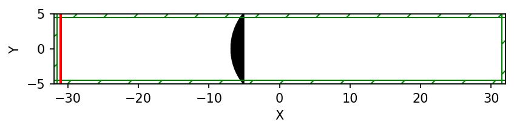

==========
Refraction
==========

.. _reflection_and_refraction:

In this chapter we show how to simulate refraction in MEEP. There are two demos. In the first one we observe refraction in lens with spherical surface and simulate the intensity of the electric field to estimate the focal length of the lens. The second simulation is about Luneburg Lens.

Demo 1: Refraction in lens
========================== 

First we import the libraries we need in this simulation.

.. code-block :: python

    import meep as mp
    import numpy as np
    import matplotlib.pyplot as plt

We create simulation area cell and perfectly mached layers around it

.. code-block :: python

    sx=64
    sy=10
    cell = mp.Vector3(sx,sy,0)
    dpml=0.5
    pml_layers=[mp.PML(dpml)]

The source used in this simulation is continuous source, which is located at 0.5 distance from PML layers of the left side of the cell and which spans over y-direction of the cell.

.. code-block :: python

    freq = 1
    sources = [
    mp.Source(mp.ContinuousSource(frequency = freq, is_integrated=True),
    center=mp.Vector3(-0.5 * sx + dpml+0.5, 0, 0),
    size=mp.Vector3(0,sy),
    component = mp.Ez)
    ]

We create the lens object by creating a sphere with defined radius and then create a block with refractive index of 1 which cuts off the wanted slice of the sphere at distance of lens width. Offset tell how much the lens is moved from the center of the cell. The radius of the lens can be changed but then you have to notice how much of the lens fits in the cell in y-direction. By changing the variable sy defined before creating the cell you can make the lens fit better to your cell. Also if you increase the radius of the lens or reduce the refractive index of the lens you need to make sure that the cell is long enough for you to be able to see the focal point of the lens. You can do this by changing the variable sx.

.. code-block :: python

    offset = -7
    radius = 8
    lens_index = 1.5
    lens_width = 2
    geometry=[mp.Sphere(center=mp.Vector3(offset+radius,0),
        radius=radius,
        material=mp.Medium(index=lens_index)),
        mp.Block(mp.Vector3(2*radius,mp.inf,mp.inf),
        center=mp.Vector3(offset+lens_width+radius,0),
        material=mp.Medium(index=1.0))
        ]

Then we create the simulation object with all the cell, PML layers, geometry and source created above. You can change the value of resolution to bigger value, but the simulations might take longer to run. We force complex field on, because then we can easily measure the intensity of the electric field.

.. code-block :: python

    resolution=20
    sim = mp.Simulation(cell_size=cell,
                        boundary_layers=pml_layers,
                        geometry=geometry,
                        sources=sources,
                        resolution=resolution,
                        force_complex_fields=True)

Now we run the simulation until 75. This time is long enough because then the wave has reached the right side of the cell and we don't observe change. We can use plot2D to easily see the geometry of the simulation. We can plot the electric field at the end of the simulation by using get_array. Now we have to notice that we are using complex field so to be able to plot them we take absolute values of the field data. To get the imshow to show the plot not upside down we define origin="lower".

.. code-block :: python

    sim.run(until=75)

    plt.figure(dpi=150)
    sim.plot2D()

.. code-block :: python

    eps_data = sim.get_array(center=mp.Vector3(), size=cell, component=mp.Dielectric)
    ez_data = sim.get_array(center=mp.Vector3(), size=cell, component=mp.Ez)
    plt.figure()
    plt.imshow(abs(eps_data).transpose(), interpolation="spline36", cmap="binary", origin="lower")
    plt.imshow(abs(ez_data).transpose(), interpolation="spline36", cmap="RdBu", alpha=0.9, origin="lower")

.. figure:: refraction_figures/lens_end_field.png
   :alt: test text
   :width: 90%
   :align: center

To estimate the focal length we examine the electric field at the middle of the cell in y-direction and from after the lens until the right side PML layer in x-direction by using get_array and defining corresponding center and size. The values of the fields are spaced equally so we can create the distance from the lens using linspace. We take both z-component of the electric field and x component of the Poynting vector to show how they relate to intensity. We also calcute the ratio of square of Ez and Sx. A numeric value of focal length is obtained by taking the index of maximum value of Sx and taking the value of distance corresponding to that index. Then we plot the values to visualize them and save the figure using savefig. The numeric value of focal length is shown in the title of the legend.

.. code-block :: python

    center_dataEz = sim.get_array(center=mp.Vector3((sx/2+offset)/2-dpml), size=mp.Vector3((sx/2-offset-dpml),0,0), component=mp.Ez)
    center_dataSx = sim.get_array(center=mp.Vector3((sx/2+offset)/2-dpml), size=mp.Vector3((sx/2-offset-dpml),0,0), component=mp.Sx)
    pointsEz = np.linspace(0,sx/2-offset-dpml,len(center_dataEz))
    pointsSx = np.linspace(0,sx/2-offset-dpml,len(center_dataSx))

    Ez2Sx = []
    i = 0
    while i < len(center_dataEz):
        Ez2Sx.append(abs(center_dataEz[i])**2/abs(center_dataSx[i]))
        i = i+1

    focal_length = pointsSx[np.argmax(center_dataSx)]

    plt.figure()
    plt.plot(pointsEz, abs(center_dataEz), label='Ez')
    plt.plot(pointsEz, abs(center_dataEz) ** 2, label='Ez**2')
    plt.plot(pointsSx, abs(center_dataSx), label='Sx')
    plt.plot(pointsSx, Ez2Sx, label='Ez**2/Sx')
    plt.legend(loc="upper right", title="f = {:.2f}".format(focal_length))
    plt.savefig("Intensity_after_lens.png")
    plt.show()

.. figure:: refraction_figures/Intensity_after_lens.png
   :alt: test text
   :width: 90%
   :align: center

We can create animation of the simulation using Animate2D object and at_every function.

.. code-block :: python

    sim.reset_meep()

    f = plt.figure(dpi=100)
    Animate = mp.Animate2D(fields=mp.Ez, f=f, realtime=False, normalize=True)
    plt.close()

    sim.run(mp.at_every(1, Animate), until=75)
    plt.close()

    filename = "./Lens_animation.mp4"
    Animate.to_mp4(10, filename)

We notice the ratio of :math:`\left|E_{z}\right|^{2}` and :math:`S_{x}` is 2 other than at the close vicinity from the lens where there is a lot of error. Intensity is defined as the magnitude of the Poynting vector but also corresponds to the square of the electric field:

.. math::

    \frac{1}{2}cn\varepsilon_{0}\left|{E}\right|^{2}

In meep speed of light and vacuum permittivity are defined as 1. Thus the square of Ez is twice as large as Sz as it should be.

Focal length depeds on refractive index and curvature of the lens according to Lens-Maker's equation:

.. math::

    \frac{1}{f}=(n-1)\left(\frac{1}{R_{1}}-\frac{1}{R_{2}}+\frac{(n-1)d}{nR_{1}R_{2}}\right)

In this simulation we have a simple case where only one of the surfaces is spherical, while the other one is flat. Thus :math:`R_{2}=\infty` and the equation simplify to:

.. math::

    f=\frac{R_{1}}{n-1}

The focal length is the length in the plot where the maximum intensity is reached. There is some error compared to Lens-Maker's equation because Lens-Maker's equation is based on geometrical optics, where MEEP does wave optics. MEEP takes into account effects such as diffraction, interference, near-field effects and reflection at the lens' surface. In our simulation the size of lens is only around 10 times the wavelength so the lens we consider is microscopic, which causes these phenomena have more effect. MEEP could be used to simulate larger lens, but the simulation times might grow long. In MEEP the legths are defined as fractions so by keeping the geometry the same and increasing frequency (decreasing wavelength) of the source we can simulate larger lens size. The resolution used in the simulation can limit the accuracy. When increasing the frequency, we need to increase the resolution to keep the results reasonable. Lens-Maker's equation assumes paraxial approximation. Thus the there is more error for thicker lens with smaller radius where the angle of incidence is larger.

Demo 2: Luneburg lens
=====================

Luneburg lens