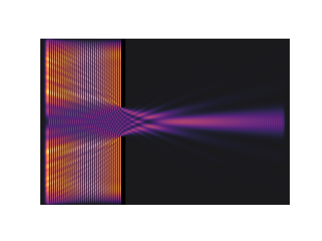
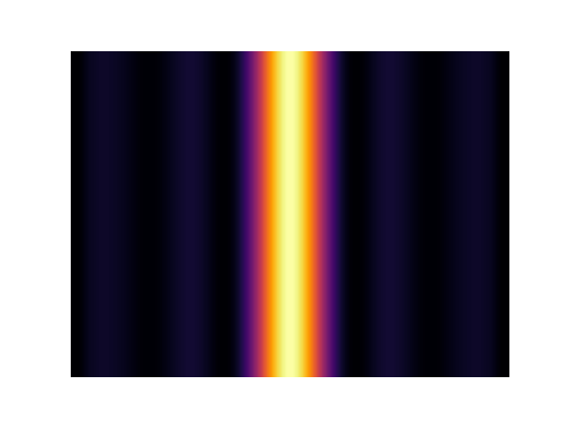
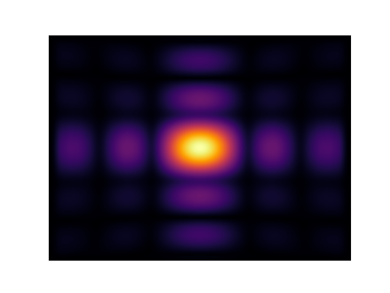
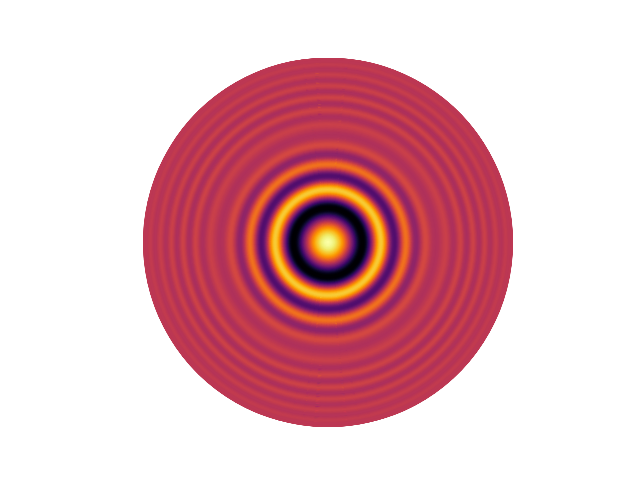

============
Symmetries and dimensions
============

.. _symmetries_and_dimensions:

Introduction
============

In these demos we will continue studying interference produced by light 
diffracting in an aperture. The key point in these demos will be the exploitation 
of symmetries and dimensions. We will focus mainly on showing simple use cases of 
the symmetries and higher dimensions. For curious readers, `Meeps 
official documentation <https://meep.readthedocs.io/en/latest/Exploiting_Symmetry/>`_ 
has more information about how Meep handles the symmetries and what requirements 
there are regarding them.

We will first show a simple 2-dimensional case with single slit diffraction. Building on this 
demo, we will expand it to 3 dimensions in the form of a rectangular slit. Lastly we will exploit 
the possibility of using cylindrical coordinates in the case of a circular aperture diffraction.

Demo 1: 2D-case
========================== 

We will firstly import all necessary libraries. In addition to the
libraries mentioned in previous sections we will also import 'h5py'.
H5py is a python package used for storing data in H5DF-form. In this
demo we will introduce only the very basics of using this package. A
more thorough tutorial can be found on the `h5py documentation <https://www.h5py.org>`_.

.. code-block :: python

   import h5py
   import meep as mp
   import matplotlib.pyplot as plt
   import numpy as np
   import os

Our simulation cell will be a 30 by 20 rectangle. For a more modular
code, we will make variable for the center of our cell. We form the
single slit by adding two blocks to the cell. We make sure the electric field will not 
penetrate the wall by giving the blocks substantial values for
epsilon. The cell will also be surrounded by the PML layer as in most
cases.

.. code-block :: python

   domain = [0, 30, -10, 10]

   center = mp.Vector3(
         (domain[1] + domain[0]) / 2,
         (domain[3] + domain[2]) / 2,
         )

   cell = mp.Vector3(
         domain[1] - domain[0],
         domain[3] - domain[2],
         )

   wallPos = 10
   wallWidth = 0.5
   apertureWidth = 1.5

   wallMaterial = mp.Medium(epsilon = 1e6)
   wallLength = (cell.y-2*apertureWidth)/2

   geometry = [mp.Block(mp.Vector3(wallWidth, wallLength, mp.inf),
               center = mp.Vector3(wallPos - center.x, domain[3] - wallLength/2),
               material = wallMaterial),
               mp.Block(mp.Vector3(wallWidth, wallLength, mp.inf),
               center = mp.Vector3(wallPos - center.x, domain[2] + wallLength/2),
               material = wallMaterial)]

   pmlThickness = 1
   pmlLayers = [mp.PML(pmlThickness)]

Our light source will produce 500 nm light as a wavefront which spans
the whole y-dircetion of the cell. We use Meeps ``ContinousSource`` object for
this and we set it just outside the left border PML.

.. code-block :: python

   sourceLambda = 0.5  # in μm
   sourceFrequency = 1 / sourceLambda

   source = mp.Source(
         src=mp.ContinuousSource(
            frequency=sourceFrequency,
            is_integrated=True,
            ),
         component=mp.Ez,
         center= mp.Vector3(1, 0, 0) - center,
         size=mp.Vector3(y=cell.y),
         )

The resolution of our simulation will be calculated with the smallest
length of our simulation as recommended by the Meeps official documentation.
We also set ``force_complex_fields`` to
True. This will automatically double the simulation time but
including the complex phase terms of our field is crucial for
simulating interference.

.. code-block :: python

   smallestLength = min(
         sourceLambda,
         wallWidth,
         apertureWidth
   )

   pixelCount = 10
   resolution = int(np.ceil(pixelCount / smallestLength))

   sim = mp.Simulation(
         cell_size=cell,
         sources=[source],
         boundary_layers=pmlLayers,
         geometry=geometry,
         resolution=resolution,
         force_complex_fields=True
         )

We extract the field and dielectric data into a h5 file. This is a
bit unnecessary for the 2D-case, but will come in very handy when we
increase dimensions to our simulation. Our h5-file consists of a
dataset for the dielectric data, which stays the same during our
simulation and therefore only needs one set of values, and a dataset
for the field values which has two sets of values; one of the initial
state of the simulation and one of the final state.

.. code-block :: python

   # Method for extracting Ez and dielectric data
   def getData(sim, cellSize):
         ezData = sim.get_array(
            center=mp.Vector3(), size=cellSize, component=mp.Ez)
         epsData = sim.get_array(
            center=mp.Vector3(), size=cellSize, component=mp.Dielectric)
         return ezData, epsData

   # Where to save the results
   simPath = 'simulation.h5'

   def simulate(sim, simPath):
         
         # Remove previous sim file
         if os.path.exists(simPath):
            os.remove(simPath)
         
         # Save data to an HDF5 file
         with h5py.File(simPath, 'a') as f:
            
            # Save initial state as first frame
            sim.init_sim()
            ezData, epsData = getData(sim, cell)
            f.create_dataset(
               'ezData',
               shape=(2, *ezData.shape),
               dtype=ezData.dtype,
               )
            f.create_dataset(
               'epsData',
               shape=epsData.shape,
               dtype=epsData.dtype,
               )
            f['ezData'][0]  = ezData
            f['epsData'][:] = epsData
         
            # Run until the the desired length
            sim.run(until=cell[0]+10)

            # Capture electral field data    
            ezData, _ = getData(sim, cell)
            f['ezData'][1]  = ezData

After defining the simulation and field extraction scheme, we can run
the simulation. The h5-file uses straightforward NumPy and Python
methaphors wich makes extracting the data back into our code trivial.

.. code-block :: python

   simulate(sim, simPath)

   # Grab dielectric and Ez data from the file
   with h5py.File(simPath, 'r') as f:
         finalSnap = f['ezData'][1]
         finalEps = f['epsData'][:]

Finally we plot the data. Each y-directional slice of the simulation
is expressed as a vector of one axis. To help visualize the
diffraction pattern, we use NumPys ``vstack``.

.. code-block :: python

   # Compute intensity as square of the complex amplitude
   finalSnap = np.abs(finalSnap)**2
   vmax = np.max(finalSnap[-1])

   # Plot simulation
   plt.figure(1)
   plt.imshow(finalEps.T,
               cmap='binary')
   plt.imshow(finalSnap.T,
               interpolation='spline36',
               cmap='inferno',
               alpha=0.9)
   plt.axis('off')
   plt.show()

   plt.figure(2)
   plt.imshow(
            np.vstack(finalSnap[-1]).T,
            cmap='inferno',
            aspect='auto',
            vmax=vmax,
            )
   plt.axis('off')
   plt.show()

Demo 2: 3D-case, rectangular aperture
========================== 

Adding data in the z-direction and thus increasing the dimensions from 2D to 3D 
does not require any explicit actions. We can simply use vectors with 3 objects 
instead of 2 and Meep will deduct the dimensions. This is because so far Meep has interpreted 
our vectors as ``(_,_,0)``, indicating the third dimension to be 0 (strictly speaking the 
dielectric data will be assumed uniform in that dimension).

.. code-block :: python

   import h5py
   import meep as mp
   import matplotlib.pyplot as plt
   import numpy as np
   import os

   SOL = 299792458e-9

   domain = [0, 30, -10, 10, -10, 10]

   center = mp.Vector3(
         (domain[1] + domain[0]) / 2,
         (domain[3] + domain[2]) / 2,
         (domain[5] + domain[4]) / 2
         )

   cell = mp.Vector3(
         domain[1] - domain[0],
         domain[3] - domain[2],
         domain[5] - domain[4]
         )

In our case, the dielectric and field data will have mirror symmetry over the y and the z -planes. 
Normally Meep does not take this into consideration and calculates the field values in every point 
in the space. If we, however tell Meep about the symmteries it will only store the number of values 
necessary considering the symmetries. The symmetries will be stored in a vector as Meeps ``Mirror`` 
objects.

.. code-block :: python

   symmetries = [mp.Mirror(mp.Y),
                  mp.Mirror(mp.Z, phase=-1)]

Note, that there is an additional ``phase`` argument on the z-directional symmetry. This is because 
the field symmetry requires information about the phase of the field. Even sources are implicated by a phase factor 
of +1 and odd sources by -1. By default the phase factor is set to +1. In our case, however the z-directional field will
be an odd source. 

Our dielectric data will consist of a rectangular hole in a wall. Defining 3D-structures in Meep requires 
a bit of creativity sometimes as we are limited to quite a narrow set of objects. We will construct 
the hole in the wall by adding 4 overlapping ``Block`` objects on the edges of the cell.

.. code-block :: python

   wallPos = 10
   wallWidth = 0.5
   apertureWidth = 1.5
   wallMaterial = mp.Medium(epsilon = 1e6)
   wallLength = (cell[1]-2*apertureWidth)/2

   geometry = [mp.Block(mp.Vector3(wallWidth, wallLength, mp.inf),
               center = mp.Vector3(wallPos - center.x, domain[3] - wallLength/2
                                    , 0), material = wallMaterial),
               mp.Block(mp.Vector3(wallWidth, wallLength, mp.inf),
               center = mp.Vector3(wallPos - center.x, domain[2] + wallLength/2
                                    , 0), material = wallMaterial),
               mp.Block(mp.Vector3(wallWidth, mp.inf, wallLength),
               center = mp.Vector3(wallPos - center.x, 0
                                    , domain[3] - wallLength/2), material = wallMaterial),
               mp.Block(mp.Vector3(wallWidth, mp.inf, wallLength),
               center = mp.Vector3(wallPos - center.x, 0
                                    , domain[2] - wallLength/2), material = wallMaterial)]

   pmlThickness = 1
   pmlLayers = [mp.PML(pmlThickness)]

Constructing the source follows directly from the 2D-case with the addition of using 3D-vectors.

.. code-block :: python

   sourceLambda = 0.5  # in μm
   sourceFrequency = 1 / sourceLambda

   source = mp.Source(
         src=mp.ContinuousSource(
            frequency=sourceFrequency,
            is_integrated=True,
            ),
         component=mp.Ez,
         center= mp.Vector3(1, 0, 0) - center,
         size=mp.Vector3(y=cell[1],z=cell[2]),
         )
      

In higher dimensionalities it is important to be cautious of the resolution and the simulation time. 
The simulation time will increase with a higher factor, the more dimesnions there are. In the 2D-case 
we used the smallest length of the simulation in choosing the resolution. If we were to use this method 
now, the simulation time would be in the vicinity of ~20 min with an average laptop. Due to this limitation 
it is very important to study the convergence with different resolutions in higher dimensions. 

Setting up the simulation is done again similarily with the addition of the symmetries into the ``Simulation`` 
object.

.. code-block :: python

   smallestLength = min(
         sourceLambda,
         wallWidth,
         apertureWidth
   )

   pixelCount = 10
   #resolution = int(np.ceil(pixelCount / smallestLength))
   resolution = 10

   sim = mp.Simulation(
         cell_size=cell,
         sources=[source],
         boundary_layers=pmlLayers,
         geometry=geometry,
         resolution=resolution,
         force_complex_fields=True,
         symmetries = symmetries
         )

   # Method for extracting Ez and dielectric data
   def getData(sim, cellSize):
         ezData = sim.get_array(
            center=mp.Vector3(), size=cellSize, component=mp.Ez)
         epsData = sim.get_array(
            center=mp.Vector3(), size=cellSize, component=mp.Dielectric)
         return ezData, epsData

We will use the exact same method for storing the values in to a h5-file as the dataset shape is defined 
by using the first frame of the simulation. 

.. code-block :: python

   # Where to save the results
   simPath = 'simulation.h5'

   def simulate(sim, simPath):
         
         # Remove previous sim file, if any
         if os.path.exists(simPath):
            os.remove(simPath)
         
         # Save data to an HDF5 binary file
         with h5py.File(simPath, 'a') as f:
            
            # Save initial state as first frame
            sim.init_sim()
            ezData, epsData = getData(sim, cell)
            f.create_dataset(
               'ezData',
               shape=(2, *ezData.shape),
               dtype=ezData.dtype,
               )
            f.create_dataset(
               'epsData',
               shape=epsData.shape,
               dtype=epsData.dtype,
               )
            f['ezData'][0]  = ezData
            f['epsData'][:] = epsData
         
            # Run until the next frame time
            sim.run(until=cell[0]+10)

            # Capture electral field data    
            ezData, _ = getData(sim, cell)
            f['ezData'][1]  = ezData

   simulate(sim, simPath)

Visualizing the 3D data in Meep is possible with using the ``plot3D()`` function on the simulation, 
but in most cases this method is not sufficient. This is where saving the data in a h5-file comes in handy. 
Now that our data is in a separate file, we can visualize it outside of python with for example 
`Paraview <https://www.paraview.org>`_ or in easily accessible websites such as `myhdf5 <https://myhdf5.hdfgroup.org/help>`_.

.. code-block :: python

   # Grap the final frame
   with h5py.File(simPath, 'r') as f:
         finalSnap = f['ezData'][1]

   # Compute intensity as square of the complex amplitude
   finalSnap = np.abs(finalSnap)**2
   vmax = np.max(finalSnap[-1])

   plt.figure(2)
   plt.imshow(
            finalSnap[-1].T,
            cmap='inferno',
            aspect='auto',
            vmax=vmax,
            )
   plt.axis('off')
   plt.show()

Demo 3: Cylindrical coordinates, circular apreture
========================== 

Next wwe will simulate the diffraction of light in a circular aperture. 
We could do this by exploiting two directional symmetry as in the previous 
demo, but Meep offers an even better method for this; cylindrical coordinates. 
Cylindrical symmetry can be activated in the simulation by defining 
the dimensions as ``CYLINDRICAL``. By doing so Meep interprets all vectors 
as :math:`(r,\theta,z)` where r is the radius of the cell, 
:math:`\theta` is the angle from the positive r-axis around z-axis and 
z is the length of the cell, instead of :math:`(x,y,z)`.  

.. code-block :: python

   dimensions = mp.CYLINDRICAL
   cellRadius = 20.0
   cellLength = 40.0

   cell_size = mp.Vector3(cellRadius,0,cellLength)

When there is full rotational symmetry we can set the values of :math:`\theta` 
to be zero.

This time we will construct the geometry of the cell by adding a singular block 
which spans from the edge of the aperture to the cell wall in radial direction. 
Because of cylindrical symmetry, this block will wrap around all values for 
:math:`\theta` and thus form a wall with a circular aperture.

.. code-block :: python

   wallPos = 10
   wallWidth = 0.5
   apertureRadius = 1
   wallMaterial = mp.Medium(epsilon = 1e6)

   geometry = [mp.Block(mp.Vector3(cellRadius - apertureRadius, 1e20, wallWidth),
                           center = mp.Vector3((cellRadius+apertureRadius)/2, 0, -17),
                           material = wallMaterial)]

   pmlThickness = 1.0
   pmlLayers = [mp.PML(pmlThickness)]

As a source, we will study the radial component of the field, while in previous 
demos we worked with the z-directional field component. Otherwise we follow 
a similar method.

.. code-block :: python

   sourceLambda = 0.5
   sourceFrequency = 1 / sourceLambda

   sources = [mp.Source(mp.ContinuousSource(sourceFrequency,fwidth=0.2*sourceFrequency,is_integrated=True),
                        component=mp.Er,
                        center=mp.Vector3(0.5*cellRadius,0,-0.5*cellLength+1),
                        size=mp.Vector3(cellRadius))]

For acquiring the data we could use the h5-files as before, but this time 
we handle the data solely inside python. This is done with the ``get_array()`` -method.

.. code-block :: python

   resolution = 25

   sim = mp.Simulation(cell_size=cell_size,
                     boundary_layers=pmlLayers,
                     resolution=resolution,
                     geometry=geometry,
                     sources=sources,
                     dimensions=dimensions,
                     force_complex_fields=True,
                     m=-1)

   sim.run(until=cellLength+10)

   nonpmlVol = mp.Volume(center=mp.Vector3(0.5*cellRadius),
                        size=mp.Vector3(cellRadius,0,cellLength))
   erData = sim.get_array(component=mp.Er,vol=nonpmlVol)
                                                                                
Due to the symmetry our data is not calculated along the whole cell,
but only at one specific :math:`\theta` value. Therefore we need to copy the data 
for all angular values. The data can then be plotted with pyplot in polar coordinates.

.. code-block :: python

   r = np.linspace(0,cellRadius,erData.shape[1])
   z = np.linspace(-0.5*cellLength,0.5*cellLength,erData.shape[0])
   
   theta = np.linspace(0,2*np.pi, 100)

   #making up some data    
   theta,r = np.meshgrid(theta,r)
   values_2d = np.sin(theta)*np.exp(-r)

   plt.subplots(1,1,subplot_kw=dict(projection='polar'))
   plt.pcolormesh(theta,r,np.tile(np.real(erData[-10]),
                     (100,1)).T, cmap='inferno', shading='gouraud')
   plt.axis('off')
   plt.show()

