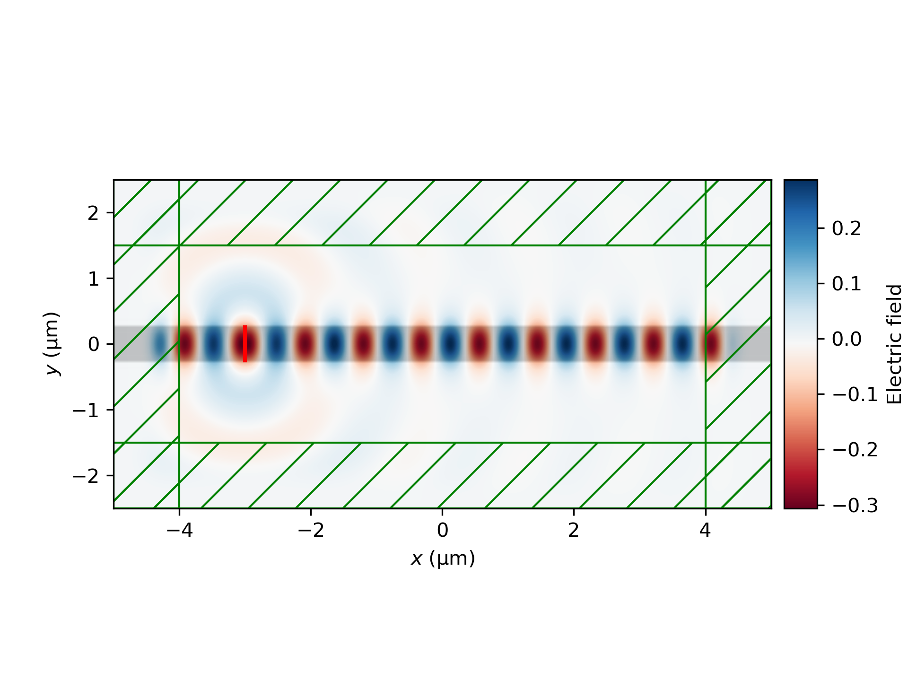
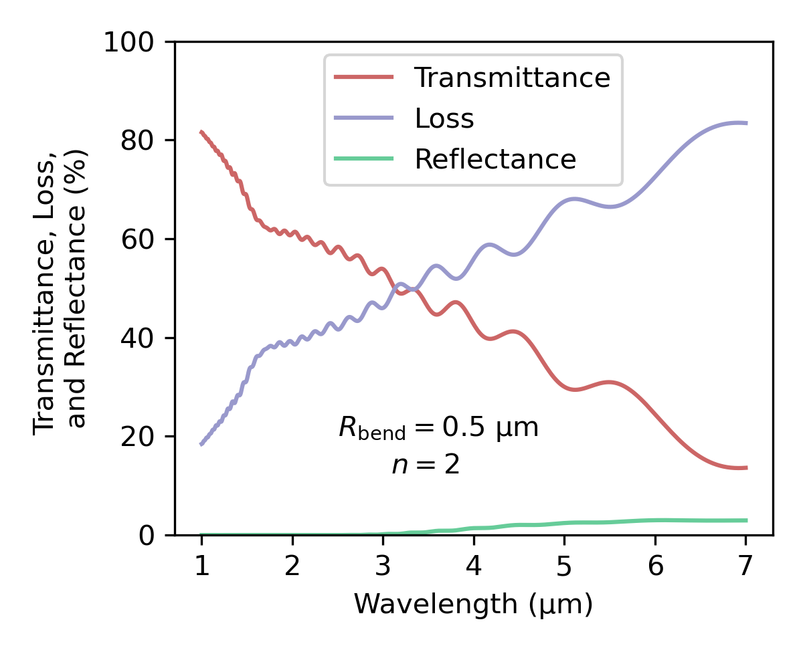

==========
Waveguides
==========

.. _waveguides:

Introduction
============

An optical waveguide is a structure that confines and directs light, ensuring it follows a desired path rather than dispersing. In layman's terms, a waveguide is essentially *a wire for light*. These waveguides play an important role in various applications, enabling technologies such as optical fiber communications and `photonic integrated circuits <https://www.rp-photonics.com/photonic_integrated_circuits.html>`_. In this section, we will discuss the basics on how Meep allows us to simulate these structures and provide some example simulations to accompany or to further explain the examples (`1 <https://meep.readthedocs.io/en/master/Python_Tutorials/Basics/#fields-in-a-waveguide>`_, `2 <https://meep.readthedocs.io/en/master/Python_Tutorials/Basics/#transmittance-spectrum-of-a-waveguide-bend>`_, and `3 <https://meep.readthedocs.io/en/master/Python_Tutorials/Resonant_Modes_and_Transmission_in_a_Waveguide_Cavity/>`_) provided by the official Meep documentation.

Before tackling the examples, we will explain briefly the basics behind waveguides to provide an initial understanding and intuition for the simulations. The confinement of light in a waveguide can happen through various ways, the most common of which is *total internal reflection*. Other means include for example the use of metallic reflectors or photonic crystals. Let's concentrate here on the simplest and most common case since it is enough for our purposes. 

A typical waveguide structure consists of a *core* with a higher refractive index :math:`n_1` and a surrounding *cladding* with a lower refractive index :math:`n_2`. Now, if the light is coming from the core towards the cladding, the light refracts at the interface according to Snell's law

.. math::

   n_1 \sin{\theta_1} = n_2 \sin{\theta_2},

where :math:`\theta_1` is the angle of incidence and :math:`\theta_2` is the angle of refraction. Because the light is traveling from optically denser medium to optically rarer medium, total internal reflection is possible if the angle of incidence is large enough. Using Snell's law, we can solve for the critical angle of incidence :math:`\theta_\text{c}` from which the phenomenon starts to occur. Setting :math:`\theta_2 = 90°`, we get the critical angle 

.. math::

   \theta_\text{c}=\arcsin{\left(\frac{n_2}{n_1}\right)}.

Hence, for larger angles of incidence than the critical angle, the light reflected at the interface back to the core. This is essentially the mechanism how the light can be trapped inside the waveguide. 

However, we must remember that this is just the principle explained using ray optics. For further analysis, we would need for example the help of Fresnel coefficients and a more rigorous mathematical treatment of waves as fields. 

Lastly, we briefly mention one phenomena that we will later observe in our waveguide simulations, *evanascent waves*. If we study the total internal reflection case with Maxwell's equations, we naturally get a solution with an incident wave and a reflected wave. Interestingly, the solution does not comply with Maxwell's equations without an exponentialy decaying field penetrating into the cladding material. This phenomenon enables *evanascent coupling* which is utilized for example in photonic integrated circuits. 

..
   TODO: Even though in the real world, waveguides are three-dimensional structures, they can often be simulated in two dimensions with the help of *effective refractive index*.

Demo 1: Straight Dielectric Waveguide
============

In this demo, we will get acquainted with the basics of simulating dielectric waveguides. We will simulate how an electric field generated by a continous wave source propagates in a straight dielectric waveguide. We will also learn a way to extract data from the simulation and to visualize the results by creating some figures and an animation. This demo is very similar to the one provided in Meep's official documentation but here we try explain the workflow in a little bit different way.

In this demo, we will discuss the following matters of simulation in Meep:

- Creating a simulation cell with dielectric waveguide regions which are simple in shape. 
- Defining a simple continuous wave source which is coupled to the waveguide. 
- Conducting a simple *convergence study* to determine a suitable resolution for a simulation. 
- Extracting data from the simulation during and after the simulation.
- Visualizing the simulation by creating figures and animating. 

Getting started 
----------------
Naturally, we need to import the libraries we need before any coding. In addition to Meep, we import also Numpy, Pyplot from Matplotlib, and h5py for visualization purposes.

.. code-block:: python

   import meep as mp
   import numpy as np
   import h5py
   import matplotlib.pyplot as plt
   from matplotlib.animation import FuncAnimation
   from matplotlib import cm
   from matplotlib.colors import TwoSlopeNorm

The next step is to define the region where Meep is calculating the fields, i.e. the simulation *cell*. This time we create a 2D cell of the size 10 µm :math:`\times` 5 µm :math:`\times` 0 µm. The cell is defined in a 3D vector whose elements tell the size of the cell. 

.. code-block:: python

   cell_x = 10
   cell_y = 5  
   cell_z = 0

   cell = mp.Vector3(cell_x, cell_y, cell_z)

Now it is time to add the actual waveguide to the cell. To do that, we need to define its dimensions and material. Here we want to simulate a 0.5 µm wide waveguide which is infinitely long and high. We choose our material to be silicon nitride (Si\ :sub:`3`\N\ :sub:`4`\ ). Its refractive index is around 2.0 at the wavelength of 1.55 µm [1]_. which is our wavelength region of interest in this case. 

The material is specified with a ``Medium`` object. We can define its refractive index with the parameter ``index``, or alternatively we could specify its dielectric constant :math:`\varepsilon` with the parameter ``epsilon``. The waveguide geometry can be defined with a ``Block`` object which needs the size, the center and the material. It is customary to store the created geometries in a list called ``geometry``.

.. code-block:: python

   wg_sx = mp.inf # length
   wg_sy = 0.5    # width
   wg_sz = mp.inf # height

   Si3N4 = mp.Medium(index=2.0)

   geometry = [mp.Block(mp.Vector3(wg_sx, wg_sy, wg_sz), 
                        center=mp.Vector3(0, 0, 0),
                        material=Si3N4)]

Next, we introduce the source of the electric field to our simulation. It is located on the left side of our simulation cell in the waveguide and it is defined as a line across the waveguide. We also specify the free space wavelength (in µm) of the field it generates. Here we also use the ``width`` parameter (in Meep time units) to turn on the source gradually in order to avoid exciting other frequencies because of the discontinuity. Also here it is customary to store the sources in a list called ``sources``. 

.. 
   TODO: Tutki tuo width-parameter-juttu?

.. code-block:: python

   # coordinates of the source
   source_x = -3
   source_y = 0
   source_z = 0

   wavelength = 1.55
   width = 5

   sources = [mp.Source(mp.ContinuousSource(wavelength=wavelength, width=width),
                        component=mp.Ez, 
                        center=mp.Vector3(source_x, source_y, source_z),
                        size=mp.Vector3(0, wg_sy, 0))]

It should also be specified what happens at the edges of the simulation cell. In this case, we want that when the field meets the boundary of the simulation cell, it does not reflect and interfere with the field propagating towards the boundaries. This can be done with the perfectly matched layers (PML) which absorb the incident field. Note that they need to have a finite thickness to avoid numerical errors related to the absorption. 

Here we create a 1-µm perfectly matched layers inside our simulation cell, stored in an object named ``pml_layers``. 

.. code-block:: python

   pml_w = 1.0
   pml_layers = [mp.PML(pml_w)]

We must specify the resolution according to which the space and time are discretized. In Meep, this is done by a single variable ``resolution`` which defines the number of pixels per a distance unit. We will set it to 20 for now, but we will get back to this once we are discussing the convergence study. 

.. code-block:: python

   resolution = 20
   
Finally, we define the simulation object which contains the different objects we have defined earlier.

.. code-block:: python

   sim = mp.Simulation(cell_size=cell,
                    boundary_layers=pml_layers,
                    geometry=geometry,
                    sources=sources,
                    resolution=resolution)

Now, before running the simulation, it is a good idea to check that we have set it up correctly. With a function ``plot2D()``, we can see the waveguide geometry, the source, and the perfectly matched layers. Don't forget to show (or save) the figure!

.. code-block:: python

   sim.plot2D()
   plt.show()

You can see the waveguide geometry as the black area, the source as the red line and PMLs at the edges of the cell. Everything looks good! 

Running the simulation and basic visualization
----------------------------------------------

Now we can specify the time until which the simulation runs and run the simulation.

.. code-block:: python

   sim_time = 200
   plt.savefig("1_simulation_setup.pdf")
   sim.run(until=sim_time)

Now that the simulation has run, we can use ``plot2D()`` to see what kind of result we have obtained. Here we need to tell which field and which component we want to see. We'd like to see the :math:`z`-component of the electric field.

.. code-block:: python
    
   sim.plot2D(fields=mp.Ez)
   plt.savefig("2_after_first_run.pdf")
   plt.show()

It is nice figure but if you want more control how to figure looks, you could plot it more manually. Here we show one way of extracting the data from the simulation after it has run and visualizing it using Matplotlib. 

.. code-block:: python

   # dielectric constant in the simulation cell (i.e. the waveguide geometry)
    eps_data = sim.get_array(center=mp.Vector3(0, 0, 0), size=cell, component=mp.Dielectric).T 

   # the z-component of the electic field
   ez_data = sim.get_array(center=mp.Vector3(0, 0, 0), size=cell, component=mp.Ez).T

   fig = plt.figure()
   ax = fig.add_subplot(1, 1, 1)
   ax.imshow(eps_data, extent=[0, cell_x, 0, cell_y], cmap='binary')

   # determine the global minimum and maximum of the field
   data_min = ez_data.min()
   data_max = ez_data.max()
   print(f"min: {data_min}, max: {data_max}")

   # create a custom colormap where zero is white
   cmap = cm.RdBu  # Base colormap
   norm = TwoSlopeNorm(vmin=data_min, vcenter=0, vmax=data_max)

   ez_image = ax.imshow(ez_data, extent=[0, cell_x, 0, cell_y], cmap=cmap,
                        norm=norm, alpha=0.9, interpolation="spline16")
   fig.colorbar(ez_image, label="Electric field", ax=ax, orientation='horizontal')
   ax.set_xlabel(r"$x$ (µm)")
   ax.set_ylabel(r"$y$ (µm)")

   plt.savefig("3_improved_figure.pdf")
   plt.show()

Investigating the convergence
-----------------------------

One important question might arise at some point during our numerical experiments: do we know that the current resolution is sufficient? We can determine the sufficient resolution by doing a convergence study. In practice, this can be done by making the simulation with different resolutions and seeing when the simulation results do not change (significantly), i.e. seeing if the simulation has been converged. 

There are multiple ways of doing this but here we choose to inspect the magnitude of the electric field at two different points in and just outside the waveguide after the simulation is run. By doing this, we can get some sort of an idea about the sufficiency of the resolution. 

.. code-block:: python

   resolutions = np.array([5.0, 10.0, 20.0, 40.0, 80.0])

   wg_point = mp.Vector3(4, 0, 0)
   wg_results = np.zeros_like(resolutions, dtype=object)

   outside_point = mp.Vector3(2, 0.27, 0)
   outside_results = np.zeros_like(resolutions, dtype=object)

   for i, resolution in enumerate(resolutions):
      sim = mp.Simulation(
         cell_size=cell,
         boundary_layers=pml_layers,
         geometry=geometry,
         sources=sources,
         resolution=resolution,
         force_complex_fields=True,
      )
      sim.run(until=sim_time)

      wg_results[i] = np.abs(sim.get_field_point(mp.Ez, wg_point))
      outside_results[i] = np.abs(sim.get_field_point(mp.Ez, outside_point))

   fig = plt.figure()

   ax = fig.add_subplot(1, 1, 1)
   ax.plot(
      resolutions, wg_results, "x-", linewidth=2, label="A point inside the waveguide"
   )
   ax.plot(
      resolutions,
      outside_results,
      "o-.",
      linewidth=2,
      label="A point just outside the waveguide",
   )

   ax.set_xscale("log")
   ax.minorticks_off()
   ax.set_xticks(resolutions)
   ax.set_xticklabels([str(int(r)) for r in resolutions])
   ax.set_xlabel("Resolution (px/µm)")
   ax.set_ylabel(r"$|E_z|$ (arb. unit)")
   ax.legend(loc=0)

   plt.savefig("4_convergence_study.pdf")
   plt.show()

This results in the following figure:

We see that the results are quite well converged when the resolution is 20 which is the resolution we used earlier in the demo by a pure coincidence. Increasing the resolution does not change the obtained result very much, so it is not worth the increase in computation time. In this case, we could even set the resolution to 15 if we wanted to run the simulation somewhat faster without compromising the accuracy too much. Setting the resolution is a tradeoff between computation time and accuracy. 

.. note::
   A good rule of thumb for a good resolution would be for example 10 pixels/wavelength in the region with highest refractive index. In this case, this would give us a resolution of

   .. math::

      \frac{10~\text{px}}{\lambda/n}=\frac{10~\text{px}}{1.55~\text{µm}}\cdot 2 \approx 13~\text{px/µm}

   which is in good agreement with our results. Nevertheless, it is not a bad idea to investigate the sufficient resolution with a convergence experiment. 

Animating the results
---------------------
Even though we are now satisfied with our resolution, we might not be as pleased with only some boring static figures about the end state of our simulation. Let's fix the situation by doing an animation! 

Let's get started by redefining the simulation object with a resolution of 20. 

.. code-block:: python

   resolution = 20
   sim = mp.Simulation(
      cell_size=cell,
      boundary_layers=pml_layers,
      geometry=geometry,
      sources=sources,
      resolution=resolution,
   )

To animate the simulation, we naturally need to gather data also during it. This can be done by introduce some *step functions* in our run command. This time we want to store the field data into an h5 file from which we can read the data later. At the beginning of the run, we store the waveguide geometry to the file and at every 0.1 timesteps, we also store the :math:`z`-component of the electric field. Note that we have also reduced the simulation time to avoid an overly long animation.

.. code-block:: python
   filename = "sim_data"
   sim_time = 50
   save_time_step = 0.1
   sim.run(
         mp.to_appended(filename,
                        mp.at_beginning(mp.output_epsilon),
                        mp.at_every(save_time_step, mp.output_efield_z)),
         until=sim_time)

After running the simulation, we should have ended up with a file the name of which end with ``sim_data.h5``. It contains the data about the geometry in a dataset called ``eps`` and the electric data in a dataset called ``ez``. Next we read the data from the file. 

.. code-block:: python

   with h5py.File(filename + ".h5", "r") as f:
      # Remember to transpose!
      eps_data = f["eps"][:,:,0].T
      ez_data = f["ez"][:,:,:].T

And now we create the animation. 

.. code-block:: python

   # Create a figure and axis for plotting
   fig = plt.figure()
   ax = fig.add_subplot(1, 1, 1)

   # Plot the eps_data as the background (fixed layer)
   background = ax.imshow(
      eps_data,
      extent=[0, cell_x, 0, cell_y],
      interpolation="spline36",
      cmap="binary",
      origin="lower",
      alpha=0.8,  # Adjust transparency for blending
   )

   # Determine the global minimum and maximum of the field
   data_min = ez_data.min()
   data_max = ez_data.max()
   print(f"min: {data_min}, max: {data_max}")

   # Create a custom colormap where zero is white
   cmap = cm.RdBu  # Base colormap
   norm = TwoSlopeNorm(vmin=data_min, vcenter=0, vmax=data_max)

   # Initialize the plot with the first time slice of the animated data
   img = ax.imshow(
      ez_data[0,:,:],
      extent=[0, cell_x, 0, cell_y],
      interpolation="spline16",
      cmap=cmap,
      norm=norm,
      origin="lower",
      alpha=0.7,
   )

   # Set up title, labels, etc.
   ax.set_title(r"$t=$0")
   ax.set_xlabel(r"$x$ (µm)")
   ax.set_ylabel(r"$y$ (µm)")

   # Define the update function for each frame of the animation
   def update(frame):
      # Update only the image data for the current time slice
      img.set_data(ez_data[frame,:,:],)
      # Update the title to show the current time
      ax.set_title(fr"$t=${frame * save_time_step:.0f}")

      return (img,)  # Return the updated image object

   # Create the animation
   ani = FuncAnimation(fig, update, frames=range(ez_data.shape[0]), interval=100, 
                     blit=True)
   ani.save("5_animation.gif", writer="imagemagick", fps=30, dpi=100)

Now we have a nice animation! Note that we can observe here how to source turns on gradually, how the PML absorbs the incident field, and also the evanascent fields traveling outside the waveguide! 

.. figure:: waveguide_figures/5_animation.gif
   :alt: Convergence study
   :width: 90%
   :align: center

.. note:: 
   Creating an animation this way is only feasible with small simulations. With large simulations, the size of the h5 file can grow rapidly. Tips for outputting data (and animating) the field propagation are presented `here <https://meep.readthedocs.io/en/latest/Python_Tutorials/Basics/#a-90-bend>`_ in the official Meep documentation. 

Demo 2: Dielectric Waveguguides with a Circular Bend
============
Now, we will make a numerical experiment to investigate how big transmission losses might happen when the field propagates through a waveguide which has a circular bend, i.e. a bend with a constant bend radius of curvature. In this demo, we do this investigation for one bent waveguide, after which we extend our discussion for waveguides with bends that have different radii of curvature. You should note that this demo is somewhat more advanced than the first one. 

In this demo, we will consider the following matters of simulation:

- Creating a 2D waveguide geometry using GDSII format with Python.
- Importing a 2D waveguide geometry defined in a GDSII file to Meep. 
- Keeping track of the flux through specific regions in the waveguide.
- Simulating the transmission, reflection, and losses in a waveguide.
- Creating a simulation function. 

Brief explanation of the simulation flow
----------------------------------------
Before we start tackling how to simulate transmission and losses, it is explained how we will simulate that. It is good to understand on a basic level what is happening under the hood so we can more intuitively understand what sort of actions we need to implement in the simulation code. A more detailed explanation can be found in the `official Meep documentation <https://meep.readthedocs.io/en/master/Introduction/#transmittancereflectance-spectra>`_, and they also have `an example demo <https://meep.readthedocs.io/en/master/Scheme_Tutorials/Basics/#transmittance-spectrum-of-a-waveguide-bend>`_ on this topic. Nevertheless, we go through the workflow briefly also here. 

Here, we are intersted what is the fraction of the incoming power is transmitted through the waveguide. The power which is not transmitted is either reflected back to where the incident field came from or radiated away. With FDTD, we can in a fairly straightforward way investigate these fractions (i.e. transmittance, reflectance, and scattered loss) over a broadband wavelength range only with a single run, using Fourier transform. 

To calculate power going through an area in the simulation, we need to introduce ``FluxRegion`` objects to the simulation in Meep. Meep can calculate the flux by integrating a component of the Poynting vector over the ``FluxRegion``. The frequencies at which the flux is calculated have to be specified. 

In this simulation, we will locate one of these ``FluxRegion`` objects at the end of our waveguide. We can then calculate the transmitted power there. That, however, is not interesting itself – we need to divide the transmitted power with incident power. We do this by running the simulation twice, first without the bend and then with it. In the first simulation, we will calculate the incident power similarly with the ``FluxRegion`` object. Then we run the simulation with the bend and calculate the transmitted power. After that, we can simply divide the transmitted power by the incident power and we have our transmittance.

In this demo, we want to keep track of the reflectance also, for the demo to more useful. We introduce another ``FluxRegion`` before the bend structure in the second simulation. This keeps track of the flux going through it but the problem is that we must somehow ignore the incident field at this point. For this, the same ``FluxRegion`` is also present in the first simulation without the bend. In the first simulation, we keep track of the Fourier-transformed electric and magnetic fields at this point and later in the second run, we can subtract these Fourier-transformed fields from the total field going through this region. The residual fields correspond to the reflected fields and with those, it is possible to calculate the reflected power by integrating the component of the Poynting vector over the ``FluxRegion``. 

All in all, we need to do two simulations: one with the straight waveguide and one with the bent waveguide. Next we will do that in practise.

Creating a waveguide shape in GDSII format with Python
------------------------------------------------------
Let us begin with defining the desired waveguide shape to a GDSII file. In the first demo, we defined the waveguide geometry within Meep, but that is not always viable, especially with more complex geometries. GDSII is a standard format which is very widely used to define integrated circuit layouts. Hence, there are multiple tools you can use to create the desired shape in this format. For example, a nice way to create these files is a Python library called `gdspy <https://gdspy.readthedocs.io/en/stable/>`_. A good open-source software for inspecting GDSII files is for example `KLayout <https://www.klayout.de>`_. 

.. note::
   There are also other possibilities to create these kinds of files, for example if you are familiar with AutoCAD, you could save your 2D design as a dxf and convert it to GDSII (for example with Klayout). You should also see another Python library, `GDSFactory <https://gdsfactory.github.io/gdsfactory/index.html>`_. 
   
   Remember that you can be creative and come up with your own workflow! 

Our goal here is to create a waveguide geometry that has three different sections:

   #. The first straight section: this is where the source is located.
   #. The bent section: the region which is bent with a constant radius of curvature.
   #. The second straight section: this is where ideally the whole field should propagate.

For the normalization run, we also need to specify a straight waveguide geometry. Additionally, for both the bent and the straight waveguide, we need ``FluxRegion`` objects for monitoring the reflected and the transmitted field. 

Naturally, we start by importing important libraries we need here. Note that ``gdspy`` needs to be installed for us to be able to use it. It should be quite easy to add it to your environment with Conda. 

.. code-block:: python
   import meep as mp
   import numpy as np
   import matplotlib.pyplot as plt
   import os
   import gdspy

First thing is to define where we want to generate our GDSII files. We specify this in a (constant) variable called ``GDS_DIR``. Make sure to create this directory in the same directory where you are running the Python file. We also name the layers by integers so we can keep track which items are on which layer.

.. code-block:: python

   GDS_DIR = "./gds_files/"

   SIM_CELL_LAYER = 1                  # simulation cell
   SRC_LAYER = 2                       # source of the field
   REFL_MON_LAYER = 3                  # reflection monitor

   WG_LAYER_BENT_WG = 4                # bent waveguide
   TRAN_MON_LAYER_BENT_WG = 5          # transmission monitor for bent wg

   WG_LAYER_STRAIGHT_WG = 8            # straight waveguide
   TRAN_MON_LAYER_STRAIGHT_WG = 9      # transmission monitor for straight wg

Next, we define functions where we generate each stucture in the simulation cell. First, we define the waveguide with the circular bend. 

.. code-block:: python

   def circular_bend(cell, x0, wg_w, br, l1, l2, layer):
      """
      Args:
         cell: gdspy cell
         x0: reference point for the drawing, a tuple of the form (x,y)
         wg_w: width of the waveguide
         br: (maximum) bend radius, float
         l1: the length of the first straight section, float
         l2: the length of the second straight section, float
         layer: layer onto which the structure is saved
      """
      # First straight section
      points = [
         (x0[0], x0[1]),
         (x0[0] + l1, x0[1]),
         (x0[0] + l1, x0[1] + wg_w),
         (x0[0], x0[1] + wg_w),
      ]
      poly = gdspy.Polygon(points, layer=layer)
      cell.add(poly)

      # Circular arc
      arc = gdspy.Round(
         center=(x0[0] + l1, x0[1]-br),
         radius=br+wg_w,
         inner_radius=br,
         initial_angle=0,
         final_angle=np.pi/2,
         tolerance=0.001,
         layer=layer,
      )
      cell.add(arc)

      # Second straight section
      points = [
         (x0[0] + l1 + br, x0[1] - br ),
         (x0[0] + l1 + br + wg_w, x0[1] - br),
         (x0[0] + l1 + br + wg_w, x0[1] - br - l2),
         (x0[0] + l1 + br, x0[1] - br - l2),
      ]
      poly = gdspy.Polygon(points, layer=layer)
      cell.add(poly)

At first look, the following functions might look intimidating, but they are only mostly playing with the coordinates. They are quite similarly constructed so we will discuss only this in more detail. In this function, we construct first the first straight section of the waveguide, the length of which is l1. We start by defining four points (i.e. the corners) and then joining them together to a closed polygon. Also it is important to add the shape into the cell. 

Next, we create the interesting part: the bend. It is defined as a gdspy.Round object which automatically calculates the points and joins them to a closed polygon shape. Here, the tolerance parameter is good to keep quite small to obtain good accuracy. Remember again to add the shape into the cell. 

Lastly, we create the second straight section. This is very similar to the first straight section. 

We create also the following functions:

- ``source_regions``: This is a line which specifies the location of the source.
- ``refl_mon``: This is a line which specifies the location of the ``FluxRegion`` monitoring the reflected field.
- ``tran_mon_bent_wg``: This is a line which specifies the location of the ``FluxRegion`` monitoring the transmitted field in the bent waveguide.
- ``straight_wg``: This is a shape defining the straight waveguide (for the normalization run).
- ``tran_mon_straight_wg``: This is a line which specifies the location of the ``FluxRegion`` monitoring the transmitted field in the straight waveguide. 
- ``sim_cell``: This is a rectangle which speficies the size and the location of the simulation cell.

.. code-block:: python

   def source_regions(cell, x0, wg_w, l1, layer, offset=4):
      path = gdspy.FlexPath(
         [(x0[0] + offset - wg_w, x0[1] + 1 * wg_w), 
            (x0[0] + offset - wg_w, x0[1])],
         0,
         layer=layer,
      )
      cell.add(path)

   def refl_mon(cell, x0, wg_w, l1, layer, offset=4):
      path = gdspy.FlexPath(
         [
               (x0[0] + l1 - offset, x0[1] + 1.5 * wg_w),
               (x0[0] + l1 - offset, x0[1] - 0.5 * wg_w),
         ],
         0,
         layer=layer,
      )
      cell.add(path)

   def tran_mon_bent_wg(cell, x0, wg_w, br, l1, l2, layer, offset=2):
      path = gdspy.FlexPath(
         [
               (x0[0] + l1 + br - 0.5 * wg_w, x0[1] - br - l2 + offset + wg_w),
               (x0[0] + l1 + br + 1.5 * wg_w, x0[1] - br - l2 + offset + wg_w),
         ],
         0,
         layer=layer,
      )
      cell.add(path)

   def straight_wg(cell, x0, tol, wg_w, br, l1, l2, layer):
      # First straight section
      length = sim_cell(cell, x0, tol, wg_w, br, l1, l2, layer, False)[0]
      points = [
         (x0[0], x0[1]),
         (x0[0] + length, x0[1]),
         (x0[0] + length, x0[1] + wg_w),
         (x0[0], x0[1] + wg_w),
      ]
      poly = gdspy.Polygon(points, layer=layer)
      cell.add(poly)

   def tran_mon_straight_wg(cell, x0, wg_w, br, l1, l2, layer, offset=2):
      length = sim_cell(cell, x0, tol, wg_w, br, l1, l2, layer, False)[0]
      path = gdspy.FlexPath(
         [
               (x0[0] + length - offset, x0[1] - 0.5 * wg_w),
               (x0[0] + length - offset, x0[1] + wg_w + 0.5 * wg_w),
         ],
         0,
         layer=layer,
      )
      cell.add(path)

   def sim_cell(cell, x0, tol, wg_w, br, l1, l2, layer, add=True):
      points = [
         (x0[0], x0[1] + wg_w + tol),
         (x0[0] + l1 + br + tol, x0[1] + wg_w + tol),
         (x0[0] + l1 + br + tol, x0[1] - br - l2 - wg_w),
         (x0[0], x0[1] - br - l2 - wg_w),
      ]
      poly = gdspy.Polygon(points, layer=layer)
      if add:
         cell.add(poly)
      return (l1 + br + tol, 2 * wg_w + tol + br + l2)  # x, y size

Let us define the waveguide to be 0.5 µm wide and choose the straight sections to be for example 20 µm and 10 µm long. Here we use the bend radius of 0.5 µm. We also define the filename. 

.. code-block:: python

   wg_w = 0.5      # waveguide width
   br = 0.5        # bend radius 
   l1 = 20         # length of the first straight section
   l2 = 10         # length of the second straight section
   tol = 3         # spacing used between the waveguide and simulation cell edge

   filename = GDS_DIR + f"{br}.gds" 

Now, to generate the shapes, we need to create a gds library and add a cell to it. Then to this cell, we can add the desired waveguide shape and monitors, simulation cell etc. 

.. code-block:: python

   # The GDSII file is called a library, which contains multiple cells.
   lib = gdspy.GdsLibrary()
   # Geometry must be placed in cells.
   cell = lib.new_cell(f"{br}")

For the import to work properly in Meep, it is a good idea (you'll thank yourself later) to center the geometry such that the center of the simulation cell is in the origin in the GDSII coordinate system. With our convenient functions, it is now very straightforward to build the desired waveguide shape. Lastly, we need to save the gds library with the cell containing all the objects we have created in a GDSII file. 

.. code-block:: python

   # x0 is such that the structure is centered at the origin
   x0 = ((-l1 - br - tol) / 2, (l2 + br - tol) / 2)

   # common layers
   sim_cell(cell, x0, tol, wg_w, br, l1, l2, SIM_CELL_LAYER)
   source_regions(cell, x0, wg_w, l1, SRC_LAYER)
   refl_mon(cell, x0, wg_w, l1, REFL_MON_LAYER)

   # layers for bent wg
   circular_bend(cell, x0, wg_w, br, l1, l2, WG_LAYER_BENT_WG)
   tran_mon_bent_wg(cell, x0, wg_w, br, l1, l2, TRAN_MON_LAYER_BENT_WG)

   # layers for straight wg
   straight_wg(cell, x0, tol, wg_w, br, l1, l2, WG_LAYER_STRAIGHT_WG)
   tran_mon_straight_wg(cell, x0, wg_w, br, l1, l2, TRAN_MON_LAYER_STRAIGHT_WG)

   # layer to identify the center
   test = gdspy.Round((0, 0), 1, 1, 0, 2 * np.pi, 0.001)
   cell.add(test)

   lib.write_gds(filename)  # Save the library in a file

Now we can see the file we have created for example in KLayout. We should see something like this:

Importing the structure to Meep
-------------------------------
We have now defined the 2D geometry of our simulation in the GDSII files. Before we import the contents of the file into Meep, we must specify what are the dimensions fo the situation in the third dimension. Also, this a good place to specify the material of the waveguide and the thickness of the perfectly matched layers. For simplicity, the waveguide is designed to be very tall, similar to the first demo (meaning it has a large extent in the z-dimension). We assign large values to ``wg_zmin`` and ``wg_zmax`` instead of ``-mp.Inf`` and ``mp.Inf``, as using infinity may sometimes cause errors. We also set the resolution of the simulation here. 

..
   Also note here that the height of the waveguide should not matter in this simulation. 

.. code-block:: python

   # Define simulation parameters
   cell_zmin = 0      # simulation cell zmin
   cell_zmax = 0      # simulation cell zmax

   pml_w = 1.0

   wg_zmin = -100     # waveguide region zmin
   wg_zmax = 100      # waveguide region zmax

   wg_material = mp.Medium(index=2)  

   resolution = 20

.. note::
   Here we are convinced that with the resolution of 20, the simulation is converged. However, in your own simulations, you should remember to check the convergence. 

We can now set the wavelength area of the interest here. This time we will use a Gaussian source with a central frequency ``fcen`` and some width in frequency ``df``. Meep monitors the fluxes only on frequency range :math:`[f_\mathrm{cen}-\frac{\mathrm{d}f}{2},f_\mathrm{cen}+\frac{\mathrm{d}f}{2}]` in order to avoid numerical errors which could occur due to too small intensity. In the code, we specify the desired wavelength range and then calculate these parameters. We also set the parameter ``nfreq`` which defines the number of different frequencies Meep uses when monitoring. 

.. code-block:: python

   # wavelength range
   wl_begin = 1
   wl_end = 10

   fcen = (1/wl_begin+1/wl_end) / 2   # central frequency
   df = np.abs(1/wl_end-1/wl_begin)   # width in frequency 
   nfreq = 1000        # number of different frequencies

We can now proceed with importing the shapes from the file to Meep. For the shape of the dielectric waveguide, this happens via the command ``mp.get_GDSII_prisms`` which reads the file and returns the shape conveniently in the same format as used in the simulation object. 

For the locations and sizes of the simulation cell, source and flux monitors, we use the command ``mp.GDSII_vol``. Later when we specify, as is customary, the sources object, we specify volume instead of center and size as we did in the first demo.  

.. code-block:: python

   # Read volumes for cell, geometry, source region 
   # and flux monitors from the GDSII file
   sim_cell = mp.GDSII_vol(filename, SIM_CELL_LAYER, cell_zmin, cell_zmax)

   # the straight waveguide is needed for the normalization run
   straight_wg = mp.get_GDSII_prisms(
      wg_material, filename, WG_LAYER_STRAIGHT_WG, wg_zmin, wg_zmax
   ) 

   # the bent waveguide geometry is for the actual run
   bent_wg = mp.get_GDSII_prisms(
      wg_material, filename, WG_LAYER_BENT_WG, wg_zmin, wg_zmax
   ) 

   src_vol = mp.GDSII_vol(filename, SRC_LAYER, wg_zmin, wg_zmax)

   straight_out_vol = mp.GDSII_vol(filename, TRAN_MON_LAYER_STRAIGHT_WG, wg_zmin, wg_zmax)

   bent_out_vol = mp.GDSII_vol(filename, TRAN_MON_LAYER_BENT_WG, wg_zmin, wg_zmax)

   in_vol = mp.GDSII_vol(filename, REFL_MON_LAYER, wg_zmin, wg_zmax)

   straight_wg_end_pt = straight_out_vol.center
   bent_wg_end_pt = bent_out_vol.center

   # Define the objects for the simulation
   sources = [
      mp.Source(mp.GaussianSource(fcen, fwidth=df), component=mp.Ez, volume=src_vol)
   ]
   straight_geometry = straight_wg
   bent_geometry = bent_wg
   pml_layers = [mp.PML(pml_w)]

   # Create the simulation objects
   normalization_sim = mp.Simulation(
      cell_size=sim_cell.size,
      boundary_layers=pml_layers,
      geometry=straight_geometry,
      sources=sources,
      resolution=resolution,
   )

   actual_sim = mp.Simulation(
      cell_size=sim_cell.size,
      boundary_layers=pml_layers,
      geometry=bent_geometry,
      sources=sources,
      resolution=resolution,
   )

We have now the geometry and the source defined. This would be enough if we wanted to do similar simulation to the first one. However, we want to have more quantitative information now for estimating the losses in the bend. For this purpose, we need to introduce flux monitors monitoring the through going flux around the central frequency to the simulation. For both the normalization simulation and the actual simulation, we add flux monitors for reflecting and transmitted field. 

.. code-block:: python

   straight_refl = normalization_sim.add_flux(fcen, df, nfreq, mp.FluxRegion(volume=in_vol))
   straight_tran = normalization_sim.add_flux(fcen, df, nfreq, mp.FluxRegion(volume=straight_out_vol))

   bend_refl = actual_sim.add_flux(fcen, df, nfreq, mp.FluxRegion(volume=in_vol))
   bend_tran = actual_sim.add_flux(fcen, df, nfreq, mp.FluxRegion(volume=bent_out_vol))

Now we can confirm if we indeed have imported the waveguide geometry and the source and the monitors properly to the both simulations. For a quick check, we use the built-in command ``plot2D()``. We should see the waveguide geometry as the black region, the source as the red line, the flux monitors as the blue lines, and the perfectly matched layer as the hatched green regions along the edges of the computational domain.

.. code-block:: python

   normalization_sim.plot2D()
   plt.show()
   actual_sim.plot2D()

|pic1| |pic2|

Running the simulation
----------------------
Next we need to define how long we want to simulate our structure. The time can be hard to predict, so we will use a workaround. In Meep, it is possible to specify that we want to run the simulation until the intensity has decayed by a certain amount at a specified point. For that, we need to specify the number by which we want the field to be decayed. To ensure that we do not stop the simulation before the field has actually vanished, we also specify a duration for which the simulation keeps running after the intensity has decayed by the given number. 

.. code-block:: python

   decay_by = 1e-3
   t_after_decay = 50

Now we can run the normalization run. After the run, we want to save the data from the location that is before the bend in the actual simulation for calculating the reflected flux. We also save the incident power with which we can normalize the data gathered from the actual simulation. 

.. code-block:: python

   # Normalization run
   normalization_sim.run(until_after_sources=mp.stop_when_fields_decayed(t_after_decay, mp.Ez, straight_wg_end_pt, decay_by))

   # save the field data for calculating the reflection later
   straight_refl_data = normalization_sim.get_flux_data(straight_refl)

   # incident power
   straight_tran_flux = mp.get_fluxes(straight_tran)

Before we can run the actual simulation, we need to tell the ``FluxRegion`` responsible for monitoring the reflected field about the field which is propagating forwards so that Meep can use that information to cancel the incident field in the Fourier calculations. 

Let us now run the actual simulation. After the simulation, we save the reflected and transmitted powers along with the frequencies at which the flux was calculated. 

.. code-block:: python
   
   # information about the field propagating forwards
   actual_sim.load_minus_flux_data(bend_refl, straight_refl_data)

   # Actual run
   actual_sim.run(until_after_sources=mp.stop_when_fields_decayed(t_after_decay, mp.Ez, bent_wg_end_pt, decay_by))

   # save the reflected flux
   bend_refl_flux = mp.get_fluxes(bend_refl)

   # save the transmitted flux
   bend_tran_flux = mp.get_fluxes(bend_tran)

   # save the frequencies
   flux_freqs = mp.get_flux_freqs(bend_tran)

All the necessary results are now gathered and we may present the results in a figure. Here we also calculate the transmittance, reflectance, and loss. 

.. code-block:: python

   wl = []
   Rs = []
   Ts = []
   for i in range(nfreq):
      wl = np.append(wl, 1 / flux_freqs[i])
      # calculation of reflection and transmission
      Rs = np.append(Rs, -bend_refl_flux[i] / straight_tran_flux[i])
      Ts = np.append(Ts, -bend_tran_flux[i] / straight_tran_flux[i])
      
   Ls = 1 - Rs - Ts # calculation of loss

   fig = plt.figure(figsize=(4,3.25))
   ax = fig.add_subplot(111)
   colors = ["#CC6666", "#9999CC", "#66CC99"]

   # main plot
   ax.plot(wl, 100*Ts, color=colors[0], label="Transmittance")
   ax.plot(wl, 100*Ls, color=colors[1], label="Loss")
   ax.plot(wl, 100*Rs, color=colors[2], label="Reflectance")

   ax.set_ylim(bottom=0, top=100)
   ax.set_xlabel("Wavelength (μm)")
   ax.set_ylabel("Transmittance, Loss, \nand Reflectance (%)")
   ax.set_title("")
   ax.legend(loc=0)

   plt.savefig("one_wg_TRL.pdf")
   plt.savefig("one_wg_TRL.png", dpi=300)
   plt.show()

We can see that as the wavelength increases, the loss also increases. At longer wavelength, we start to see also some reflectance. 

Simulating waveguides with different bend radii
-----------------------------------------------
We have now successfully simulated one waveguide but our initial goal was to see how to bend radius affects the losses. Now we expand our treatment to do that. The workflow is very similar to the single waveguide case but we just have to do that with varying bend radius. For that purpose, we will define a function which we can use to simulate one specific case with certain parameters, such as bend radius and wavelength range. 

Let us start a new Python file for this purpose. Of course, we also need to import, define the constants and the functions which generate the GDSII files. Note that we have added here a directory for storing the results so we can analyze the results without running the simulation every time. 

.. code-block:: python

   import meep as mp
   import numpy as np
   import matplotlib.pyplot as plt
   import matplotlib.cm as cm
   import matplotlib.colors as mcolors
   import os
   import gdspy

   GDS_DIR = "./gds_files/"
   RESULT_DIR = "./results/"

   SIM_CELL_LAYER = 1                  # simulation cell
   SRC_LAYER = 2                       # source of the field
   REFL_MON_LAYER = 3                  # reflection monitor

   WG_LAYER_BENT_WG = 4                # bent waveguide
   TRAN_MON_LAYER_BENT_WG = 5          # transmission monitor for bent wg

   WG_LAYER_STRAIGHT_WG = 8            # straight waveguide
   TRAN_MON_LAYER_STRAIGHT_WG = 9      # transmission monitor for straight wg

   def gen_circular_bend(cell, x0, wg_w, br, l1, l2, layer):
      
      """
      Args:
         cell: gdspy cell
         x0: reference point for the drawing, a tuple of the form (x,y)
         wg_w: width of the waveguide
         br: (maximum) bend radius, float
         l1: the length of the first straight section, float
         l2: the length of the second straight section, float
         layer: layer onto which the structure is saved
      """
      # First straight section
      points = [
         (x0[0], x0[1]),
         (x0[0] + l1, x0[1]),
         (x0[0] + l1, x0[1] + wg_w),
         (x0[0], x0[1] + wg_w),
      ]
      poly = gdspy.Polygon(points, layer=layer)
      cell.add(poly)

      # Circular arc
      arc = gdspy.Round(
         center=(x0[0] + l1, x0[1]-br),
         radius=br+wg_w,
         inner_radius=br,
         initial_angle=0,
         final_angle=np.pi/2,
         tolerance=0.001,
         layer=layer,
      )
      cell.add(arc)

      # Second straight section
      points = [
         (x0[0] + l1 + br, x0[1] - br ),
         (x0[0] + l1 + br + wg_w, x0[1] - br),
         (x0[0] + l1 + br + wg_w, x0[1] - br - l2),
         (x0[0] + l1 + br, x0[1] - br - l2),
      ]
      poly = gdspy.Polygon(points, layer=layer)
      cell.add(poly)

      
   def gen_source_regions(cell, x0, wg_w, l1, layer, offset=4):
      path = gdspy.FlexPath(
         [(x0[0] + offset - wg_w, x0[1] + 1 * wg_w), 
            (x0[0] + offset - wg_w, x0[1])],
         0,
         layer=layer,
      )
      cell.add(path)

   def gen_refl_mon(cell, x0, wg_w, l1, layer, offset=4):
      path = gdspy.FlexPath(
         [
               (x0[0] + l1 - offset, x0[1] + 1.5 * wg_w),
               (x0[0] + l1 - offset, x0[1] - 0.5 * wg_w),
         ],
         0,
         layer=layer,
      )
      cell.add(path)

   def gen_tran_mon_bent_wg(cell, x0, wg_w, br, l1, l2, layer, offset=2):
      path = gdspy.FlexPath(
         [
               (x0[0] + l1 + br - 0.5 * wg_w, x0[1] - br - l2 + offset + wg_w),
               (x0[0] + l1 + br + 1.5 * wg_w, x0[1] - br - l2 + offset + wg_w),
         ],
         0,
         layer=layer,
      )
      cell.add(path)

   def gen_straight_wg(cell, x0, tol, wg_w, br, l1, l2, layer):
      # First straight section
      length = gen_sim_cell(cell, x0, tol, wg_w, br, l1, l2, layer, False)[0]
      points = [
         (x0[0], x0[1]),
         (x0[0] + length, x0[1]),
         (x0[0] + length, x0[1] + wg_w),
         (x0[0], x0[1] + wg_w),
      ]
      poly = gdspy.Polygon(points, layer=layer)
      cell.add(poly)

   def gen_tran_mon_straight_wg(cell, x0, wg_w, br, l1, l2, layer, offset=2):
      length = gen_sim_cell(cell, x0, tol, wg_w, br, l1, l2, layer, False)[0]
      path = gdspy.FlexPath(
         [
               (x0[0] + length - offset, x0[1] - 0.5 * wg_w),
               (x0[0] + length - offset, x0[1] + wg_w + 0.5 * wg_w),
         ],
         0,
         layer=layer,
      )
      cell.add(path)

   def gen_sim_cell(cell, x0, tol, wg_w, br, l1, l2, layer, add=True):
      points = [
         (x0[0], x0[1] + wg_w + tol),
         (x0[0] + l1 + br + tol, x0[1] + wg_w + tol),
         (x0[0] + l1 + br + tol, x0[1] - br - l2 - wg_w),
         (x0[0], x0[1] - br - l2 - wg_w),
      ]
      poly = gdspy.Polygon(points, layer=layer)
      if add:
         cell.add(poly)
      return (l1 + br + tol, 2 * wg_w + tol + br + l2)  # x, y size

Now, let us define the simulation function which takes care of creating the necessary GDSII files and simulating the structures on those files. This is very similar to what we did in the first part of the demo. 

.. code-block:: python

   def simulate_bent_wg(
      br,                     # bend radius
      resolution,             # simulation resolution
      wl_a,                   # beginning of the wavelength range
      wl_b,                   # end of the wavelength range
      nfreq,                  # number of frequencies (wavelengths) 
      wg_w,                   # waveguide width
      l1,                     # length of the first straight section
      l2,                     # length of the second straight section
      tol,                    # spacing used between the waveguide and cell edge
      cell_zmin,              # simulation cell zmin
      cell_zmax,              # simulation cell zmax
      wg_material,            # material of the waveguide
      pml_w,                  # width of the perfectly mached layer
      wg_zmin,                # waveguide region zmin
      wg_zmax,                # waveguide region zmax
      decay_by,               # intensity decay to start stop counter
      t_after_decay,          # duration sim. keeps running after decay
      show_confirmation=False,# show the simulation structure before running
   ):
      # PART I: Create the GDSII file
      
      filename = GDS_DIR + f"{br}.gds" 
      
      # The GDSII file is called a library, which contains multiple cells.
      lib = gdspy.GdsLibrary()
      # Geometry must be placed in cells.
      cell = lib.new_cell(f"{br}")
      
      # x0 is such that the structure is centered at the origin
      x0 = ((-l1 - br - tol) / 2, (l2 + br - tol) / 2)

      # common layers
      gen_sim_cell(cell, x0, tol, wg_w, br, l1, l2, SIM_CELL_LAYER)
      gen_source_regions(cell, x0, wg_w, l1, SRC_LAYER)
      gen_refl_mon(cell, x0, wg_w, l1, REFL_MON_LAYER)

      # layers for bent wg
      gen_circular_bend(cell, x0, wg_w, br, l1, l2, WG_LAYER_BENT_WG)
      gen_tran_mon_bent_wg(cell, x0, wg_w, br, l1, l2, TRAN_MON_LAYER_BENT_WG)

      # layers for straight wg
      gen_straight_wg(cell, x0, tol, wg_w, br, l1, l2, WG_LAYER_STRAIGHT_WG)
      gen_tran_mon_straight_wg(cell, x0, wg_w, br, l1, l2, TRAN_MON_LAYER_STRAIGHT_WG)

      # layer to identify the center
      test = gdspy.Round((0, 0), 1, 1, 0, 2 * np.pi, 0.001)
      cell.add(test)

      lib.write_gds(filename)  # Save the library in a file    
      
      
      # PART II: Import the structure to Meep
      
      # Read volumes for cell, geometry, source region 
      # and flux monitors from the GDSII file
      sim_cell = mp.GDSII_vol(filename, SIM_CELL_LAYER, cell_zmin, cell_zmax)
      
      straight_wg = mp.get_GDSII_prisms(
         wg_material, filename, WG_LAYER_STRAIGHT_WG, wg_zmin, wg_zmax
      ) # the straight waveguide is needed for the normalization run

      bent_wg = mp.get_GDSII_prisms(
         wg_material, filename, WG_LAYER_BENT_WG, wg_zmin, wg_zmax
      ) # the bent waveguide geometry is for the actual run

      src_vol = mp.GDSII_vol(filename, SRC_LAYER, wg_zmin, wg_zmax)

      straight_out_vol = mp.GDSII_vol(filename, TRAN_MON_LAYER_STRAIGHT_WG, wg_zmin, wg_zmax)

      bent_out_vol = mp.GDSII_vol(filename, TRAN_MON_LAYER_BENT_WG, wg_zmin, wg_zmax)

      in_vol = mp.GDSII_vol(filename, REFL_MON_LAYER, wg_zmin, wg_zmax)

      straight_wg_end_pt = straight_out_vol.center
      bent_wg_end_pt = bent_out_vol.center

      # Define the objects for the simulation
      fcen = (1/wl_a+1/wl_b) / 2   # central frequency
      df = np.abs(1/wl_a-1/wl_b)   # width in frequency 
      sources = [
         mp.Source(mp.GaussianSource(fcen, fwidth=df), component=mp.Ez, volume=src_vol)
      ]
      straight_geometry = straight_wg
      bent_geometry = bent_wg
      pml_layers = [mp.PML(pml_w)]

      # PART III: Set up the simulation

      # Create the simulation objects
      normalization_sim = mp.Simulation(
         cell_size=sim_cell.size,
         boundary_layers=pml_layers,
         geometry=straight_geometry,
         sources=sources,
         resolution=resolution,
      )

      actual_sim = mp.Simulation(
         cell_size=sim_cell.size,
         boundary_layers=pml_layers,
         geometry=bent_geometry,
         sources=sources,
         resolution=resolution,
      )

      straight_refl = normalization_sim.add_flux(fcen, df, nfreq, mp.FluxRegion(volume=in_vol))
      straight_tran = normalization_sim.add_flux(fcen, df, nfreq, mp.FluxRegion(volume=straight_out_vol))

      bend_refl = actual_sim.add_flux(fcen, df, nfreq, mp.FluxRegion(volume=in_vol))
      bend_tran = actual_sim.add_flux(fcen, df, nfreq, mp.FluxRegion(volume=bent_out_vol))
      
      # plot only if wanted
      if show_confirmation:
         normalization_sim.plot2D()
         plt.show()
         actual_sim.plot2D()
         
      
      # PART IV: Running the simulation
      
      # Normalization run
      normalization_sim.run(until_after_sources=mp.stop_when_fields_decayed(t_after_decay, mp.Ez, straight_wg_end_pt, decay_by))

      # save the field data for calculating the reflection later
      straight_refl_data = normalization_sim.get_flux_data(straight_refl)

      # incident power
      straight_tran_flux = mp.get_fluxes(straight_tran)
      
      # information about the field propagating forwards
      actual_sim.load_minus_flux_data(bend_refl, straight_refl_data)

      # Actual run
      actual_sim.run(until_after_sources=mp.stop_when_fields_decayed(t_after_decay, mp.Ez, bent_wg_end_pt, decay_by))

      # save the reflected flux
      bend_refl_flux = mp.get_fluxes(bend_refl)

      # save the transmitted flux
      bend_tran_flux = mp.get_fluxes(bend_tran)

      # save the frequencies
      flux_freqs = mp.get_flux_freqs(bend_tran)
      
      
      # PART V: Calculate and return the results
      wls = []
      Rs = []
      Ts = []
      for i in range(nfreq):
         wls = np.append(wls, 1 / flux_freqs[i])
         Rs = np.append(Rs, -bend_refl_flux[i] / straight_tran_flux[i])
         Ts = np.append(Ts, -bend_tran_flux[i] / straight_tran_flux[i])
      
      Ls = 1 - Rs - Ts
      
      # return wavelength, transmittance, loss, and reflectance
      return wls, Ts, Ls, Rs

Now, we define the parameters which the function takes. After that, we can simply call the functions in a for loop and store the results for each bend radius. 

.. code-block:: python

   # Simulation parameters
   brs = np.linspace(0.5, 3, 20)
   l1 = 20
   l2 = 10

   resolution = 20
   wl_a = 1
   wl_b = 5
   nfreq = 200
   show_confirmation = False

   cell_zmin = 0
   cell_zmax = 0
   wg_w = 0.5
   wg_zmin = -100
   wg_zmax = 100
   wg_material = mp.Medium(index=2)
   pml_w = 1.0
   decay_by = 1e-3
   t_after_decay = 100
   tol = 3

   const_args = (resolution,   # simulation resolution
      wl_a,                   # beginning of the wavelength range
      wl_b,                   # end of the wavelength range
      nfreq,                  # number of frequencies (wavelengths) 
      wg_w,                   # waveguide width
      l1,                     # length of the first straight section
      l2,                     # length of the second straight section
      tol,                 # spacing used between the waveguide and cell edge
      cell_zmin,              # simulation cell zmin
      cell_zmax,              # simulation cell zmax
      wg_material,            # material of the waveguide
      pml_w,                  # width of the perfectly mached layer
      wg_zmin,                # waveguide region zmin
      wg_zmax,                # waveguide region zmax
      decay_by,               # intensity decay to start stop counter
      t_after_decay,          # duration sim. keeps running after decay
      show_confirmation,      # show the simulation structure before running
   )

   # Run the simulation and store the results
   for br in brs:
      print(30*"*")
      print(f"Simulating the structure with a bend radius of {br}")
      print(30*"*")
      
      args = (br, *const_args)
      wls, Ts, Ls, Rs = simulate_bent_wg(*args)
      
      results = np.column_stack((wls, Ts, Ls, Rs))
      # save
      print("SAVING...")
      np.savetxt(RESULT_DIR + f"{br}.txt", results)
      
      print(30*"*")
      print(f"Simulated the structure with a bend radius of {br} successfully")
      print(30*"*")

   print("Simulation program successfully run!")

Visualizing the results
-----------------------
Now that we have our results, we can plot them to see what is going on. Let us create a figure where we show the results.

.. code-block:: python

   # interesting wavelengths
   iwls = np.array([1, 1.5, 2, 2.5, 3, 3.5, 4, 4.5, 5])

   # A helper function for finding the index of the value closest to the target
   def clst_i_rng(arr, target):
      if np.min(arr) <= target <= np.max(arr):  # range check
         return np.abs(arr - target).argmin()
      else:
         return None

   # A helper function to read the data from a file
   def read_data(filename):
      data = np.loadtxt(filename)
      wls = data[:, 0]
      Ts = data[:, 1]
      Ls = data[:, 2]
      Rs = data[:, 3]
      
      return wls, Ts, Ls, Rs

   # Create empty arrays to store the data for each wavelength
   iwl_datas = [np.empty((len(brs), 4)) for _ in iwls]

   # Read the data for each bend radius (br)
   for i, br in enumerate(brs):
      filename = RESULT_DIR + f"{br}.txt"
      wls, Ts, Ls, Rs = read_data(filename)
      
      # For each wavelength in iwls, find the closest index and store the corresponding values
      for j, iwl in enumerate(iwls):
         k = clst_i_rng(wls, iwl)
         if k is not None:  # Only assign if k is valid
               iwl_datas[j][i] = (wls[k], Ts[k], Ls[k], Rs[k])

   # Prepare the figure for plotting
   fig = plt.figure(figsize=(9,5))

   # Colors for the wavelengths
   n = len(iwls)
   cmap = cm.get_cmap("copper")
   colors = [cmap(i / (n)) for i in range(n)]

   # Create subplots for each curve type
   ax1 = fig.add_subplot(231)  # Transmittance
   ax2 = fig.add_subplot(232)  # Loss
   ax3 = fig.add_subplot(233)  # Reflectance

   axes = [ax1, ax2, ax3] 

   # Plot the Transmittance (T), Loss (L), and Reflectance (R) for each wavelength
   for j, iwl in enumerate(iwls):
      # Extract the data for the current wavelength
      iwl_data = iwl_datas[j]
      T_data = iwl_data[:, 1]
      L_data = iwl_data[:, 2]
      R_data = iwl_data[:, 3]

      # Plot on each subplot
      axes[0].plot(brs, 100*T_data, ".-", lw=2, color=colors[j], label=f"{iwl} µm")
      axes[1].plot(brs, 100*L_data, ".-", lw=2, color=colors[j], label=f"{iwl} µm")
      axes[2].plot(brs, 100*R_data, ".-", lw=2, color=colors[j], label=f"{iwl} µm")

   # Add titles and labels
   ax1.set_ylabel("Transmittance (%)")
   ax1.set_title("a)")
   ax1.set_ylim(0, 100)  # Ensure y-axis is 0-100
   ax2.set_ylabel("Loss (%)")
   ax2.set_title("b)")
   ax2.set_ylim(0, 100)  # Ensure y-axis is 0-100
   ax3.set_ylabel("Reflectance (%)")
   ax3.set_title("c)")
   ax3.set_ylim(0, 2.5)

   ax3.axhline(y=3, color="gray", linestyle="dashed", linewidth=1)
   ax3.text(2.5, 2.2, "Different y-scale", fontsize=10, color="gray", ha="right")

   for ax in axes:
      ax.set_xlabel("Bend radius (µm)")
      ax.set_xlim([0.5, 3])
      ax.set_xticks([0.5, 1, 1.5, 2, 2.5, 3])

   # Create an inset axis for the colorbar
   cbar_ax = ax3.inset_axes([1.1, 0.0, 0.05, 1])  # (x, y, width, height)

   # Create a ScalarMappable for colorbar
   bounds = np.linspace(iwls[0], iwls[-1], len(iwls) + 1)  # Color boundaries
   norm = mcolors.BoundaryNorm(bounds, cmap.N)  # Use boundaries for discrete colormap
   sm = cm.ScalarMappable(cmap=cmap, norm=norm)
   sm.set_array([])  # Dummy data for colorbar

   cbar = fig.colorbar(sm, cax=cbar_ax, ticks=iwls, orientation="vertical")
   cbar.ax.yaxis.set_label_position("right") 
   cbar.ax.set_ylabel("Wavelength (µm)", fontsize=10)
   cbar.ax.tick_params(labelsize=8)

   # Set ticks at midpoints to center them
   cbar.ax.yaxis.set_ticks_position("none")
   midpoints = (bounds[:-1] + bounds[1:]) / 2  # Middle points between boundaries
   cbar.set_ticks(midpoints)
   cbar.set_ticklabels([f"{w:.1f}" for w in iwls])  # Ensure labels are correctly mapped
   cbar.ax.tick_params(labelsize=8, size=0)

   # results with respect to wavelength

   # get how many wavelengths
   wls, _, _, _ = read_data(RESULT_DIR + f"{br}.txt")
   nfreq = len(wls)

   # Create empty arrays to store the data for each wavelength
   br_datas = [np.empty((nfreq, 4)) for _ in brs]

   # Read the data for each bend radius (br)
   for i, br in enumerate(brs):
      filename = RESULT_DIR + f"{br}.txt"
      wls, Ts, Ls, Rs = read_data(filename)
      br_datas[i] = (wls, Ts, Ls, Rs)
      
   # Colors for the wavelengths
   n = len(brs)
   cmap = cm.get_cmap("jet")
   colors = [cmap(i / (n)) for i in range(n)]

   # Create subplots for each curve type
   ax4 = fig.add_subplot(234)  # Transmittance
   ax5 = fig.add_subplot(235)  # Loss
   ax6 = fig.add_subplot(236)  # Reflectance

   axes = [ax4, ax5, ax6]

   # Plot the Transmittance (T), Loss (L), and Reflectance (R) for each wavelength
   for j, br in enumerate(brs):
      # Extract the data for the current wavelength
      br_data = br_datas[j]
      wls = br_data[0]
      T_data = br_data[1]
      L_data = br_data[2]
      R_data = br_data[3]

      # Plot on each subplot
      axes[0].plot(wls, 100*T_data, "-", lw=2, color=colors[j], label=f"{iwl} µm")
      axes[1].plot(wls, 100*L_data, "-", lw=2, color=colors[j], label=f"{iwl} µm")
      axes[2].plot(wls, 100*R_data, "-", lw=2, color=colors[j], label=f"{iwl} µm")
      

   # Add titles and labels
   ax4.set_ylabel("Transmittance (%)")
   ax4.set_title("d)")
   ax4.set_ylim(0, 100)  # Ensure y-axis is 0-100
   ax5.set_ylabel("Loss (%)")
   ax5.set_title("e)")
   ax5.set_ylim(0, 100)  # Ensure y-axis is 0-100
   ax6.set_ylabel("Reflectance (%)")
   ax6.set_title("f)")
   ax6.set_ylim(0, 2.5)

   ax6.text(3.5, 2.2, "Different y-scale", fontsize=10, color="gray", ha="right")

   for ax in axes:
      ax.set_xlabel("Wavelength (µm)")
      ax.set_xticks([1, 2, 3, 4, 5])
      ax.set_xlim([1, 5])

   # Create an inset axis for the colorbar
   cbar_ax = ax6.inset_axes([1.1, 0.0, 0.05, 1])  # (x, y, width, height)

   # Create a ScalarMappable for colorbar
   bounds = np.linspace(brs[0], brs[-1], len(brs) + 1)  # Color boundaries
   norm = mcolors.BoundaryNorm(bounds, cmap.N)  # Use boundaries for discrete colormap
   sm = cm.ScalarMappable(cmap=cmap, norm=norm)
   sm.set_array([])  # Dummy data for colorbar

   cbar = fig.colorbar(sm, cax=cbar_ax, ticks=brs, orientation="vertical")
   cbar.ax.yaxis.set_label_position("right") 
   cbar.ax.set_ylabel("Bend radius (µm)", fontsize=10, labelpad=-5)
   cbar.ax.tick_params(labelsize=8)

   # Set ticks at midpoints to center them
   cbar.ax.yaxis.set_ticks_position("none")
   midpoints = (bounds[:-1] + bounds[1:]) / 2  # Middle points between boundaries
   cbar.set_ticks([midpoints[0], midpoints[-1]])
   cbar.set_ticklabels([f"{brs[0]:.1f}", f"{brs[-1]:.1f}"])  # Ensure labels are correctly mapped
   cbar.ax.tick_params(labelsize=8, size=0)

   # Adjust layout to prevent overlap
   plt.tight_layout()

   # Save the figure
   plt.savefig("Results.pdf")
   plt.savefig("Results.png", dpi=300)

   # Show the plot
   plt.show()

.. figure:: waveguide_figures/1_results_radii_wl.png
   :alt: Results for multiple wavelengths and bend radii. 
   :width: 110%
   :align: center

Here we explore the results by plotting transmittance, loss, and reflectance with respect to bend radius in different wavelengths (figures a), b), and c)) and then plotting them with respect to wavelength in different bend radii (figures d), e), and f)). 

We can also visualize the results using a heatmap. Here we want to include all wavelengths which we used in the simulation, not just the few ones like in the figure above. The code is omitted here but it is available in GitHub. 

Perhaps the overall results are easier to see from the heatmap: the transmittance is better when the wavelength is shorter and when the bend radius is larger. These results agree with our intuition. 

.. [1] K. Luke, Y. Okawachi, M. R. E. Lamont, A. L. Gaeta, M. Lipson. Broadband mid-infrared frequency comb generation in a Si3N4 microresonator. Opt. Lett. 40, 4823-4826 (2015)
